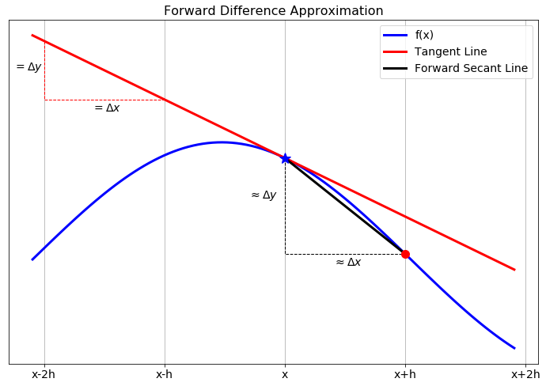
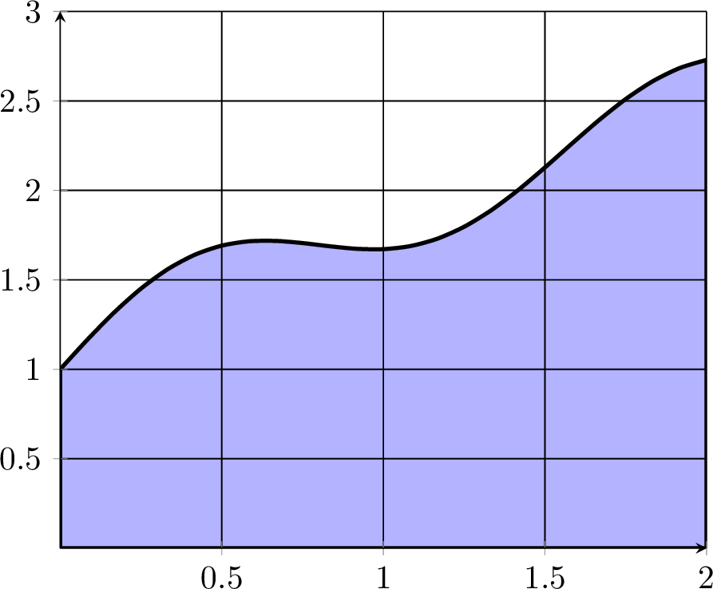
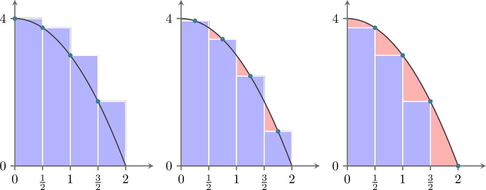
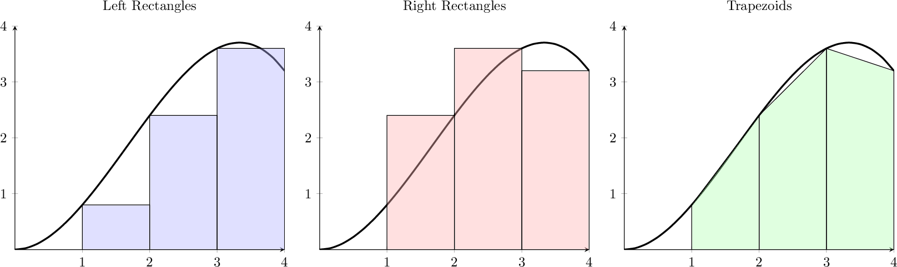
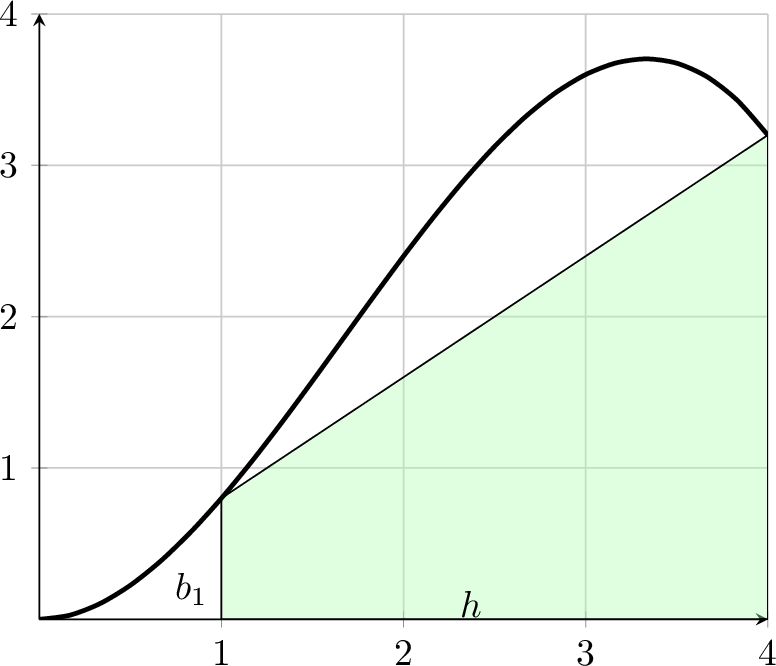

# Calculus {#sec-calculus}

> *The calculus was the first achievement of modern mathematics and it is difficult to overestimate its importance.*\
> --[Hungarian-American Mathematician John von Neumann](https://en.wikipedia.org/wiki/John_von_Neumann)

## Intro to Numerical Calculus

In this chapter we build some of the common techniques for approximating the two primary computations in calculus: taking derivatives and evaluating definite integrals. The primary goal of this chapter is to build a solid understanding of the basic techniques for numerical differentiation and integration. These will be crucial in the later chapters of this book when we numerically integrate ordinary and partial differential equations.

Recall the typical techniques from differential calculus: the power rule, the chain rule, the product rule, the quotient rule, the differentiation rules for exponentials, inverses, and trig functions, implicit differentiation, etc. With these rules, and enough time and patience, we can find a derivative of any algebraically defined function. The truth of the matter is that not all functions are given to us algebraically, and even the ones that are given algebraically are sometimes really cumbersome.

------------------------------------------------------------------------

::: {#exr-3.2}
💬 When a police officer fires a radar gun at a moving car it uses a laser to measure the distance from the officer to the car:

-   The speed of light is constant.

-   The time between when the laser is fired and when the light reflected off of the car is received can be measured very accurately.

-   Using the formula $\text{distance} = \text{rate} \cdot \text{time}$, the time for the laser pulse to be sent and received can then be converted to a distance.

How does the radar gun then use that information to calculate the speed of the moving car?
:::

------------------------------------------------------------------------

Integration, on the other hand, is a more difficult situation. You may recall some of the techniques of integral calculus such as the power rule, $u$-substitution, and integration by parts. However, these tools are not enough to find an antiderviative for every given function. Furthermore, not every function can be written algebraically.

------------------------------------------------------------------------

::: {#exr-3.3}
💬 In statistics the function known as *the normal distribution* (the bell curve) is defined as 
$$
N(x) = \frac{1}{\sqrt{2\pi}} e^{-x^2/2}.
$$
 One of the primary computations of introductory statistics is to find the area under a portion of this curve since this area gives the probability of some event 
$$
P(a < x < b) = \int_a^b \frac{1}{\sqrt{2\pi}} e^{-x^2/2} dx.
$$
 The trouble is that there is no known antiderivative of this function. Propose a method for approximating this area.
:::

------------------------------------------------------------------------

::: {#exr-3.5}
💬 A dam operator has control of the rate at which water is flowing out of a hydroelectric dam. He has records for the approximate flow rate through the dam over the course of a day. Propose a way for the operator to use his data to determine the total amount of water that has passed through the dam during that day.

:::

------------------------------------------------------------------------

What you have seen here are just a few examples of why you might need to use numerical calculus instead of the classical routines that you learned earlier in your mathematical career. Another typical need for numerical derivatives and integrals arises when we approximate the solutions to differential equations later in the module.

Throughout this chapter we will make heavy use of Taylor's Theorem to build approximations of derivatives and integrals. This has become a recurring scheme in this module: Taylor's Theorem is your all-purpose approximation tool. It suggests the approximation methods and it allows you to understand the error that comes with the approximation.

## Differentiation with Finite Differences {#sec-differentiation}

### The First Derivative

::: {#exr-3.6}
💬 Recall from your first-semester Calculus class that the derivative of a function $f(x)$ is defined as 
$$
f'(x) = \lim_{\Delta x \to 0} \frac{f(x+\Delta x) - f(x)}{\Delta x}.
$$
 A Calculus student proposes that it would just be much easier if we dropped the limit and instead just always choose $\Delta x$ to be some small number, like $0.001$ or $10^{-6}$. Discuss the following questions:

1.  When might the Calculus student's proposal actually work pretty well in place of calculating an actual derivative?

2.  When might the Calculus student's proposal fail in terms of approximating the derivative?

:::

------------------------------------------------------------------------

In this section we will build several approximation of first and second derivatives. The primary idea for each of these approximations is:

-   Partition the interval $[a,b]$ into $N$ sub intervals

-   Define the distance between two points in the partition as $\Delta x$.

-   Approximate the derivative at any point $x$ in the interval $[a,b]$ by using linear combinations of $f(x-\Delta x)$, $f(x)$, $f(x+\Delta x)$, and/or other points in the partition.

Partitioning the interval into discrete points turns the continuous problem of finding a derivative at every real point in $[a,b]$ into a discrete problem where we calculate the approximate derivative at finitely many points in $[a,b]$.

This distance $\Delta x$ between neighbouring points in the partition is often referred to as the **step size**. It is also common to denote the step size by the letter $h$. We will use both notations for the step size interchangeably, using mostly $h$ in this section on differentiation and $\Delta x$ in the next section on integration. Note that in general the points in the partition do not need to be equally spaced, but that is the simplest place to start. @fig-3.1 shows a depiction of the partition as well as making clear that $h$ is the separation between each of the points in the partition. 

![A partition of the interval $[a,b]$.](figures/Calculus/IntervalPartition.png){#fig-3.1 alt="A partition of the interval $[a,b]$ using step size $h$."}

------------------------------------------------------------------------

::: {#exr-3.7}
🖋 Let us take a close look at partitions before moving on to more details about numerical differentiation.

1.  If we partition the interval $[0,1]$ into $3$ equal sub intervals each with length $h$ then:

    a.  $h = \underline{\hspace{1in}}$

    b.  $[0,1] = [0,\underline{\hspace{0.25in}}] \cup [\underline{\hspace{0.25in}},\underline{\hspace{0.25in}}] \cup [\underline{\hspace{0.25in}},1]$

    c.  There are four total points that define the partition. They are $0, \underline{\hspace{0.25in}}, \underline{\hspace{0.25in}}, 1$.

2.  If we partition the interval $[3,7]$ into $5$ equal sub intervals each with length $h$ then:

    a.  $h = \underline{\hspace{1in}}$

    b.  $[3,7] = [3,\underline{\hspace{0.25in}}] \cup [\underline{\hspace{0.25in}},\underline{\hspace{0.25in}}] \cup [\underline{\hspace{0.25in}},\underline{\hspace{0.25in}}] \cup [\underline{\hspace{0.25in}},\underline{\hspace{0.25in}}] \cup [\underline{\hspace{0.25in}},7]$

    c.  There are 6 total points that define the partition. They are $0, \underline{\hspace{0.25in}}, \underline{\hspace{0.25in}}, \underline{\hspace{0.25in}}, \underline{\hspace{0.25in}}, 7$.

3.  More generally, if a closed interval $[a,b]$ contains $N$ equal sub intervals where 
$$
 [a,b] = \underbrace{[a,a+h] \cup [a+h, a+2h] \cup \cdots \cup [b-2h,b-h] \cup [b-h,b]}_{\text{$N$ total sub intervals}} 
$$
 then the length of each sub interval, $h$, is given by the formula 
$$
 h = \frac{\underline{\hspace{0.25in}} - \underline{\hspace{0.25in}}}{\underline{\hspace{0.25in}}}. 
$$

:::

------------------------------------------------------------------------

::: {#exr-3.8}
🖋 🎓 In Python's `numpy` library there is a nice tool called `np.linspace()` that partitions an interval in exactly the way that we want. The command takes the form `np.linspace(a, b, n)` where the interval is $[a,b]$ and $n$ the number of points used to create the partition. For example, `np.linspace(0,1,5)` will produce the list of numbers `0, 0.25, 0.5, 0.75, 1`. Notice that there are 5 total points, the first point is $a$, the last point is $b$, and there are $4$ total sub intervals in the partition. Hence, if we want to partition the interval $[0,1]$ into 20 equal sub intervals then we would use the command `np.linspace(0,1,21)` which would result in a list of numbers starting with `0, 0.05, 0.1, 0.15,` etc. What command would you use to partition the interval $[5,10]$ into $100$ equal sub intervals?

:::

------------------------------------------------------------------------

::: {#exr-3.9}
🖋 Consider the Python command `np.linspace(0,1,50)`.

1.  What interval does this command partition?

2.  How many points are going to be returned?

3.  How many equal length subintervals will we have in the resulting partition?

4.  What is the length of each of the subintervals in the resulting partition?

:::

------------------------------------------------------------------------

Now let us get back to the discussion of numerical differentiation. If we recall that the definition of the first derivative of a function is 
$$
 \begin{aligned} \frac{df(x)}{dx} = \lim_{h \to 0} \frac{f(x+h) - f(x)}{h}. \label{eqn:derivative_definition}\end{aligned}
$$
 our first approximation for the first derivative is naturally 
$$
 \begin{aligned} \frac{df(x)}{dx} \approx \frac{f(x+h) - f(x)}{h}=:\Delta f(x). \label{eqn:derivative_first_approx}\end{aligned}
$$
 In this approximation of the derivative we have simply removed the limit and instead approximated the derivative as the slope. It should be clear that this approximation is only good if the step size $h$ is *small*. In @fig-3.2 we see a graphical depiction of what we are doing to approximate the derivative. The slope of the tangent line ($\Delta y / \Delta x$) is what we are after, and a way to approximate it is to calculate the slope of the secant line formed by looking $h$ units forward from the point $x$.

{#fig-3.2 alt="The forward difference differentiation scheme for the first derivative."}

While this is the simplest and most obvious approximation for the first derivative there is a much more elegant technique, using Taylor series, for arriving at this approximation. Furthermore, the Taylor series technique gives us information about the approximation error and later will suggest an infinite family of other techniques.

------------------------------------------------------------------------

### Truncation Error

::: {#exr-3.10}
🖋 From Taylor's Theorem we know that for an infinitely differentiable function $f(x)$, 
$$
f(x) = f(x_0) + \frac{f'(x_0)}{1!} (x-x_0)^1 + \frac{f''(x_0)}{2!}(x-x_0)^2 + \frac{f^{(3)}(x_0)}{3!}(x-x_0)^3 + \cdots.
$$
 What do we get if we replace every "$x$" in the Taylor Series with "$x+h$" and replace every "$x_0$" in the Taylor Series with "$x$?" In other words, in @fig-3.1 we want to centre the Taylor series at $x$ and evaluate the resulting series at the point $x+h$. 
$$
f(x+h) = \underline{\hspace{3in}}
$$


:::

------------------------------------------------------------------------

::: {#exr-3.11}
🖋 Solve the result from the previous exercise for $f'(x)$ to create an approximation for $f'(x)$ using $f(x+h)$, $f(x)$, and some higher order terms. (fill in the blanks and the question marks) 
$$
f'(x) = \frac{f(x+h) - ???}{??} + \underline{\hspace{2in}}
$$
:::

------------------------------------------------------------------------

::: {#exr-3.12}
🖋 🎓 In the formula that you developed in @exr-3.11, if we were to truncate after the first fraction and drop everything else (called the *remainder*), we know that we would be introducing a truncation error into our derivative computation. If $h$ is taken to be very small then the first term in the remainder is the largest and everything else in the remainder can be ignored (since all subsequent terms should be extremely small ... pause and ponder this fact). Therefore, the amount of error we make in the derivative computation by dropping the remainder depends on the power of $h$ in that first term in the remainder.

What is the power of $h$ in the first term of the remainder from @exr-3.11?
:::

------------------------------------------------------------------------

::: {#def-3.1}
#### Order of a Numerical Differentiation Scheme
The **order** of a numerical derivative is the power of the step size in the first term of the remainder of the rearranged Taylor Series. For example, a first order method will have "$h^1$" in the first term of the remainder. A second order method will have "$h^2$" in the first term of the remainder. Etc.

For sufficiently small step size $h$, the error that you make by truncating the series is dominated by the first term in the remainder, which is proportional to the power of $h$ in that term. Hence, the **order** of a numerical differentiation scheme tells you how the error you are making by using the approximation scheme decreases as you decrease the step-size $h$.
:::

------------------------------------------------------------------------


::: {#def-3.2}
(**Big O Notation**) We say that the error in a differentiation scheme is $\mathcal{O}(h)$ (read: "big O of $h$"), if and only if there is a positive constant $M$ such that 
$$
 |\text{Error}| \le M \cdot h
$$
when $h$ is sufficiently small. This is equivalent to saying that a differentiation method is "first order." 

More generally, we say that the error in a differentiation scheme is $\mathcal{O}(h^k)$ (read: "big O of $h^k$") if and only if there is a positive constant $M$ such that 
$$
 |\text{Error}| \leq M \cdot h^k. 
$$
when $h$ is sufficiently small. This is equivalent to saying that a differentiation scheme is "$k^{th}$ order." 
:::

------------------------------------------------------------------------

::: {#thm-3.1}
The approximation you derived in @exr-3.11 gives a first order approximation of the first derivative: 
$$
 f'(x) = \frac{f(x+h) - f(x)}{h} + \mathcal{O}(h).
$$
This is called the **forward difference approximation** of the first derivative.

:::

------------------------------------------------------------------------

::: {#exr-3.13}
💻 💬 Consider the function $f(x) = \sin(x) (1- x)$. The goal of this exercise is to make sense of the discussion of the "order" of the derivative approximation. 

a.  Find $f'(x)$ analytically.

b.  Use your answer to part (a) to verify that $f'(1) = -\sin(1) \approx -0.8414709848$.

c.  🎓  To approximate the first derivative at $x=1$ numerically with the forward-difference approximation formula from @thm-3.1 we calculate 
$$
 f'(1) \approx \frac{f(1+h) - f(1)}{h}=:\Delta f(1).
$$
 We want to see how the error in the approximation behaves as $h$ is made smaller and smaller. The table below shows the approximation and the absolute error for $h = 2^{-1}$ and $h = 2^{-2}$. It also shows the error reduction factor, which is the ratio of two successive absolute errors. Extend the table to include $h = 2^{-3}$ up to $h = 2^{-10}$. Start with the code given below but use a loop to create the 10 rows.

```{python}
import numpy as np
    
# Setup function and exact derivative
f = lambda x: np.sin(x) * (1 - x)
exact = -np.sin(1)
delta_f = lambda h: (f(1 + h) - f(1)) / h
    
# Create table header
hdr1 = "h"
hdr2 = "Δf(1)"
hdr3 = "|f'(1) - Δf(1)|"
hdr4 = "Error reduction factor"
print(f"{hdr1:<20} | {hdr2:<18} | {hdr3:<18} | {hdr4:<18}")
print("-" * 82)
    
# Fill in n=1 row
h = 2**(-1)
h_str = f"2^-1 = {h:g}"
error = abs(exact - delta_f(h))
print(f"{h_str:<20} | {delta_f(h):<18.15f} | {error:<18.15f} |")
    
# Fill in n=2 row
h = 2**(-2)
h_str = f"2^-2 = {h:g}"
error_prev = error
error = abs(exact - delta_f(h))
print(f"{h_str:<20} | {delta_f(h):<18.15f} | {error:<18.15f} | {error_prev/error:<18.15f}")

```


d. Use the following function to plot the absolute error as a function of $h$.

```{python}
import matplotlib.pyplot as plt

def plot_forward_difference_errors(f, x, exact, H):
    """
    Plot the absolute error in the finite difference approximation

    Parameters:
        f (function): Function whose derivative we approximate
        x (float): The point at which we want the derivative
        exact (float): The exact value of f'(x)
        H (vector): We will calculate the error at each of the
                    entries of this vector
    Returns:
        A plot with the stepsizes on the x axis and the 
        absolute error on the y axis
    """

    # Create list of errors
    AbsError = [] # start off with a blank list of errors
    for h in H:
        approx = (f(x+h) - f(x))/h
        AbsError.append(abs(approx - exact))

    # Make a loglog plot
    plt.loglog(H, AbsError, 'b*')
    plt.xlabel("h")
    plt.ylabel("Absolute Error")
    plt.title("Absolute Error vs. h")
    plt.grid()
    return(plt)
```

Here is an example of how to use the function:

```{python}
# Setup function and exact derivative
f = lambda x: np.sin(x) * (1 - x)
x = 1
exact = -np.sin(x)

# Create vector of step sizes
H = [2**(-n) for n in range(1, 11)]

# Plot the absolute error
plot_forward_difference_errors(f, x, exact, H)
```

e. 💬 Discuss the pattern in how the absolute error changes as $h$ is changed? What does the log-log plot tell you? How does this agree with what the table tells you?

f.  There was nothing really special in part (c) about powers of 2. Modify your code to build similar tables and plots for the following sequences of $h$: 
$$
\begin{aligned} h &= 3^{-1}, \, 3^{-2}, \, 3^{-3}, \, \ldots \\ h &= 5^{-1}, \, 5^{-2}, \, 5^{-3}, \, \ldots \\ h &= 10^{-1}, \, 10^{-2}, \, 10^{-3}, \, \ldots. \\ \end{aligned}
$$

    Do you see any anomalies that could be caused by rounding errors?

g. Create the table and the plot for several different choices of the function $f$ and the point $x$ at which you compute the derivative. Does the pattern you observe in part (e) continue to hold? 

h.  💬 What does your answer to part (e) have to do with the approximation order of the numerical derivative method that you used?

:::

::: {#exr-3.16}
💬 Explain the phrase: *The forward difference approximation* $f'(x) \approx \frac{f(x+h)-f(x)}{h}$ *is first order.*

:::

------------------------------------------------------------------------

### Efficient Coding

Now that we have a handle on how the forward-difference approximation scheme for the first derivative works and how the error depends on the step size, let us build some code that will take in a function and output the approximate first derivative on an entire interval instead of just at a single point.

------------------------------------------------------------------------

::: {#exr-3.17}
💻 🎓 We want to build a Python function that accepts:

-   a mathematical function,

-   the bounds of an interval,

-   and the number of subintervals.

The function will return the forward-difference approximation of the first derivative at every point in the interval except at the right-hand side. For example, we could send the function $f(x) = \sin(x)$, the interval $[0,2\pi]$, and tell it to split the interval into 100 subintervals. We would then get back an approximate value of the derivative $f'(x)$ at all of the points except at $x=2\pi$.

1.  First of all, why can we not compute the forward-difference approximation of the derivative at the last point?

2.  Next, fill in the blanks in the partially complete code below and update the comments to say what each line does.

``` python         
import numpy as np
import matplotlib.pyplot as plt
def ForwardDiff(f,a,b,N):
    x = np.linspace(a,b,N+1) # What does this line of code do? 
    # What's up with the N+1 in the previous line?
    h = x[1] - x[0] # What does this line of code do?
    df = [] # What does this line of code do?
    for j in np.arange(len(x)-1): # What does this line of code do?  
        # What's up with the -1 in the definition of the loop?

        # Now we want to build the approximation 
        # (f(x+h) - f(x)) / h.
        # Obviously "x+h" is just the next item in the list of 
        # x values so when we do f(x+h) mathematically we should 
        # write f(x[j+1]) in Python (explain this).  
        # Fill in the question marks below
        df.append((f(???) - f(???)) / h )
    return df
```

3.  Now we want to call upon this function to build the first order approximation of the first derivative for some function. We will use the function $f(x) = \sin(x)$ on the interval $[0,2\pi]$ with 100 sub intervals (since we know what the answer should be). Complete the code below to call upon your `ForwardDiff()` function and to plot $f(x)$, $f'(x)$, and the approximation of $f'(x)$.

``` python         
f = lambda x: np.sin(x)
exact_df = lambda x: np.cos(x)
a = ???
b = ???
N = 100 # What is this?
x = np.linspace(a,b,N+1) 
# What does the previous line do?  
# What's up with the N+1?

df = ForwardDiff(f,a,b,N) # What does this line do?

# In the next line we plot three curves: 
# 1) the function f(x)
# 2) the function f'(x)
# 3) the approximation of f'(x)
# However, we do something funny with the x in the last plot. Why?
plt.plot(x,f(x),'b',x,exact_df(x),'r--',x[0:-1], df, 'k-.')
plt.grid()
plt.legend(['f(x) = sin(x)',
            'exact first deriv',
            'approx first deriv'])
plt.show()
```

4.  Implement your completed code and then test it in several ways:

    a.  Test your code on functions where you know the derivative. Be sure that you get the plots that you expect.

    b.  Test your code with a very large number of sub intervals, $N$. What do you observe?

    c.  Test your code with small number of sub intervals, $N$. What do you observe?

:::

------------------------------------------------------------------------

::: {#exr-3.18}
💻 Now let us build the first derivative function in a much *smarter* way -- using NumPy arrays in Python. Instead of looping over all of the $x$ values, we can take advantage of the fact that NumPy operations can act on all the elements of an array at once and hence we can do all of the function evaluations and all the subtractions and divisions at once without a loop.

1.  The line of code `x = np.linspace(a,b,N+1)` builds a numpy vector of $N+1$ values of $x$ starting at $a$ and ending at $b$. Then `y = f(x)` builds a vector with the function values at all the elements in `x`. In the following questions remember that Python indexes all lists starting at 0. Also remember that you can call on the last element of a list using an index of `-1`. Finally, remember that if you do `x[p:q]` in Python you will get a list of `x` values starting at index `p` and ending at index `q-1`.

    1.  What will we get if we evaluate the code `y[1:]`?

    3.  What will we get if we evaluate the code `y[:-1]`?

    5.  What will we get if we evaluate the code `y[1:] - y[:-1]`?

    6.  What will we get if we evaluate the code `(y[1:] - y[:-1]) / h`?

2.  Use the insight from part (1) to simplify your first order first derivative function to look like the code below.

``` python         
def ForwardDiff(f,a,b,N):
    x = np.linspace(a,b,N+1)
    h = x[1] - x[0]
    y = f(x)
    df = # your line of code goes here?  
    return df
```
3. Test your new function by checking that the plots from the previous exercise still look the same.
:::

::: {#exr-3.19}
💻 Write code that finds a first order approximation for the first derivative of $f(x) = \sin(x) (1 - x)$ on the interval $x \in (0,15)$. Your script should output two plots (side-by-side).

a.  The left-hand plot should show the function in blue and the approximate first derivative as a red dashed curve. Sample code for this exercise is given below.

``` python         
import matplotlib.pyplot as plt
import numpy as np

f = lambda x: np.sin(x) * (1 - x)
a = 0
b = 15
N = # make this an appropriately sized number of subintervals
x = np.linspace(a,b,N+1) # what does this line do?
y = f(x) # what does this line do?
df = ForwardDiff(f,a,b,N) # what does this line do?

fig, ax = plt.subplots(1,2) # what does this line do?
ax[0].plot(x,y,'b',x[0:-1],df,'r--') # what does this line do?
ax[0].grid()
```

b.  The right-hand plot should show the absolute error between the exact derivative and the numerical derivative. You should use a logarithmic $y$ axis for this plot.

``` python         
exact = lambda x: # write a function for the exact derivative
# There is a lot going on the next line of code ... explain it.
ax[1].semilogy(x[0:-1],abs(exact(x[0:-1]) - df))
ax[1].grid()
fig
```
c. 💬 You should see a rather spiky plot on the right, where the drops to very low values at certain $x$ values. Can you explain why the forward difference approximation is so much more precise at these points? What is special about the shape of the original function at these points?

c.  Play with the number of sub intervals, $N$, and demonstrate the fact that we are using a first order method to approximate the first derivative.

:::

------------------------------------------------------------------------

::: {#exr-max_err_plot}
💻 You have seen in the previous exercise how the error is different at different $x$. It might be interesting to look at the largest error over the entire interval for different step sizes.

1.  Find the numerical first derivative with your `ForwardDiff` function on the interval [0,15] with a stepsize of $h = 0.1$.

2.  Find the absolute difference between your numerical first derivative and the actual first derivative. This is point-by-point subtraction so you should end up with a vector containing the errors at each point, just as in the previous exercise. Again be careful to take into account that the numerical derivative is not available at the right end point.

3.  Find the maximum of your errors. If all is well, you should find that the maximum error is approximately 0.6731791497487658.

5.  Now we want to see how this maximum error changes as we change the number of points used. Build a function `plot_max_forward_difference_errors` that produces a log-log plot showing the value of $h$ on the horizontal axis and the maximum error on the vertical axis. 

```python
def plot_max_forward_difference_errors(f, f_prime, a, b, H):
    """
    Plot the maximum absolute error in the forward difference 
    approximation for the first derivative of f on the interval [a,b]

    Parameters:
        f (function): Function whose derivative we approximate
        f_prime (function): Exact derivative of f
        a (float): Left endpoint of interval
        b (float): Right endpoint of interval
        H (vector): Vector of step sizes h
    Returns:
        A plot with the stepsizes on the x axis and the 
        absolute error on the y axis
    """

    # Your code here
```

You will need to write a loop that gets the error for many different values of $h$. You can build on the code from you `plot_forward_difference_errors` function. You should find that the maximum errors again line up approximately on a straight line with a slope of 1.
:::

------------------------------------------------------------------------

### A Better First Derivative

Next we will build a more accurate numerical first derivative scheme. The derivation technique is the same: play a little algebra game with the Taylor series and see if you can get the first derivative to simplify out. This time we will be hoping to get a second order method.

------------------------------------------------------------------------

::: {#exr-3.20}
🖋 Consider again the Taylor series for an infinitely differentiable function $f(x)$: 
$$
 f(x) = f(x_0) + \frac{f'(x_0)}{1!} (x-x_0)^1 + \frac{f''(x_0)}{2!}(x-x_0)^2 + \frac{f^{(3)}(x_0)}{3!}(x-x_0)^3 + \cdots .
$$


1.  Replace the "$x$" in the Taylor Series with "$x+h$" and replace the "$x_0$" in the Taylor Series with "$x$" and simplify. 
$$
f(x+h) = \underline{\hspace{3in}}.
$$


2.  Now replace the "$x$" in the Taylor Series with "$x-h$" and replace the "$x_0$" in the Taylor Series with "$x$" and simplify. 
$$
f(x-h) = \underline{\hspace{3in}}.
$$


3.  Find the difference between $f(x+h)$ and $f(x-h)$ and simplify. Be very careful of your signs. 
$$
f(x+h) - f(x-h) = \underline{\hspace{3in}}.
$$


4.  Solve for $f'(x)$ in your result from part (3). Fill in the question marks and blanks below once you have finished simplifying. 
$$
f'(x) = \frac{??? - ???}{2h} + \underline{\hspace{3in}}.
$$


5.  Use your result from part (4) to verify that 
$$
f'(x) = \underline{\hspace{2in}} + \mathcal{O}(h^2).
$$


6.  Draw a picture similar to @fig-3.2 showing what this scheme is doing graphically.

:::

------------------------------------------------------------------------

::: {#exr-3.21}
💻 🎓 Let us return to the function $f(x) = \sin(x)(1- x)$ but this time we will approximate the first derivative at $x=1$ using the formula 
$$
f'(1) \approx \frac{f(1+h) - f(1-h)}{2h}=:\delta f(1).
$$
 You should already have the first derivative and the exact answer from earlier exercises (if not, then go get them by hand again).

a. We want to see how the error in the approximation behaves as $h$ is made smaller and smaller. Adapt your code from @exr-3.13 to extend the table to include $h = 2^{-3}$ up to $h = 2^{-10}$. 

```{python}
#| echo: false
import numpy as np
    
# Setup function and exact derivative
f = lambda x: np.sin(x) * (1 - x)
exact = -np.sin(1)
delta_f = lambda h: (f(1 + h) - f(1 - h)) / (2 * h)
    
# Create table header
hdr1 = "h"
hdr2 = "δf(1)"
hdr3 = "|f'(1) - δf(1)|"
hdr4 = "Error reduction factor"
print(f"{hdr1:<20} | {hdr2:<18} | {hdr3:<18} | {hdr4:<18}")
print("-" * 82)
    
# Fill in n=1 row
h = 2**(-1)
h_str = f"2^-1 = {h:g}"
error = abs(exact - delta_f(h))
print(f"{h_str:<20} | {delta_f(h):<18.15f} | {error:<18.15f} |")
    
# Fill in n=2 row
h = 2**(-2)
h_str = f"2^-2 = {h:g}"
error_prev = error
error = abs(exact - delta_f(h))
print(f"{h_str:<20} | {delta_f(h):<18.15f} | {error:<18.15f} | {error_prev/error:<18.15f}")

```

b. Adapt your code for the `plot_forward_difference_errors` function to create a `plot_central_difference_errors` function and use it to plot the errors for the sequences of $h$ in part (a).

c.  Build similar tables for the following sequences of $h$: 
$$
\begin{aligned} h &= 3^{-1}, \, 3^{-2}, \, 3^{-3}, \, \ldots \\ h &= 5^{-1}, \, 5^{-2}, \, 5^{-3}, \, \ldots \\ h &= 10^{-1}, \, 10^{-2}, \, 10^{-3}, \, \ldots . \end{aligned}
$$

d. 💬 Discuss the pattern in how the absolute error changes as $h$ is changed? What does the log-log plot tell you? How does this agree with what the table tells you? How does this compare to the error for the forward difference approximation?

e.  💬 What does your answer to part (d) have to do with the approximation order of the numerical derivative method that you used?

:::

------------------------------------------------------------------------

::: {#exr-3.23}
💻 Write a Python function `CentralDiff(f, a, b, N)` that takes a mathematical function `f`, the start and end values of an interval [`a`, `b`] and the number `N` of subintervals to use. It should return a second order numerical approximation to the first derivative on the interval. This should be a vector with $N-1$ entries (why?). You should try to write this code without using any loops. (Hint: This should really be a minor modification of your first order first derivative code.) Test the code on functions where you know the first derivative.

:::

------------------------------------------------------------------------

::: {#exr-3.25}
💻 💬 The plot shown in @fig-3.3 shows the maximum absolute error between the exact first derivative of a function $f(x)$ and a numerical first derivative approximation scheme. At this point we know two schemes: 
$$
 f'(x) = \frac{f(x+h) - f(x)}{h} + \mathcal{O}(h) 
$$
 and 
$$
 f'(x) = \frac{f(x+h) - f(x-h)}{2h} + \mathcal{O}(h^2). 
$$


1.  Which curve in the plot matches with which method. How do you know?

2.  Recreate the plot with a function of your choosing.

```{python}
#| label: fig-3.3
#| fig-cap: Maximum absolute error between the first derivative and two different approximations of the first derivative.
#| fig-alt: Maximum absolute error between the first derivative and two different approximations of the first derivative.
#| code-fold: true
import numpy as np
import matplotlib.pyplot as plt

# Choose a function f
f = lambda x: np.sin(x)
# Give its derivative
df = lambda x: np.cos(x)
# Choose interval
a = 0
b = 2*np.pi

m = 16 # Number of different step sizes to plot
# Pre-allocate vectors for errors
fd_error = np.zeros(m)
cd_error = np.zeros(m)
# Pre-allocate vector for step sizes
H = np.zeros(m)

# Loop over the different step sizes
for n in range(m):
    N = 2**(n+2) # Number of subintervals
    x = np.linspace(a, b, N+1)
    y = f(x)
    h = x[1]-x[0] # step size

    # Calculate the derivative and approximations
    exact = df(x)
    forward_diff = (y[1:]-y[:-1])/h
    central_diff = (y[2:]-y[:-2])/(2*h)

    # save the maximum of the errors for this step size
    fd_error[n] = max(abs(forward_diff - df(x[:-1])))
    cd_error[n] = max(abs(central_diff - df(x[1:-1])))
    H[n] = h

# Make a loglog plot of the errors agains step size
plt.loglog(H,fd_error,'b-', label='Approximation Method A')
plt.loglog(H,cd_error,'r-', label='Approximation Method B')
plt.xlabel('Steps size h')
plt.ylabel('Maximum Absolute Error')
plt.title('Comparing Two First Derivative Approximations')
plt.grid()
plt.legend()
plt.show()
```

:::

------------------------------------------------------------------------

### The Second Derivative

Now we will search for an approximation of the second derivative. Again, the game will be the same: experiment with the Taylor series and some algebra with an eye toward getting the second derivative to pop out cleanly. This time we will do the algebra in such a way that the first derivative cancels.

From the previous exercises you already have Taylor expansions of the form $f(x+h)$ and $f(x-h)$. Let us summarize them here since you are going to need them for future computations. 
$$
 \begin{aligned} f(x+h) &= f(x) + \frac{f'(x)}{1!} h + \frac{f''(x)}{2!} h^2 + \frac{f^{(3)}(x)}{3!} h^3 + \cdots \\ f(x-h) &= f(x) - \frac{f'(x)}{1!} h + \frac{f''(x)}{2!} h^2 - \frac{f^{(3)}(x)}{3!} h^3 + \cdots. \end{aligned} 
$$

------------------------------------------------------------------------

::: {#exr-3.26}
🖋 The goal of this exercise is to use the Taylor series for $f(x+h)$ and $f(x-h)$ to arrive at an approximation scheme for the second derivative $f''(x)$.

1.  Add the Taylor series for $f(x+h)$ and $f(x-h)$ and combine all like terms. You should notice that several terms cancel. 
$$
f(x+h) + f(x-h) = \underline{\hspace{3in}}.
$$


2.  Solve your answer in part (1) for $f''(x)$. 
$$
f''(x) = \frac{?? - 2 \cdot ?? + ??}{h^2} + \underline{\hspace{1in}}.
$$


3.  If we were to drop all of the terms after the fraction on the right-hand side of the previous result we would be introducing some error into the derivative computation. What does this tell us about the order of the error for the second derivative approximation scheme we just built?

:::

------------------------------------------------------------------------

::: {#exr-3.27}
🖋 💬 Again consider the function $f(x) = \sin(x)(1 - x)$.

1.  Calculate the derivative of this function and calculate the exact value of $f''(1)$.

2.  If we calculate the second derivative with the central difference scheme that you built in the previous exercise using $h = 0.5$ then we get an absolute error of about 0.044466. Stop now and verify this error calculation.

3.  Based on our previous work with the order of the error in a numerical differentiation scheme, what do you predict the error will be if we calculate $f''(1)$ with $h = 0.25$? With $h = 0.05$? With $h = 0.005$? Defend your answers.

:::

------------------------------------------------------------------------

::: {#exr-3.28}
💻 Write a Python function `SecondDiff(f, a, b, N)` that takes a mathematical function `f`, the start and end values of an interval [`a`, `b`] and the number `N` of subintervals to use. It should return a second order numerical approximation to the second derivative on the interval. This should be a vector with $N-1$ entries (why?). As before, you should write your code without using any loops.

:::

------------------------------------------------------------------------

::: {#exr-3.29}
💻 💬 Test your second derivative code on the function $f(x) = \sin(x) (1-x)$ by doing the following.

::: {#exr-max_err_plot_second}
💻 🎓 You have seen in the previous exercise how the error is different at different $x$. It might be interesting to look at the largest error over the entire interval for different step sizes.

1.  Find the numerical second derivative with your `SecondDiff` function on the interval [0,15] with a stepsize of $h = 0.1$.

2.  Find the absolute difference between your numerical second derivative and the actual second derivative. This is point-by-point subtraction so you should end up with a vector containing the errors at each interior point. Again be careful to take into account that the numerical second derivative is not available at the endpoints.

3. 🎓 Find the maximum of your errors. 

4.  Now we want to see how this maximum error changes as we change the number of points used. Build a function `plot_max_second_difference_errors` that produces a log-log plot showing the value of $h$ on the horizontal axis and the maximum error on the vertical axis. You can simply adapt the code from you `plot_max_forward_difference_errors` function. You should find that the maximum errors again line up approximately on a straight line.
:::

5. 💬  Discuss what you see? How do you see the fact that the numerical second derivative is second order accurate?

:::

------------------------------------------------------------------------

The table below summarizes the formulas that we have for derivatives thus far. 

| **Derivative** | **Formula**                                            | **Error**            | **Name**            |
|----------------|--------------------------------------------------------|----------------------|---------------------|
| $1^{st}$     | $f'(x) \approx \frac{f(x+h) - f(x)}{h}$              | $\mathcal{O}(h)$   | Forward Difference  |
| $1^{st}$     | $f'(x) \approx \frac{f(x+h) - f(x-h)}{2h}$           | $\mathcal{O}(h^2)$ | Central Difference |
| $2^{nd}$     | $f''(x) \approx \frac{f(x+h) - 2f(x) + f(x-h)}{h^2}$ | $\mathcal{O}(h^2)$ | Central Difference |


------------------------------------------------------------------------

::: {#exr-3.30}
💬  Let $f(x)$ be a twice differentiable function. We are interested in the first and second derivative of the function $f$ at the point $x = 1.74$. Use what you have learned in this section to answer the following questions. (For clarity, you can think of "$f$" as a different function in each of the following questions ...it does not really matter exactly what function $f$ is.)

1.  Johnny used a numerical first derivative scheme with $h = 0.1$ to approximate $f'(1.74)$ and found an absolute error of 3.28. He then used $h=0.01$ and found an absolute error of 0.328. What was the order of the error in his first derivative scheme? How can you tell?

2.  Betty used a numerical first derivative scheme with $h = 0.2$ to approximate $f'(1.74)$ and found an absolute error of 4.32. She then used $h=0.1$ and found an absolute   error of 1.08. What numerical first derivative scheme did she likely use?

4.  Harry wants to compute $f''(1.74)$ to within 1% using a central difference scheme. He tries $h=0.25$ and gets an absolute percentage  error of 3.71%. What $h$ could he try next so that his absolute percentage  error is close to 1%?

:::

::: {#exr-3.30n}
🖋 We said at the start of this section that the spacing of the steps do not have to be constant. Insteady of a constant step size $h$ we could have variable step sizes $\Delta x_i:=x_{i+1}-x_i$. However, this complicates the expression for the second derivative. In this exercise you can check that you fully understood the derivation of the formula for the second derivative by repeating it for these variable step sizes. So you will need to start with the Taylor expansions of $f(x_{i+1})=f(x_i+\Delta x_i)$ and $f(x_{i-1})=f(x_i-\Delta x_{i-1})$ around $x_i$.

:::

------------------------------------------------------------------------

## Integration {#sec-integration}

Now that we understand how to calculate derivatives, we begin our work on the second principal computation of calculus: evaluating a definite integral. You will be able to transfer much of what you did in the previous section, where you investigated the errors in numerical differentiation, to the investigation of the errors in numerical integration.

------------------------------------------------------------------------

::: {#exr-3.31}
💬 Remember that a single-variable definite integral can be interpreted as the signed area between the curve and the $x$ axis. Consider the shaded area of the region under the function plotted in @fig-3.4 between $x=0$ and $x=2$.

1.  What rectangle with area 6 gives an upper bound for the area under the curve? Can you give a better upper bound?

2.  Why must the area under the curve be greater than 3?

3.  Is the area greater than 4? Why/Why not?

4.  Work with your group to give an estimate of the area and provide an estimate for the amount of error that you are making.

{#fig-3.4 alt="A sample integration"}

:::

------------------------------------------------------------------------

In this section we will study three different techniques for approximating the value of a definite integral: Riemann sums, trapezoidal rule, Simpsons's rule.

### Riemann Sums

In this subsection we will build our first method for approximating definite integrals. Recall from Calculus that the definition of the Riemann integral is 
$$
\int_a^b f(x) dx = \lim_{\Delta x \to 0} \sum_{j=1}^N f(x_j) \Delta x,
$$
where $N$ is the number of sub intervals on the interval $[a,b]$ and $\Delta x$ is the width of the interval^[In this module we will give all subintervals the same length. This simplifies things but is not necessary.]. As with differentiation, we can remove the limit and have a decent approximation of the integral so long as $N$ is large (or equivalently, as long as $\Delta x$ is small). 
$$
\int_a^b f(x) dx \approx \sum_{j=1}^N f(x_j) \Delta x.
$$
You are likely familiar with this approximation of the integral from Calculus. The value of $x_j$ can be chosen anywhere within the sub interval and three common choices are to use the left-aligned, the right-aligned, and the midpoint-aligned endpoints. We see a depiction of the resulting approximations in @fig-3.5.

{#fig-3.5 alt="Left-aligned Riemann sum, midpoint-aligned Riemann sum, and right-aligned Riemann sum"}

Clearly, the more rectangles we choose the closer the sum of the areas of the rectangles will get to the integral.

Assuming the boundaries of the $N$ subintervals are given by $x_0, x_1, \ldots, x_N$, these three choices define the following approximations:

**Left Riemann sum:**
$$
\int_a^b f(x) dx \approx \sum_{j=0}^{N-1} f(x_{j}) \Delta x
$$

**Right Riemann sum:**
$$
\int_a^b f(x) dx \approx \sum_{j=0}^{N-1} f(x_{j+1}) \Delta x
$$

**Midpoint Riemann sum:**
$$
\int_a^b f(x) dx \approx \sum_{j=0}^{N-1} f\left(\frac{x_{j} + x_{j+1}}{2}\right) \Delta x
$$


------------------------------------------------------------------------

::: {#exr-3.32}
💻 🎓 Write a Python function `RiemannSum(f, a, b, N, method='left')` that approximates an integral with a Riemann sum. 
Your Python function should accept a Python Function `f`, a lower bound `a`, an upper bound `b`, the number of subintervals `N`, and an optional input `method` that allows the user to designate whether they want 'left', 'right', or 'midpoint' rectangles. You should write your code without any loops. Test your code on several functions for which you know the integral.

:::

------------------------------------------------------------------------

```{python}
#| echo: false
import numpy as np

def RiemannSum(f, a, b, N, method='left'):
    x = np.linspace(a, b, N+1)
    dx = (b - a) / N
    if method == 'left':
        return np.sum(f(x[:-1])) * dx
    elif method == 'right':
        return np.sum(f(x[1:])) * dx
    elif method == 'midpoint':
        midpoints = (x[:-1] + x[1:]) / 2
        return np.sum(f(midpoints)) * dx
    else:
        raise ValueError("Method must be 'left', 'right', or 'midpoint'")
```

::: {#exr-3.33}
💻 Consider the function $f(x) = \sin(x)$. We know the antiderivative for this function, $F(x) = -\cos(x) + C$. In this question we are going to get a sense of the order of the error when doing Riemann Sum integration.

a.  Find the exact value of 
$$
I=\int_0^{1} f(x) dx.
$$

b.  To approximate the integral numerically using the left Riemann sum we calculate 
$$
 I \approx \sum_{j=0}^{N-1} f(x_j) \Delta x =: A_{\text{left}}(\Delta x).
$$
 We want to see how the error in the approximation behaves as $\Delta x$ is made smaller and smaller. The table below shows the approximation and the absolute error for $\Delta x = 2^{-1}$ and $\Delta x = 2^{-2}$. It also shows the error reduction factor, which is the ratio of two successive absolute errors. Modify the code to build a similar table for the sequence
$$
\Delta x = 3^{-1}, \, 3^{-2}, \, 3^{-3}, \, \ldots 
$$

```{python}
import numpy as np
    
# Setup function and exact integral
f = lambda x: np.sin(x)
exact = -np.cos(1) + np.cos(0)
    
# Create table header
hdr1 = "Δx"
hdr2 = "A_left(Δx)"
hdr3 = "|I - A_left(Δx)|"
hdr4 = "Error reduction factor"
print(f"{hdr1:<20} | {hdr2:<18} | {hdr3:<18} | {hdr4:<18}")
print("-" * 82)

for n in range(1,11):
    dx = 2**(-n)
    dx_str = f"2^-{n} = {dx:g}"
    approx = RiemannSum(f, 0, 1, int(np.round(1/dx)), method='left')
    error = abs(exact - approx)
    if n == 1:
        print(f"{dx_str:<20} | {approx:<18.15f} | {error:<18.15f} | ")
    else:
        print(f"{dx_str:<20} | {approx:<18.15f} | {error:<18.15f} | {error_prev/error:<18.15f}")
    error_prev = error

```


c.  Formulate your conjecture for how the error depends on the stepsize.

d.  Repeat part (b) to create the tables and answer the questions using the right Riemann sum and the midpoint Riemann sum instead of the left Riemann sum. What happens to the error reduction factor in each case? What do you conjecture is the order of the three Riemann sum methods? Compare your conjecture with the other members of your group.

:::

------------------------------------------------------------------------

::: {#exr-3.34}
💻 💬 🎓 This exercise continues examining the absolute integration errors from the previous problem, this time with a plot.

Use the following function to plot the absolute error as a function of $\Delta x$.

```{python}
import numpy as np
import matplotlib.pyplot as plt

def plot_riemann_errors(f, a, b, exact, DX):
    """
    Plot the absolute error in the Riemann sum approximation

    Parameters:
        f (function): Function whose integral we approximate
        a (float): Left endpoint of interval
        b (float): Right endpoint of interval
        exact (float): The exact value of the integral
        DX (vector): We will calculate the error at each of the
                     stepsizes in this vector
    Returns:
        A plot with the stepsizes on the x axis and the 
        absolute error on the y axis
    """

    # Create lists of errors
    error_left = []
    error_right = []
    error_midpoint = []
    
    for dx in DX:
        N = int(np.round((b - a) / dx))
        error_left.append(abs(RiemannSum(f, a, b, N, method='left') - exact))
        error_right.append(abs(RiemannSum(f, a, b, N, method='right') - exact))
        error_midpoint.append(abs(RiemannSum(f, a, b, N, method='midpoint') - exact))

    # Make a loglog plot
    plt.loglog(DX, error_left, 'b*', label='Left Sum', markersize=14)
    plt.loglog(DX, error_right, 'ro', label='Right Sum')
    plt.loglog(DX, error_midpoint, 'g+', label='Midpoint Sum')

    plt.xlabel("Δx")
    plt.ylabel("Absolute Error")
    plt.title("Absolute Error vs. Δx")
    plt.legend()
    plt.grid(True)
    return plt
```

Here is an example of how to use the function:

```{python}
# Setup function and exact integral again
f = lambda x: np.sin(x)
exact = -np.cos(1) + np.cos(0)

# Create vector of step sizes
DX = [2**(-n) for n in range(1, 11)]

# Plot the absolute error
plot_riemann_errors(f, 0, 1, exact, DX)
```

Discuss the pattern in how the absolute error changes as $\Delta x$ is changed. What does the log-log plot tell you? How does this agree with what the tables you created in the previous exercise told you? (Again notice the similarity between this exercise and @exr-3.25 where you created a similar plot for approximating a derivative.

:::

------------------------------------------------------------------------

### Trapezoidal Rule

Now let us turn our attention to some slightly better algorithms for calculating the value of a definite integral: The Trapezoidal Rule and Simpson's Rule. There are many others, but in practice these two are relatively easy to implement and have reasonably good error approximations. To motivate the idea of the trapezoidal rule consider @fig-3.6. It is plain to see that trapezoids will make better approximations than rectangles at least in this particular case. Another way to think about using trapezoids, however, is to see the top side of the trapezoid as a secant line connecting two points on the curve. As $\Delta x$ gets arbitrarily small, the secant lines become better and better approximations for tangent lines and are hence arbitrarily good approximations for the curve. For these reasons it seems like we should investigate how to systematically approximate definite integrals via trapezoids.

{#fig-3.6 alt="Motivation for using trapezoids to approximate a definite integral."}

------------------------------------------------------------------------

::: {#exr-3.37}
🖋 🎓 Consider a single trapezoid approximating the area under a curve. From geometry we recall that the area of a trapezoid is 
$$
A = \frac{f(a) + f(b)}{2}\left( b - a \right).
$$
The function shown in the @fig-3.7 is $f(x) = \frac{1}{5} x^2 (5-x)$. Find the area of the shaded region as an approximation to 
$$
\int_1^4 \left( \frac{1}{5} x^2 (5-x) \right) dx.
$$

{#fig-3.7 alt="A single trapezoid to approximate area under a curve."}

Now use the same idea with $h = \Delta x = 1$  to approximate the area under the function using three trapezoids, as illustrated in the last panel of @fig-3.6.

:::

------------------------------------------------------------------------

::: {#exr-3.37b}
#### Trapezoidal Rule
Now generalise the idea from @exr-3.37 to divide the interval $[a,b]$ into $N$ subintervals with boundaries $\{x_0=a, x_1, x_2, \ldots, x_{N-1},x_N=b\}$. Fill in the missing bits in the equations below. The area of the trapezoid on the subinterval from $x_{j-1}$ to $x_j$ is
$$
A_j = \frac{1}{2} \left[ f(???) + f(???) \right]\left(??? - ??? \right).
$$
Then the approximation of the integral is
$$
\int_a^b f(x) dx \approx \sum_{???}^{???} A_j = A.
$$
This simplifies to 
$$
\int_a^b f(x) dx \approx \frac{1}{2} \left[ f(x_0) + f(x_N) \right] + \sum_{???}^{???} f(???).
$$

:::

------------------------------------------------------------------------

::: {#exr-3.39}
💻 🎓 Write a Python function `Trapezoidal(f, a, b, N)` that approximates an integral with the trapezoidal method you derived in the previous exercise. 
Your Python function should accept a Python Function `f`, a lower bound `a`, an upper bound `b` and the number of subintervals `N`. You should write your code without any loops. Test your code on several functions for which you know the integral. 

:::

------------------------------------------------------------------------

::: {#exr-3.40}
You have by now developed and repeatedly used ways to investigate how the errors for numerical integration and differentiation schemes depend on the stepsize. It is now up to you to do the same for the trapezoidal rule. The goal is to answer the question:

> If I approximate the integral with a fixed $\Delta x$ and find an absolute error of $P$, then what will the absolute   error be using a width of $\Delta x / M$?

You can either do this with a table as in @exr-3.33 or with a graph as in @exr-3.34. What is the order of the error for the trapezoidal rule?
:::

------------------------------------------------------------------------

### Simpsons Rule

The trapezoidal rule does a decent job approximating integrals, but ultimately you are using linear functions to approximate $f(x)$ and the accuracy may suffer if the step size is too large or the function too non-linear. You likely notice that the trapezoidal rule will give an exact answer if you were to integrate a linear or constant function. A potentially better approach would be to get an integral that evaluates quadratic functions exactly. We call this method Simpson's Rule after [Thomas Simpson (1710-1761)](https://en.wikipedia.org/wiki/Thomas_Simpson) who, by the way, was a basket weaver in his day job so he could pay the bills and keep doing math.

Three points are needed to uniquely determine a quadratic function, where two points were enough to uniquely determine a linear function. So for Simpson's method we need to evaluate the function at three points (not two as for the trapezoidal rule). To approximate the integral a function $f(x)$ on the interval $[a,b]$ we will use the three points $(a,f(a))$, $(m,f(m))$, and $(b,f(b))$ where $m=\frac{a+b}{2}$ is the midpoint of the two boundary points.

We want to find constants $A_1$, $A_2$, and $A_3$ in terms of $a$, $b$, $f(a)$, $f(b)$, and $f(m)$ such that 
$$
\int_a^b f(x) dx = A_1 f(a) + A_2 f(m) + A_3 f(b)
$$
 is exact for all constant, linear, and quadratic functions. This would guarantee that we have an exact integration method for all polynomials of order 2 or less but should serve as a decent approximation if the function is not quadratic.

To make sure that the formula is exact for all constant, linear, and quadratic functions we can plug in $f(x)=1$, $f(x)=x$, and $f(x)=x^2$ into the equation and solve the resulting linear system of equations for $A_1$, $A_2$, and $A_3$.
$$
\begin{split}
\int_a^b 1 dx = b-a &= A_1 + A_2 + A_3,\\
\int_a^b x dx = \frac{b^2 - a^2}{2} &= A_1 a + A_2 \left( \frac{a+b}{2} \right) + A_3 b,\\
\int_a^b x^2 dx = \frac{b^3 - a^3}{3} &= A_1 a^2 + A_2 \left( \frac{a+b}{2} \right)^2 + A_3 b^2,
\end{split}
$$
is solved by
$$
A_1 = \frac{b-a}{6}, \quad A_2 = \frac{4(b-a)}{6}, \quad \text{and} \quad A_3 = \frac{b-a}{6}.
$$


------------------------------------------------------------------------

::: {#exr-3.43}
🖋 At this point we can see that an integral can be approximated as 
$$
\int_a^b f(x) dx \approx \left( \frac{b-a}{6} \right) \left( f(a) + 4f\left( \frac{a+b}{2} \right) + f(b) \right)
$$
 and the technique will give an exact answer for any polynomial of order 2 or below.

Verify the previous sentence by integrating $f(x) = 1$, $f(x) = x$ and $f(x) = x^2$ by hand on the interval $[0,1]$ and using the approximation formula.

:::

------------------------------------------------------------------------

To make the punchline of the previous exercises a bit more clear: Using the formula 
$$
\int_a^b f(x) dx \approx \left( \frac{b-a}{6} \right) \left( f(a) + 4 f(m) + f(b) \right)
$$
 is the same as fitting a parabola to the three points $(a,f(a))$, $(m,f(m))$, and $(b,f(b))$ and finding the area under the parabola exactly. That is exactly the step up from the trapezoidal rule and Riemann sums that we were after:

-   Riemann sums approximate the function with constant functions,

-   the trapezoidal rule uses linear functions, and

-   now we have a method for approximating with parabolas.

```{python}
#| include: false

import numpy as np
import matplotlib.pyplot as plt

def f(x):
    return (1/5) * x**2 * (5 - x)

x_plot = np.linspace(0.5, 4.5, 400)
y_plot = f(x_plot)

def setup_axes():
    fig, ax = plt.subplots(figsize=(5, 4))
    ax.plot(x_plot, y_plot, 'k-', linewidth=2)
    ax.set_xlim(0.5, 4.5)
    ax.set_ylim(0, 4.5)
    ax.spines['top'].set_visible(False)
    ax.spines['right'].set_visible(False)
    ax.set_xlabel('x')
    ax.set_ylabel('f(x)')
    return fig, ax

fig1, ax1 = setup_axes()

# Single parabola over [1, 4]
a, b = 1, 4
m = (a + b) / 2

x_pts1 = np.array([a, m, b])
y_pts1 = f(x_pts1)
poly1 = np.poly1d(np.polyfit(x_pts1, y_pts1, 2))

x_fill1 = np.linspace(a, b, 100)
y_fill1 = poly1(x_fill1)

ax1.fill_between(x_fill1, 0, y_fill1, color='lightgray', alpha=0.5)
ax1.plot(x_fill1, y_fill1, 'r--', linewidth=2)

ax1.plot([a, a], [0, f(a)], 'k--')
ax1.plot([b, b], [0, f(b)], 'k--')
ax1.plot(x_pts1, y_pts1, 'ro') # Show the interpolating points

ax1.set_title("Simpson's Rule (1 Subinterval)")
fig1.tight_layout()
plt.close(fig1)

fig2, ax2 = setup_axes()

# 3 Parabolas over [1, 4]
subintervals = [(1, 2), (2, 3), (3, 4)]
for sub_a, sub_b in subintervals:
    sub_m = (sub_a + sub_b) / 2
    x_pts = np.array([sub_a, sub_m, sub_b])
    y_pts = f(x_pts)
    poly = np.poly1d(np.polyfit(x_pts, y_pts, 2))
    
    x_fill = np.linspace(sub_a, sub_b, 100)
    y_fill = poly(x_fill)
    
    ax2.fill_between(x_fill, 0, y_fill, color='lightgray', alpha=0.5, edgecolor='k')
    ax2.plot(x_fill, y_fill, 'r--', linewidth=1.5)
    
    ax2.plot([sub_a, sub_a], [0, f(sub_a)], 'k-')
    ax2.plot([sub_b, sub_b], [0, f(sub_b)], 'k-')
    ax2.plot(x_pts, y_pts, 'ro', markersize=4)

ax2.set_title("Simpson's Rule (3 Subintervals)")
fig2.tight_layout()
plt.close(fig2)
```

```{python}
#| echo: false
#| label: fig-simpson-1
#| fig-cap: Simpson's rule approximation with a single parabola.
#| fig-alt: Simpson's rule approximation with a single parabola.
fig1
```


To improve upon this idea we now examine the problem of partitioning the interval $[a,b]$ into small pieces and running this process on each piece. This is called Simpson's Rule for integration.

```{python}
#| echo: false
#| label: fig-simpson-3
#| fig-cap: Simpson's rule approximation with three parabolas.
#| fig-alt: Simpson's rule approximation with three parabolas.
fig2
```

------------------------------------------------------------------------

::: {#exr-3.43b}
#### Simpson's Rule
We divide the interval $[a,b]$ into $N$ subintervals with boundaries $\{x_0=a, x_1, x_2, \ldots, x_{N-1},x_N=b\}$. Fill in the missing bits in the equations below. We approximate the integral on the subinterval from $x_{j-1}$ to $x_j$ by
$$
A_j = \frac{??? - ???}{???} \left[ f(???) + ??? f(???)+f(???) \right].
$$
Then the approximation of the integral is
$$
\int_a^b f(x) dx \approx \sum_{???}^{???} A_j.
$$
This can be simplified to
$$
\int_a^b f(x) dx \approx \frac{1}{2} \left[ f(x_0) + f(x_N) \right] + \sum_{???}^{???} f(???).
$$

:::

------------------------------------------------------------------------

::: {#exr-3.45}
💻 🎓 Write a Python function `Simpsons(f, a, b, N)` that approximates an integral with Simpson's rule that you derived in the previous exercise. 
Your Python function should accept a Python Function `f`, a lower bound `a`, an upper bound `b` and the number of subintervals `N`. You should write your code without any loops. Test your code on several functions for which you know the integral. 

:::

------------------------------------------------------------------------

::: {#exr-3.44}
🎓 As in @exr-3.40, use your favourite method to determine how the absolute 
error in Simpson's rule depends on the step size and hence determine the order of the error for Simpson's rule?

:::

------------------------------------------------------------------------


::: {#exr-3.47}
 Use the integration problem and exact answer 
$$
\int_0^{\pi/4} e^{3x} \sin(2x) dx = \frac{3}{13} e^{3\pi/4} + \frac{2}{13}
$$
 and produce a log-log error plot with $\Delta x$ on the horizontal axis and the absolute error on the vertical axis. Include one graph for each of our integration methods. Fully explain how the error rates show themselves in your plot.

:::

------------------------------------------------------------------------

Thus far we have three numerical approximations for definite integrals: Riemann sums (with rectangles), the trapezoidal rule, and Simpsons's rule. There are MANY other approximations for integrals and we leave the further research to the curious reader.

Further reading: Sections 4.3 to 4.9 of [@Burden_Faires].

------------------------------------------------------------------------


## Algorithm Summaries

::: {#exr-3.87}
🖋 Starting from Taylor series prove that 
$$
f'(x) \approx \frac{f(x+h) - f(x)}{h}
$$
 is a first-order approximation of the first derivative of $f(x)$. Clearly describe what "first-order approximation" means in this context.
:::

------------------------------------------------------------------------

::: {#exr-3.88}
🖋 Starting from Taylor series prove that 
$$
f'(x) \approx \frac{f(x+h) - f(x-h)}{2h}
$$
 is a second-order approximation of the first derivative of $f(x)$. Clearly describe what "second-order approximation" means in this context.

:::

------------------------------------------------------------------------

::: {#exr-3.89}
🖋 Starting from Taylor series prove that 
$$
f''(x) \approx \frac{f(x+h) - 2f(x) + f(x-h)}{h^2}
$$
 is a second-order approximation of the second derivative of $f(x)$. Clearly describe what "second-order approximation" means in this context.

:::

------------------------------------------------------------------------

::: {#exr-3.90}
🖋 Explain how to approximate the value of a definite integral with Riemann sums. When will the Riemann sum approximation be exact? Distinguish between left, right and midpoint Riemann sums. State how the error of these approximations depends on the step size, i.e., give the order of the error for each of the three Riemann sums.

:::

------------------------------------------------------------------------

::: {#exr-3.91}
🖋 Explain how to approximate the value of a definite integral with the trapezoidal rule. When will the trapezoidal rule approximation be exact? What is the order of the Trapezoidal rule? 

:::

------------------------------------------------------------------------

::: {#exr-3.92}
🖋 Explain how to approximate the value of a definite integral with Simpson's rule. Give the full mathematical details for where Simpson's rule comes from. When will the Simpson's rule approximation be exact? What is the order of Simpson's rule?

:::

------------------------------------------------------------------------

## Truncation Errors {#sec-truncation}
Many of the approximation methods in Numerical Analysis are based on Taylor series expansions and then dropping higher-order terms in the series. The error that is introduced by truncating a Taylor series in this way is called the truncation error. The material in this section will be covered by lectures. You will not need to have read this section before the assessment quiz for this week.

Let us recall Taylor's formula for a function $f$ that is $p$ times differentiable on the interval between $x$ and $x_0$:
$$
\begin{split}
f(x)=f(x_0)&+f'(x_0)(x-x_0)+\frac{f''(x_0)}{2!}(x-x_0)^2+\cdots\\
&+\frac{f^{(p-1)}(x_0)}{(p-1)!}(x-x_0)^{p-1}+\frac{f^{(p)}(\xi)}{p!}(x-x_0)^{p}
\end{split}
$$
for some $\xi$ between $x$ and $x_0$. The error introduced by truncating the series after the $p$-th term is thus
$$
|R_p(x)|=\left|\frac{f^{(p)}(\xi)}{p!}(x-x_0)^{p}\right|.
$$
We had first discussed this in @sec-functions.

### Truncation error in finite-difference formulae
In the finite-difference formulae for derivatives that we discussed in @sec-differentiation, we approximated the derivative of a function $f$ at a point $x$ by a linear combination of function values at points close to $x$. For example, the forward difference formula for the first derivative is
$$
\begin{split}
f'(x)&\approx \frac{f(x+h)-f(x)}{h}\\
&=\frac{f(x)+hf'(x)+\frac{h^2}{2}f''(x)+\cdots-f(x)}{h}\\
&=f'(x)+\frac{h}{2}f''(\xi).
\end{split}
$$
for some $\xi$ between $x$ and $x+h$. We see that the truncation error is proportional to the stepsize $h$. We say that the trunction error is of order $h$ and that this forward-difference approximation is a first-order approximation. This means that in order to halve the size of the error we need to halve the stepsize.

You can now do a similar analysis for the other finite-difference formulae that we discussed in @sec-differentiation.

### Truncation error in numerical integration
In numerical integration we approximate the integral of a function $f$ over an interval $[a,b]$ by splitting the interval into many subintervals. So we introduce a grid of points $x_j=x_0+jh$ for $j=0,\ldots,N$ with $x_0=a$ and $x_N=b$ and $h=(b-a)/N$ and write the integral as a sum
$$
\int_a^b f(x)dx=\sum_{j=1}^{N}\int_{x_{j-1}}^{x_{j}}f(x)dx.
$$

#### Right Riemann sum
For the right Riemann sum we have
$$
I_j=\int_{x_{j-1}}^{x_{j}}f(x)dx\approx \int_{x_{j-1}}^{x_{j}}f(x_j)dx=f(x_j)h=A_j.
$$
The **local truncation error** is defined as the absolute error made in each subinterval, divided by the width of the subinterval:
$$
\tau_j=\frac{1}{h}|I_j-A_j|.
$$
For the right Riemann sum we have
$$
\begin{split}
I_j-A_j&=\int_{x_{j-1}}^{x_{j}}\left(f(x)-f(x_j)\right)dx\\
&=\int_{x_{j-1}}^{x_{j}}\left(f(x_j)+f'(\xi_j)(x-x_j)-f(x_j)\right)dx\\
&=f'(\xi_j)\int_{x_{j-1}}^{x_{j}}(x-x_j)dx\\
&=f'(\xi_j)\frac{h^2}{2}\\
\end{split}
$$
for some $\xi_j$ between $x_{j-1}$ and $x_j$. So the local truncation error is
$$
\tau_j=\frac{1}{h}\left|f'(\xi_j)\frac{h^2}{2}\right|=\frac{h}{2}|f'(\xi_j)|.
$$
We see that the local truncation error is of order $h$ and that the right Riemann sum is a first-order approximation. The reason for dividing by $h$ in the definition of the local truncation error is that the power of $h$ in the local truncation error is the same as in the  **global truncation error** $\tau$ is obtained by summing over the errors from all subintervals. For the Riemann sum we have for some $\xi$ between $a$ and $b$ that
$$
\begin{split}
\tau&=\left|\sum_{j=1}^{N}\frac{h^2}2f'(\xi_j)\right|
\leq \left|\sum_{j=1}^{N}\frac{h^2}2f'(\xi)\right|\\
&\leq \sum_{j=1}^{N}\left|\frac{h^2}2f'(\xi)\right|
=N\frac{h^2}2|f'(\xi)|\\
&=\frac{b-a}{2}h|f'(\xi_j)|.
\end{split}
$$

#### Midpoint Riemann sum

For the midpoint Riemann sum we approximate the function on each subinterval by the value of the function at the midpoint $m_j=(x_{j-1}+x_j)/2$. So we have
$$
I_j=\int_{x_{j-1}}^{x_{j}}f(x)dx\approx \int_{x_{j-1}}^{x_{j}}f(m_j)dx=f(m_j)h=A_j.
$$
For the error we expand $f(x)$ in a Taylor series around the midpoint $m_j$:
$$
\begin{split}
I_j-A_j&=\int_{x_{j-1}}^{x_{j}}\left(f(x)-f(m_j)\right)dx\\
&=\int_{x_{j-1}}^{x_{j}}\left(f(m_j)+f'(m_j)(x-m_j)+\frac{1}{2}f''(\xi_x)(x-m_j)^2-f(m_j)\right)dx\\
&=f'(m_j)\int_{x_{j-1}}^{x_{j}}(x-m_j)dx+\frac{1}{2}f''(\xi_j)\int_{x_{j-1}}^{x_{j}}(x-m_j)^2dx\\
\end{split}
$$
for some $\xi_j$ between $x_{j-1}$ and $x_j$. Since $\int_{x_{j-1}}^{x_{j}}(x-m_j)dx=0$ and $\int_{x_{j-1}}^{x_{j}}(x-m_j)^2dx=\frac{h^3}{12}$, we have
$$
I_j-A_j=\frac{1}{2}f''(\xi_j)\frac{h^3}{12}=f''(\xi_j)\frac{h^3}{24}.
$$
So the local truncation error is
$$
\tau_j=\frac{1}{h}\left|f''(\xi_j)\frac{h^3}{24}\right|=\frac{h^2}{24}|f''(\xi_j)|.
$$
We see that the local truncation error is of order $h^2$ and that the midpoint Riemann sum is a second-order approximation. 

#### Trapezoidal rule

For the trapezoidal rule we approximate the integral on each subinterval by the area of a trapezoid:
$$
A_j=\frac{h}{2}\left(f(x_{j-1})+f(x_j)\right).
$$
To find the truncation error we expand $f(x)$ in a Taylor series around the midpoint $m_j=(x_{j-1}+x_j)/2$. From our previous calculation for the midpoint Riemann sum, we know the exact value of the integral is given up to the second derivative term by:
$$
I_j = \int_{x_{j-1}}^{x_{j}}f(x)dx \approx f(m_j)h + f''(m_j)\frac{h^3}{24}.
$$
For the trapezoidal approximation $A_j$, we evaluate the Taylor series of $f(x)$ at the endpoints $x_{j-1}=m_j-h/2$ and $x_j=m_j+h/2$:
$$
\begin{split}
A_j&\approx \frac{h}{2}\left[\left(f(m_j)-f'(m_j)\frac{h}{2}+\frac{1}{2}f''(m_j)\frac{h^2}{4}\right) + \left(f(m_j)+f'(m_j)\frac{h}{2}+\frac{1}{2}f''(m_j)\frac{h^2}{4}\right)\right]\\
&= \frac{h}{2}\left[2f(m_j) + f''(m_j)\frac{h^2}{4}\right]\\
&= f(m_j)h + f''(m_j)\frac{h^3}{8}.
\end{split}
$$
Taking the difference gives the error for the subinterval:
$$
\begin{split}
I_j-A_j &\approx \left(f(m_j)h + f''(m_j)\frac{h^3}{24}\right) - \left(f(m_j)h + f''(m_j)\frac{h^3}{8}\right)\\
&= f''(m_j)h^3\left(\frac{1}{24} - \frac{3}{24}\right) = -f''(m_j)\frac{h^3}{12}.
\end{split}
$$
More rigorously, one can show that the exact local error is
$$
I_j-A_j=-\frac{1}{12}f''(\xi_j)h^3
$$
for some $\xi_j$ between $x_{j-1}$ and $x_j$. So the local truncation error is
$$
\tau_j=\frac{1}{h}\left|-\frac{h^3}{12}f''(\xi_j)\right|=\frac{h^2}{12}|f''(\xi_j)|.
$$
We see that the local truncation error is of order $h^2$ and that the trapezoidal rule is a second-order approximation.


#### Simpson's rule

For Simpson's rule we approximate the integral on each subinterval $[x_{j-1}, x_{j}]$ of width $h$ using a parabola that passes through the endpoints and the midpoint $m_j=(x_{j-1}+x_j)/2$:
$$
A_j=\frac{h}{6}\left(f(x_{j-1})+4f(m_j)+f(x_j)\right).
$$
To find the truncation error we expand $f(x)$ in a Taylor series around the midpoint $m_j$. Because Simpson's rule matches polynomials up to order 2 exactly, the lower-order error terms will cancel out, so we must expand up to the fourth derivative:
$$
f(x) \approx f(m_j)+f'(m_j)(x-m_j)+\frac{1}{2}f''(m_j)(x-m_j)^2 + \frac{1}{6}f'''(m_j)(x-m_j)^3 + \frac{1}{24}f^{(4)}(m_j)(x-m_j)^4.
$$
Integrating this expansion over the subinterval gives the integral $I_j$. The odd powers of $(x-m_j)$ integrate to zero, leaving:
$$
I_j = \int_{x_{j-1}}^{x_{j}}f(x)dx \approx f(m_j)h + f''(m_j)\frac{h^3}{24} + f^{(4)}(m_j)\frac{h^5}{1920}.
$$
For the Simpson's approximation $A_j$, we evaluate the Taylor series of $f(x)$ at the endpoints $x_{j-1}=m_j-h/2$ and $x_j=m_j+h/2$:
$$
f(m_j \pm h/2) \approx f(m_j) \pm f'(m_j)\frac{h}{2} + f''(m_j)\frac{h^2}{8} \pm f'''(m_j)\frac{h^3}{48} + f^{(4)}(m_j)\frac{h^4}{384}.
$$
Adding these endpoint values gives:
$$
f(x_{j-1})+f(x_j) \approx 2f(m_j) + f''(m_j)\frac{h^2}{4} + f^{(4)}(m_j)\frac{h^4}{192}.
$$
Substituting this into our expression for $A_j$ yields:
$$
\begin{split}
A_j &= \frac{h}{6} \left[ 4f(m_j) + (f(x_{j-1}) + f(x_j)) \right]\\
&\approx \frac{h}{6}\left[4f(m_j) + 2f(m_j) + f''(m_j)\frac{h^2}{4} + f^{(4)}(m_j)\frac{h^4}{192}\right]\\
&= f(m_j)h + f''(m_j)\frac{h^3}{24} + f^{(4)}(m_j)\frac{h^5}{1152}.
\end{split}
$$
Taking the difference $I_j-A_j$, we see that the $f(m_j)$ and $f''(m_j)$ terms cancel out:
$$
\begin{split}
I_j-A_j &\approx \left(f(m_j)h + f''(m_j)\frac{h^3}{24} + f^{(4)}(m_j)\frac{h^5}{1920}\right) - \left(f(m_j)h + f''(m_j)\frac{h^3}{24} + f^{(4)}(m_j)\frac{h^5}{1152}\right)\\
&= f^{(4)}(m_j)h^5\left(\frac{1}{1920} - \frac{1}{1152}\right) = -f^{(4)}(m_j)\frac{h^5}{2880}.
\end{split}
$$
More rigorously, one can show that the exact local error is
$$
I_j-A_j=-\frac{1}{2880}f^{(4)}(\xi_j)h^5
$$
for some $\xi_j$ between $x_{j-1}$ and $x_j$. So the local truncation error is
$$
\tau_j=\frac{1}{h}\left|-\frac{h^5}{2880}f^{(4)}(\xi_j)\right|=\frac{h^4}{2880}|f^{(4)}(\xi_j)|.
$$
We see that the local truncation error is of order $h^4$ and that Simpson's rule is a fourth-order approximation.


## Exam-style question

(a) Write down the forward difference formula and the central difference formula for the first derivative of $f(x)$ using a step size $h$. State the order of accuracy for each method. [3 marks]

(b) By using the Taylor series expansion for $f(x+h)$ and $f(x-h)$ around the point $x$, derive the central difference formula and show that its truncation error is $\mathcal{O}(h^2)$. [3 marks]

(c) Suppose you use the central difference scheme with a step size $h=0.2$ to approximate $f'(2)$ for some function $f$, and the absolute error in your approximation is $0.016$. If you reduce the step size to $h=0.05$, roughly what would you expect the new absolute error to be? Briefly justify your answer. [2 marks]

(d) Draw a graph that illustrates how the trapezoidal rule approximates a definite integral. [3 marks]

(e) What will the trapezoidal rule give as an approximation to the integral $\int_0^5 (5x+3) dx$ when using 5 subintervals? You may use any shortcuts you like to arrive at the answer. [3 marks]

(f) State the order of accuracy of the trapezoidal rule and explain clearly what this means for how the approximation error changes when the number of subintervals is doubled. [3 marks]

(g) The following incomplete Python code computes the approximation of an integral using the trapezoidal rule on the interval $[a, b]$ with $N$ subintervals. Provide the missing code indicated by `...`. Do not use loops. [3 marks]

``` python
import numpy as np

def trapezoidal(f, a, b, N):
    """
    Approximate the integral of f(x) from a to b using the trapezoidal rule.
    """
    # Create vector of equally-spaced x values bounding the N subintervals
    x = ...
    
    # Calculate width of subintervals
    dx = ...
    
    # Create vector of approximate integrals for all subintervals
    A = ...
    
    # Return the sum over the subintervals
    return ...
```


------------------------------------------------------------------------


## Problems

::: {#exr-3.97}
🖋 💬 For each of the following numerical differentiation formulas 
 
(1) prove that the formula is true and 
(2) find the order of the method. 

To prove that each of the formulas is true you will need to write the Taylor series for all of the terms in the numerator on the right and then simplify to solve for the necessary derivative. The highest power of the remainder should reveal the order of the method. 

1.  $f'(x) \approx \frac{\frac{1}{12} f(x-2h) - \frac{2}{3} f(x-h) + \frac{2}{3} f(x+h) - \frac{1}{12} f(x+2h)}{h}$

2.  $f'(x) \approx \frac{-\frac{3}{2} f(x) + 2 f(x+h) - \frac{1}{2} f(x+2h)}{h}$

3.  $f''(x) \approx \frac{-\frac{1}{12} f(x-2h) + \frac{4}{3} f(x-h) - \frac{5}{2} f(x) + \frac{4}{3} f(x+h) - \frac{1}{12} f(x+2h)}{h^2}$

4.  $f'''(x) \approx \frac{-\frac{1}{2} f(x-2h) + f(x-h) - f(x+h) + \frac{1}{2} f(x+2h)}{h^3}$
:::

------------------------------------------------------------------------

::: {#exr-3.98}
💻 Write a function that accepts a list of $(x,y)$ ordered pairs from a spreadsheet and returns a list of $(x,y)$ ordered pairs for a first order approximation of the first derivative of the underlying function. Create a test spreadsheet file and a test script that have graphical output showing that your function is finding the correct derivative.

:::

------------------------------------------------------------------------

::: {#exr-3.99}
💻 Write a function that accepts a list of $(x,y)$ ordered pairs from a spreadsheet or a `*.csv` file and returns a list of $(x,y)$ ordered pairs for a second order approximation of the second derivative of the underlying function. Create a test spreadsheet file and a test script that have graphical output showing that your function is finding the correct derivative.

:::

------------------------------------------------------------------------

::: {#exr-3.100}
💻 Write a function that implements the trapezoidal rule on a list of $(x,y)$ order pairs representing the integrand function. The list of ordered pairs should be read from a spreadsheet file. Create a test spreadsheet file and a test script showing that your function is finding the correct integral.

:::

------------------------------------------------------------------------

::: {#exr-3.101}
💻 💬 Use numerical integration to answer the question in each of the following scenarios

1.  We measure the rate at which water is flowing out of a reservoir (in gallons per second) several times over the course of one hour. Estimate the total amount of water which left the reservoir during that hour.

| **time (min)**      | **0** | **7** | **19** | **25** | **38** | **47** | **55** |
|---------------------|-------|-------|--------|--------|--------|--------|--------|
| flow rate (gal/sec) | 316   | 309   | 296    | 298    | 305    | 314    | 322    |

You can download the data directly from the github repository for this course with the code below.

``` python         
import numpy as np
import pandas as pd
data = np.array(pd.read_csv('https://github.com/gustavdelius/NumericalAnalysis2025/raw/main/data/Calculus/waterflow.csv'))
```

2.  The department of transportation finds that the rate at which cars cross a bridge can be approximated by the function 
$$
f(t) = \frac{22.8 }{3.5 + 7(t-1.25)^4} ,
$$
 where $t=0$ at 4pm, and is measured in hours, and $f(t)$ is measured in cars per minute. Estimate the total number of cars that cross the bridge between 4 and 6pm. Make sure that your estimate has an error less than 5% and provide sufficient mathematical evidence of your error estimate.

:::

------------------------------------------------------------------------

::: {#exr-3.102}
💻 💬 Consider the integrals 
$$
\int_{-2}^2 e^{-x^2/2} dx \quad \text{and} \quad \int_0^1 \cos(x^2) dx.
$$
 Neither of these integrals have closed-form solutions so a numerical method is necessary. Create a log-log plot that shows the errors for the integrals with different values of $h$ (log of $h$ on the $x$-axis and log of the absolute error on the $y$-axis). Write a complete interpretation of the log-log plot. To get the *exact* answer for these plots use Python's `scipy.integrate.quad` command. (What we are really doing here is comparing our algorithms to Python's `scipy.integrate.quad()` algorithm).

:::

------------------------------------------------------------------------

::: {#exr-3.103}
💻 💬 Go to [data.gov](https://www.data.gov/) or the [World Health Organization Data Repository](http://apps.who.int/gho/data/?theme=home) and find data sets for the following tasks.

1.  Find a data set where the variables naturally lead to a meaningful derivative. Use appropriate code to evaluate and plot the derivative. If your data appears to be subject to significant noise then you may want to smooth the data first before doing the derivative. Write a few sentences explaining what the derivative means in the context of the data.

2.  Find a data set where the variables naturally lead to a meaningful definite integral. Use appropriate code to evaluate the definite integral. If your data appears to be subject to significant noise then you might want to smooth the data first before doing the integral. Write a few sentences explaining what the integral means in the context of the data.

In both of these tasks be very cautious of the units on the data sets and the units of your answer.

:::

------------------------------------------------------------------------

::: {#exr-3.104}
💻 💬 Numerically integrate each of the functions over the interval $[-1,2]$ with an appropriate technique and verify mathematically that your numerical integral is correct to 10 decimal places. Then provide a plot of the function along with its numerical first derivative.

1.  $f(x) = \frac{x}{1+x^4}$

2.  $g(x) = (x-1)^3 (x-2)^2$

3.  $h(x) = \sin\left(x^2\right)$

:::

------------------------------------------------------------------------

::: {#exr-3.105}
💻 💬 A bicyclist completes a race course in 90 seconds. The speed of the biker at each 10-second interval is determined using a radar gun and is given in the table in feet per second. How long is the race course?

| **Time (sec)** | **0** | **10** | **20** | **30** | **40** | **50** | **60** | **70** | **80** | **90** |
|----------------|-------|--------|--------|--------|--------|--------|--------|--------|--------|--------|
| Speed (ft/sec) | 34    | 32     | 29     | 33     | 37     | 40     | 41     | 36     | 38     | 39     |

You can download the data with the following code.

``` python         
import numpy as np
import pandas as pd
data = np.array(pd.read_csv('https://github.com/gustavdelius/NumericalAnalysis2025/raw/main/data/Calculus/bikespeed.csv'))
```

:::


------------------------------------------------------------------------

## Projects

In this section we propose several ideas for projects related to numerical Calculus. These projects are meant to be open ended, to encourage creative mathematics, to push your coding skills, and to require you to write and communicate your mathematics.

### Galaxy Integration

To analyse the light from stars and galaxies, scientists use a spectral grating (fancy prism) to split it up into the different frequencies (colours). We can then measure the intensity (brightness) of the light (in units of Watts per square meter) at each frequency (measured in Hertz), to get intensity per frequency (Watts per square meter per Hertz, W/(m$^2$ Hz)). Light from the dense opaque surface of a star produces a smooth rainbow, which produces a continuous curve when we plot intensity versus frequency. However, stars are also surrounded by thin gas which either emits or absorbs light at only a specific set of frequencies, called spectral lines. Every chemical element produces a specific set of lines (or peaks) at fixed frequencies, so by identifying the lines, we can tell what types of atoms and molecules a star is made of. If the gas is cool, then it will absorb light at these wavelengths, and if the gas is hot then it will emit light at these wavelengths. For galaxies, on the other hand, we expect mostly emission spectra: light emitted from the galaxy.

For this project we will be analysing the galaxy "ngc 1275." The black hole at the centre of this galaxy is often referred to as the "Galactic Spaghetti Monster" since the magnetic field "sustains a mammoth network of spaghetti-like gas filaments around it." You can download the data file associated with this project with the following Python code.

``` python         
import numpy as np
import pandas as pd
ngc1275 = np.array(pd.read_csv('https://github.com/gustavdelius/NumericalAnalysis2025/raw/main/data/Calculus/ngc1275.csv'))
```

In the data you will see the spectral data measuring the light intensity from ncg 1275 at several different wavelengths (measured in Angstroms ). You will notice in this data set that there are several emission lines at various wavelengths. Of particular interest are the peaks near $3800$ Angstroms, $5100$ Angstroms, $6400$ Angstroms, and the two peaks around $6700$ Angstroms. The data set contains 1,727 data points at different wavelengths. Your first job will be to transform the wavelength data to frequency via the formula 
$$
\lambda = \frac{c}{f},
$$
 where $\lambda$ is the wavelength, $c$ is the speed of light, and $f$ is the frequency (measured in Hertz). Be sure to double check the units. Given the inverse relationship between frequency and wavelength you should see the emission lines flip to the other side of the plot (right-to-left or left-to-right).

The strength of each emission line (in W/m$^2$) is defined as the relative intensity of each peak across the associated frequencies. Note that you are not interested in the intensity of the continuous spectrum -- just the peaks. That is to say that you are only interested in the area above the background curve and the background noise.

Your primary task is to develop a process for analysing data sets like this so as to determine the strength of each emission lines. You must demonstrate your process on this particular data set, but your process must be generalizable to any similar data set. Your process must clearly determine the strength of peaks in data sets like this and you must apply your procedure to determine the strength of each of these four lines with an associated margin of error. Keep in mind that you will first want to first develop a method for removing the background noise. Finally, the double peak near $6700$ Angstroms needs to be handled with care: the strength of each emission line is only the integral over one peak, not two, so you will need to determine a way to separate these peaks.

Finally, it would be cool, but is not necessary, to report on which chemicals correspond to the emission lines in the data. Remember that the galaxy is far away and hence there is a non-trivial red-shift to consider. This will take some research but if done properly will likely give a lot more merit to your paper.

### Higher Order Integration

Riemann sums can be used to approximate integrals and they do so by using piecewise constant functions to approximate the function. The trapezoidal rule uses piece wise linear functions to approximate the function and then the area of a trapezoid to approximate the area. We saw earlier that Simpson's rule uses piece wise parabolas to approximate the function. The process which we used to build Simpson's rule can be extended to any higher-order polynomial. Your job in this project is to build integration algorithms that use piece wise cubic functions, quartic functions, etc. For each you need to show all of the mathematics necessary to derive the algorithm, provide several test cases to show that the algorithm works, and produce a numerical experiment that shows the order of accuracy of the algorithm.

### Dam Integration

Go to the USGS water data repository:\
<https://maps.waterdata.usgs.gov/mapper/index.html>.\
Here you will find a map with information about water resources around the country.

-   Zoom in to a dam of your choice (make sure that it is a dam).

-   Click on the map tag then click "Access Data"

-   From the drop down menu at the top select either "Daily Data" or "Current / Historical Data." If these options do not appear then choose a different dam.

-   Change the dates so you have the past year's worth of information.

-   Select "Tab-separated" under "Output format" and press Go. Be sure that the data you got has a flow rate (ft$^3$/sec).

-   At this point you should have access to the entire data set. Copy it into a `csv` file and save it to your computer.

For the data that you just downloaded you have three tasks: (1) plot the data in a reasonable way giving appropriate units, (2) find the total amount of water that has been discharged from the dam during the past calendar year, and (3) report any margin of error in your calculation based on the numerical method that you used in part (2).
