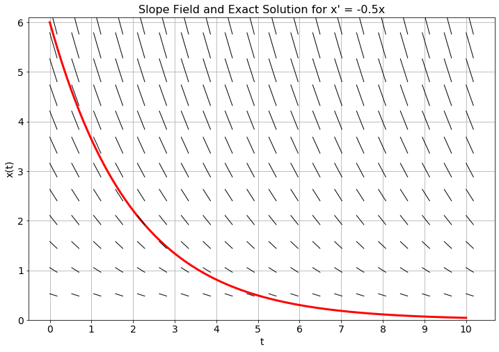
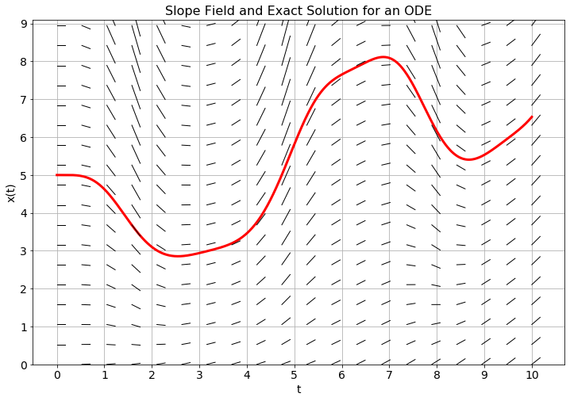
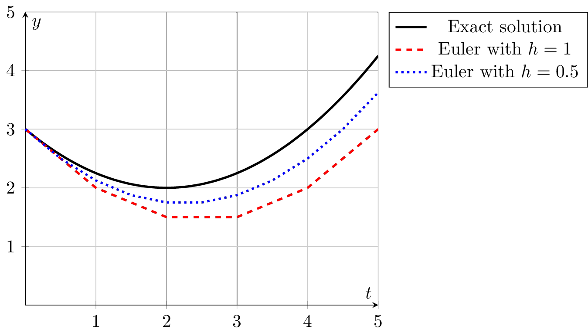

# ODE 1 {#sec-ode}

> *The mathematical discipline of differential equations furnishes the explanation of all those elementary manifestations of nature which involve time.*\
> --[Norwegian Mathematician Sophus Lie](https://en.wikipedia.org/wiki/Sophus_Lie)

The topic of this chapter is to find *approximate solutions* to *ordinary differential equations*.

Let us briefly recall what an ordinary differential equation (ODE) is. A
rather arbitrarily chosen example for an ODE (here, of second order) is
$$
y''(x) +  4 y'(x) + \sqrt[3]{y(x)} + \cos(x) = 0.
$$ {#eq-odeexample}
Equations like
this are normally satisfied by many functions $y(x)$: the problem has
many solutions. In order to specify a uniquely solvable problem, one
needs to fix *initial values*, i.e., the value of $y$ and its first
derivative at some point, say, at $x=0$:
$$
y''(x) +  4 y'(x) + \sqrt[3]{y(x)} + \cos(x) = 0, \quad y(0)=1,\; y'(0)=-2.
$$ {#eq-ivpexample}
This is a so-called *initial-value problem* (IVP). Another variant is to
specify the value of $y(x)$, but not of its derivative, at two different
points:
$$
y''(x) +  4 y'(x) + \sqrt[3]{y(x)} + \cos(x) = 0, \quad y(0)=2,\; y(1)=1.
$$ {#eq-bvpexample}
This is called a *boundary value problem* (BVP).

Both IVPs and BVPs have a unique solution (under certain mathematical
conditions). However, while one can show on abstract grounds that these
solutions exist, it is often not practicable to find an explicit
expression for them. The best one can hope for is to approximate the
solution numerically.

So what *is* a numerical solution to a differential equation?\
When solving a differential equation with analytic techniques the goal is to find an expression for the solution in terms of known functions. In a numerical solution the goal is typically to divide the domain for the solution function into a fine partition by introducing a grid of points, just like we did with numerical differentiation and integration, and then to approximate the solution to the differential equation at each point in that partition. Hence, the end result will be a list of approximate solution values at the grid points.

In this chapter we will examine some of the more common ways to create approximations of solutions to initial value problems. Moreover, we will lean heavily on Taylor Series to give us ways to accurately measure the order of the errors that we make in the process.

In this chapter we will often think of the argument of the function described by the ODE as time, but of course the methods are agnostic to the interpretation of the independent variable.

We will first concentrate on first-order differential equations of the form $x' = f(x)$. The geometric interpretation of this is that we are looking for a function $x(t)$ whose slope at every $x$ is known to us, given by $f(x)$.

## Euler's Method

::: {#exr-5.9}
🖋 Consider the differential equation $x' = -0.5x$ with the initial condition $x(0) = 6$.

a.  Since we know that $x(0) = 6$ and we know that $x'(0) = -0.5 x(0)$ we can approximate the value of $x$ at some future time step. Let us go 1 unit forward in time. That is, approximate $x(1)$ knowing that $x(0) = 6$ and $x'(0) = -3$.\
    Hint: We know a value, a slope, and the size of the step that we would like to move in the $t$ direction.
\begin{equation}
x(1) \approx \underline{\hspace{1in}}
\end{equation}


b. Use your answer from part (a) for time $t=1$ to approximate the $x$ value at time $t=2$. Then use that value to approximate the value at time $t=3$. Repeat the process to approximate the value of $x$ at times $t=2, 3, 4$. Record your answers in the table below. Then find the analytic solution to this differential equation and record the $x$ values at the appropriate times.

| $t$                     | **0** | **1** | **2** | **3** | **4** |
|-------------------------|-------|-------|-------|-------|-------|
| Approximation of $x(t)$ | 6     |       |       |       |       |
| Exact value of $x(t)$   | 6     |       |       |       |       |

c.  The "approximations of $x$" that you found in part (b) are a **numerical approximation** of the solution to the differential equation. You should notice that your numerical solution is pretty far off from the actual solution for most values of $t$. Why? What could be the sources of this error and how could we fix it?

d.  In @fig-5.1 you see a slope field and the exact solution to the differential equation $x' = -0.5x$ with $x(0) = 6$. Mark your approximate solutions at times $t=1$, $t=2$, $\ldots$, $t=4$ on the plot and connect them with straight lines.

    1.  Why are we using straight lines to connect the points?

    2.  What do you notice about your approximate solutions?

    3.  Why is it helpful to have the slope field in the background on this plot?

{#fig-5.1 alt="Plot your approximate solution on top of the slope field and the exact solution."}

:::

------------------------------------------------------------------------

::: {#exr-5.10}
🖋 In @fig-5.2 you see the analytic solution with initial condition $x(0)=5$ and a slope field for an unknown differential equation.

a.  Use the slope field and a step size of $\Delta t=1$ to plot approximate solution values at $t=1$, $t=2$, $\ldots$, $t=10$. Connect your points with straight lines. The collection of line segments that you just drew is an approximation to the solution of the unknown differential equation.

b.  Use the slope field and a step size of $\Delta t = 0.5$ to plot approximate solution values at $t=0.5$, $t=1$, $t=1.5$, $\ldots$, $t=10$. Again, connect your points with straight lines to get an approximation of the solution to the unknown differential equation.

c.  If you could take $\Delta t$ to be very very small, what difference would you see graphically between the exact solution and your collection of line segments? Why?

{#fig-5.2 alt="Plot your approximate solution on top of the slope field and the exact solution."}

:::

------------------------------------------------------------------------

The notion of approximating solutions to differential equations is simple in principle:

-   make a discrete approximation to the derivative and

-   step forward through time as a difference equation.

The challenging part is making the approximation to the derivative(s). There are many methods for approximating derivatives, and that is exactly where we will start.

------------------------------------------------------------------------

::: {#def-5.4}
#### Euler's Method
Euler's Method is a technique for approximating the solution to the differential equation $x'(t) = f(t,x(t))$. Recall from @exr-3.11 that the first derivative of a function can be discretized as
\begin{equation}
x'(t) = \frac{x(t+h) - x(t)}{h} + \mathcal{O}(h)
\end{equation}
 where $h = \Delta t$ is the step size (or the size of each partition in the domain), so the differential equation $x'(t) = f(t,x(t))$ becomes
\begin{equation}
\frac{x(t+h) - x(t)}{h} \approx f(t,x(t)).
\end{equation}
 Rewriting as a difference equation, letting $x_{n+1} = x(t_n+h)$ and $x_n = x(t_n)$, we get
\begin{equation}
x_{n+1} = x_n + h f(t_n,x_n)
\end{equation}


:::

------------------------------------------------------------------------

A way to think about Euler's method is that at a given point, the slope is approximated by the value of the right-hand side of the differential equation and then we step forward $h$ units in time following that slope. @fig-5.3 shows a depiction of the idea. Notice in the figure that in regions of high curvature Euler's method will deviate a lot from the exact solution to the differential equation. However, taking the limit as $h$ tends to $0$ theoretically gives the exact solution at the trade off of needing infinite computational resources.

{#fig-5.3 alt="Numerical solutions to a differential equation using Euler's method."}

------------------------------------------------------------------------

::: {#exr-5.11}
💬 Why would Euler's method do poorly in regions where the solution exhibits high curvature?

:::

------------------------------------------------------------------------

::: {#exr-5.11b}

🖋 🎓 Consider the differential equation $x'(t) = -2x(t)/3 + 4t$ with initial condition $x(0)=6$. By hand perform four steps of the Euler method with stepsize $h=1/2$ to obtain an approximation for $x(1/2),x(1),x(3/2)$ and $x(2)$.

:::

------------------------------------------------------------------------

::: {#exr-5.12}
💻 🎓 Write code to implement Euler's method for initial value problems. Your function should accept as input a Python function $f(t,x)$, an initial condition, a start time, an end time, and the value of $h = \Delta t$. The output should be vectors for $t$ and $x$ that you can easily plot to show the numerical solution. The code below will get you started.

``` python
def euler_1d(f, x0, t0, tmax, dt):
    """
    Solves a first-order ordinary differential equation using the Euler method.

    Parameters:
        f    : function, the function defining the differential equation. It should
               take two arguments, the independent variable t and the dependent
               variable x, and return the derivative of x with respect to t.
        x0   : float, the initial value of the dependent variable.
        t0   : float, the initial value of the independent variable.
        tmax : float, the maximum value of the independent variable.
        dt   : float, the time step.

    Returns:
       tuple containing two numpy arrays:
            - t : vector of time values.
            - x : vector of solution values at each time value.
    """
    # We need an integer number of steps so we round the number of steps
    # and then adjust dt to match.
    N = round((tmax - t0)/dt)
    dt = (tmax - t0)/N

    # Set up the time grid
    t = np.linspace(t0, tmax, N+1)
    # set up an array for x that is the same size as t
    x = np.zeros(len(t))

    # fill in the initial condition
    x[0] = ???

    for n in range(???): # think about how far we should loop
        # advance the solution forward in time with Euler
        x[n+1] = ???
    return t, x
```

:::

------------------------------------------------------------------------

::: {#exr-5.13}
💻 Test your code from the previous exercise on a first order differential equation where you know an analytic solution. For example you could use the differential equation
\begin{equation}
x' = -\frac{1}{3}x+\sin(t) \quad \text{where} \quad x(0) = 1.
\end{equation}
This has the analytic solution
\begin{equation}
x(t) = \frac{1}{10} \left( 19 e^{-t/3} + 3\sin(t) - 9\cos(t) \right).
\end{equation}
Make a plot of the approximate solution and the exact solution on the same plot
for $t\in[0,10]$
The partial code below should get you started.

``` python
import numpy as np
import matplotlib.pyplot as plt

# Define the function giving x' in terms of t and x
f = lambda t, x: ???
x0 = ???   # initial condition
t0 = ???   # initial time
tmax = ??? # final time
dt = ???   # time step (your choice, but make it small)
t, x = euler_1d(f, x0, t0, tmax, dt)
plt.plot(t, x, 'b-', label='Euler')

# Define a function giving the analytic solution
x_exact = lambda t: ???
# We will plot the exact solution at a higher resolution
t_highres = np.linspace(t0, tmax, 100)
plt.plot(t_highres, x_exact(t_highres), 'r--', label='Exact')
plt.grid()
plt.show()
```
Experiment with different values for `dt` and see how the numerical solution
changes.

:::

------------------------------------------------------------------------

::: {#exr-5.14}
💻 The goal of this problem will be to compare the maximum error when you solve the differential equation from the previous exercise on the interval $t \in [0,10]$ with the Euler method for various values of $\Delta t$.

Write a function that produces a plot with the value of $\Delta t$ on the horizontal axis and the value of the associated absolute error on the vertical axis. You should use a log-log plot. Obviously you will need to run your code many times at many different values of $\Delta t$ to build your data set. The following incomplete code will get you started.

``` python
# Create vector with different step sizes
dt = 10**(-np.linspace(0, 4, 50))
# Create vector with the same size as dt for holding the errors
errors = np.zeros_like(dt)
# Loop over the different step sizes to calculate the errors
for i in range(len(dt)):
    # Approximate the solution with Euler's method
    t, x = euler_1d(f, x0, t0, tmax, dt[i])
    errors[i] = ??? # Calculate maximum absolute error

# Plot the errors with logarithmic axes
plt.loglog(dt, errors)
plt.xlabel('Step size')
plt.ylabel('Maximum error')
plt.grid()
```

3.  What does the plot tell you? In general, if you were to divide your value of $\Delta t$ by 10, how much approximately does that reduce the error?

:::

------------------------------------------------------------------------

::: {#exr-5.15}
🖋 💬 🎓 Shelby solved a first order ODE $x' = f(t,x)$ using Euler's method with a step size of $dt = 0.1$ on a domain $t \in [0,3]$. To test her code she used a differential equation where she new the exact analytic solution and she found the maximum absolute error on the interval to be $0.15$. Jackson then solves the exact same differential equation, on the same interval, with the same initial condition using Euler's method and a step size of $dt = 0.01$. What would be your best estimate of Jackson's maximum absolute error?

:::

------------------------------------------------------------------------

::: {#thm-5.2}
Euler's method is a first order method for approximating the solution to the differential equation $x' = f(t,x)$. Hence, if the step size $h$ of the partition of the domain were to be divided by some positive constant $M$ then the maximum absolute error between the numerical solution and the exact solution would ???\
(Complete the last sentence.)

:::

------------------------------------------------------------------------

## Higher-order equations and systems of equations

::: {#exr-5.17}
#### Harmonic Oscillator

🖋 💻 If a mass is hanging from a spring then Newton's second law, $\sum F=ma$, gives us the differential equation $mx'' = F_{restoring} + F_{damping}$ where $x$ is the displacement of the mass from equilibrium, $m$ is the mass of the object hanging from the spring, $F_{restoring}$ is the force pulling the mass back to equilibrium, and $F_{damping}$ is the force due to friction or air resistance that slows the mass down.

1.  Which of the following is a good candidate for a restoring force in a spring? Defend your answer.

    a.  $F_{restoring} = -kx$: The restoring force is proportional to the displacement away from equilibrium.

    b.  $F_{restoring} = -kx'$: The restoring force is proportional to the velocity of the mass.

    c.  $F_{restoring} = -kx''$: The restoring force is proportional to the acceleration of the mass.

2.  Which of the following is a good candidate for a damping force in a spring? Defend your answer.

    a.  $F_{damping} = -bx$: The damping force is proportional to the displacement away from equilibrium.

    b.  $F_{damping} = -bx'$: The damping force is proportional to the velocity of the mass.

    c.  $F_{damping} = -bx''$: The damping force is proportional to the acceleration of the mass.

3.  Put your answers to parts (1) and (2) together and simplify to form a second-order differential equation for position:
\begin{equation}
 \underline{\hspace{0.25in}} x'' = \underline{\hspace{0.25in}} x' + \underline{\hspace{0.25in}} x
\end{equation}


4. 🎓 If we want to solve a second order differential equation numerically we need to convert it to first order differential equations (Euler's method is only designed to deal with first order differential equations, not second order). To do so we can introduce a new variable, $x_1$, such that $x_1 = x'$. For the sake of notational consistency we define $x_0 = x$. The result is a system of first-order differential equations.
\begin{equation}
\begin{aligned} x_0' &= x_1 \\ x_1' &= \underline{\hspace{2in}}\end{aligned}
\end{equation}


5.  The code and Euler's method algorithm that we have created thus far in this chapter are only designed to work with a single differential equation instead of a system, so we need to make some modifications. We can discretize the system of differential equations using Euler's method so that
\begin{equation}
 \boldsymbol{x}' = F(t,\boldsymbol{x})
\end{equation}
 where $F$ is a function that accepts a vector of inputs, plus time, and returns a vector of outputs. In the context of this particular problem,
\begin{equation}
 F(t,\boldsymbol{x}) = \begin{pmatrix} x_0' \\ x_1' \end{pmatrix} = \begin{pmatrix} x_1 \\ \underline{\hspace{1in}} \end{pmatrix}
\end{equation}


6.  We now need to discretize the derivatives in the system. As with 1D Euler's method, we will use a first-order approximation of the first derivative so that
\begin{equation}
 \frac{\boldsymbol{x}_{n+1} - \boldsymbol{x}_n }{h} = F(t_n,\boldsymbol{x}_n) + \mathcal{O}(h).
\end{equation}
 Rearranging and solving for $\boldsymbol{x}_{n+1}$ gives
\begin{equation}
 \boldsymbol{x}_{n+1} = \underline{\hspace{0.5in}} + h F( \underline{\hspace{0.25in}} , \underline{\hspace{0.25in}}).
\end{equation}


8.  The following Python function will implement Euler's method. Complete the code.

``` python
def euler(F, x0, t0, tmax, dt):
    """
    Solves a system of first-order ordinary differential equations
    using the Euler method.

    Parameters:
        F : function, the function defining the system of differential equations.
            It should take two arguments, the independent variable t and the
            dependent variable x (as a 1D numpy array), and return the
            derivative of x with respect to t (as a 1D numpy array).
        x0 : numpy vector, the initial values of the dependent variables.
        t0 : float, the initial value of the independent variable.
        tmax : float, the maximum value of the independent variable.
        dt : float, the time step.

    Returns:
        tuple containing two numpy arrays:
            - t : vector of time values.
            - x : array of solutions at each time value. Each column of x
                  corresponds to a different dependent variable.
    """
    # We need an integer number of steps so we round the number of steps
    # and then adjust dt to match.
    N = round((tmax - t0)/dt)
    dt = (tmax - t0)/N
    # Set up the time grid
    t = ???
    # set up an array for x with one row for each dependent variable and one column
    # for each grid point
    x = np.zeros((len(t), len(x0)))
    # store the initial condition in the first row of x
    x[0, :] = x0
    # loop over the different time steps
    for n in range(???):
        x[n+1, :] = x[???, ???] + dt * F(t[???], x[???, ???])
    return t, x
```

8. To use the `euler()` function to solve the system of equations from part (4), complete the following code. Use a mass of $m=2$kg, a damping force of $b=40$kg/s, and a spring constant of $k=128$N/m. Consider an initial position of $x=0$ (equilibrium) and an initial velocity of $x_1 = 0.6$m/s.

``` python
m = 2
b = 40
k = 128
F = lambda t, x: np.array([x[1], ???])
x0 = [???, ???] # initial conditions
t0 = 0
tmax = 5  # pick something reasonable here
dt = 0.01 # your choice.  pick something small
t, x = euler(F, x0, t0, tmax, dt)
```

9. 🎓 Complete the following code to make a plot that shows both position and velocity versus time.

``` python
plt.plot(t, x[???, ???], 'b-', t, x[???, ???], 'r--')
plt.grid()
plt.title('Time Evolution of Position and Velocity')
plt.legend(['which legend entry here','which legend entry here'])
plt.xlabel('time')
plt.ylabel('position and velocity')
plt.show()
```

10. Complete the following code to make a second plot, called a phase plot, that shows position versus velocity. In a phase plot, time is implicit (not one of the axes).

``` python
plt.plot(x[???, ???], x[???, ???])
plt.grid()
plt.title('Phase Plot')
plt.xlabel('???')
plt.ylabel('???')
plt.show()
```

:::

------------------------------------------------------------------------

::: {#exr-5.21}
#### A Lotka-Volterra Predator-Prey Model
🖋 💻 🎓 Let $x_0(t)$ denote the number of rabbits (prey) and $x_1(t)$ denote the number of foxes (predator) at time $t$. The relationship between the species can be modelled by the classic 1920's Lotka-Volterra Model: 
\begin{equation}
\left\{ \begin{array}{ll} x_0' &= \alpha x_0 - \beta x_0 x_1 \\ x_1' &= \delta x_0 x_1 - \gamma x_1 \end{array} \right.
\end{equation}
 where $\alpha, \beta, \gamma,$ and $\delta$ are positive constants. For this problems take $\alpha =1$, $\beta \approx 0.1$, $\gamma =1$, and $\delta =0.1$.

1.  First rewrite the system of ODEs in the form $\boldsymbol{x}' = F(t,\boldsymbol{x})$ so you can use your `euler()` code.

2.  Modify your code from the previous problem so that it works for this problem. Use `tmax = 20` and `dt = 0.05`. Start with initial conditions $x_0(0)=10$ rabbits and $x_1(0)=5$ foxes.

3.  Create the time evolution plot. What does this plot tell you in context?

4.  Create a phase plot. What does this plot tell you in context?

5.  If you decrease the step size by a factor of 10, what do you see in the two plots? Why?

:::

------------------------------------------------------------------------


## The Midpoint Method

Now we get to improve upon Euler's method. There is a long history of wonderful improvements to the classic Euler's method -- some that work in special cases, some that resolve areas where the error is going to be high, and some that are great for general purpose numerical solutions to ODEs with relatively high accuracy. In this section we will make a simple modification to Euler's method that has a surprisingly great pay-off in the error rate.

------------------------------------------------------------------------

::: {#exr-5.23}
💬 In Euler's method, if we are at the point $t_n$ then we approximate the slope $x'(t_n) = f(t_n,x_n)$ and use the slope to propagate forward one time step. As you have seen, this method can lead to an overshooting of the exact solution in regions of high curvature. It would be nice to be able to look into the future and get a better approximation of the slope so that we did not miss upcoming curvature. If you could build such a method that looks in to the future, finds a slope in the future, and then uses that slope (instead of the slope from Euler's method) to advance forward in time, how far into the future would you look? Why?

:::

------------------------------------------------------------------------

::: {#exr-5.24}
🖋 💬 Let us return to the simple differential equation $x' = -0.5x$ with $x(0) = 6$ that we saw in @exr-5.9. Now we will propose a slightly different method for approximating the solution.

a.  At $t=0$ we know that $x(0)=6$. If we use the slope at time $t=0$ to step forward in time then we will get the Euler approximation of the solution. Consider this alternative approach:

    -   Use the slope at time $t=0$ and move *half* a step forward.

    -   Find the slope at the half-way point

    -   Then use the slope from the half way point to go a full step forward from time $t=0$.

    Perhaps a bit confusing ...let us build this idea together:

    -   What is the slope at time $t=0$? $x'(0) = \underline{\hspace{0.5in}}$

    -   Use this slope to step a half step forward and find the $x$ value: $x(0.5) \approx \underline{\hspace{0.5in}}$

    -   Now use the differential equation to find the slope at time $t=0.5$. $x'(0.5) = \underline{\hspace{0.5in}}$

    -   Now take your answer from the previous step, and go one full step forward from time $t=0$. What $x$ value do you end up with?

    -   Your answers to the previous bullets should be: $x'(0) = -3$, $x(0.5) \approx 4.5$, $x'(0.5) = -2.25$, so if we take a full step forward with slope $m=-2.25$ starting from $t=0$ we get $x(1) \approx 3.75$.

b.  Repeat the process outlined in part (a) to approximate the solution to the differential equation at times $t=2, 3, 4$. Also record the exact answer at each of these times by noting that the exact solution is $x(t) = 6e^{-0.5t}$.

| $t$                    | **0** | **1** | **2** | **3** | **4** |
|------------------------|-------|-------|-------|-------|-------|
| Euler approx of $x(t)$ | 6     |       |       |       |       |
| New approx of $x(t)$   | 6     |       |       |       |       |
| Exact value of $x(t)$  | 6     |       |       |       |       |

c.  Draw a clear picture of what this method is doing in order to approximate the slope at each individual step.

d.  How does your approximation compare to the Euler approximation that you found in @exr-5.9?

:::

------------------------------------------------------------------------

::: {#def-5.5}
#### The Midpoint Method
The midpoint method is defined by first taking a half step with Euler's method to approximate a solution at time $t_{n+1/2}$. There is no grid point at
$t_{n+1/2}$ so we define this as
$$
t_{n+1/2} = (t_n + t_{n+1})/2.
$$
We then take a full step using the value of $f$ at $t_{n+1/2}$ and the approximate $x_{n+1/2}$.
$$
\begin{split}
x_{n+1/2} &= x_n + \frac{h}{2} f(t_n,x_n) \\ x_{n+1} &= x_n + h f(t_{n+1/2},x_{n+1/2})
\end{split}
$$


:::

------------------------------------------------------------------------

::: {#exr-5.25a}
🖋 🎓 As in in @exr-5.11b, consider the differential equation $x'(t) = -2x(t)/3 + 4t$ with initial condition $x(0)=6$. By hand perform one step of the midpoint method with stepsize $h=1$ to obtain an approximation for $x(1)$.

:::

------------------------------------------------------------------------

::: {#exr-5.25}
💻 Complete the code below to implement the midpoint method in one dimension.

``` python
def midpoint_1d(f, x0, t0, tmax, dt):
    """
    Solves a first-order ordinary differential equation using
    the midpoint method.

    Parameters:
        f    : function, the function defining the differential equation. It should
               take two arguments, the independent variable t and the dependent
               variable x, and return the derivative of x with respect to t.
        x0   : float, the initial value of the dependent variable.
        t0   : float, the initial value of the independent variable.
        tmax : float, the maximum value of the independent variable.
        dt   : float, the time step.

    Returns:
       tuple containing two numpy arrays:
            - t : vector of time values.
            - x : vector of solution values at each time value.
    """
    N = round((tmax - t0)/dt)
    dt = (tmax - t0)/N
    t = ??? # build the times
    x = ??? # build an array for the x values
    x[0] = # save the initial condition
    # On the next line: be careful about how far you're looping
    for n in range(???):
        slope = ??? # get the slope at the current point
        x_halfstep = ??? # take a half step forward
        x[n+1] = ??? # take a full step forward
    return t, x
```

Test your code on several differential equations where you know the solution (just to be sure that it is working).

``` python
f = lambda t, x: # your ODE right hand side goes here
x0 = # initial condition
t0 = 0
tmax = # ending time (up to you)
dt = # pick something small
t, x = midpoint_1d(???, ???, ???, ???, ???)
plt.plot(???, ???, ???)
x_exact = lambda t: # your exact solution goes here
plt.plot(???, ???, ???)
plt.legend(['Midpoint', 'Exact'])
plt.grid()
plt.show()
```

🎓 Also apply your method to the question in the feedback quiz.
:::

------------------------------------------------------------------------

::: {#exr-5.26}
💻 💬 🎓 The goal in building the midpoint method was to hopefully capture some of the upcoming curvature in the solution before we overshot it. Consider the differential equation $x' = -\frac{1}{3}x + \sin(t)$ with initial condition $x(0) = 1$ on the domain $t \in [0,10]$ as in @exr-5.13. First get a numerical solution with Euler's method using $\Delta t = 1$. Then get a numerical solution with the midpoint method using the same value for $\Delta t = 1$. Plot the two solutions on top of each other along with the exact solution 
\begin{equation}
 x(t) = \frac{1}{10} \left( 19e^{-t/3} + 3\sin(t) - 9\cos(t) \right).
\end{equation}
What do you observe?

:::

------------------------------------------------------------------------

::: {#exr-5.27}
💻 🎓 Repeat @exr-5.14 with the midpoint method. Compare your results to what you found with Euler's method.
Then use what you have discovered to answer the following, similar to @exr-5.15:

Shelby solved a first order ODE $x' = f(t,x)$ using the midpoint method with a step size of $dt = 0.1$ on a domain $t \in [0,3]$. To test her code she used a differential equation where she new the exact analytic solution and she found the maximum absolute error on the interval to be $0.15$. Jackson then solves the exact same differential equation, on the same interval, with the same initial condition using the midpoint method and a step size of $dt = 0.01$. What would be your best estimate of Jackson's maximum absolute error?

:::

------------------------------------------------------------------------

::: {#exr-5.28}
💬 We have studied two methods thus far: Euler's method and the Midpoint method. In @fig-euler-midpoint we see a graphical depiction of how each method works on the differential equation $y' = y$ with $\Delta t = 1$ and $y(0) = 1$. The exact solution at $t=1$ is $y(1) = e^1 \approx 2.718$ and is shown in red in each figure. The methods can be summarized in the table below.

Discuss what you observe as the pros and cons of each method based on the table and on the Figure.

| **Euler's Method**                        | **Midpoint Method**                                              |
|--------------------------------------------|------------------------------------------------------------------|
| 1\. Get the slope at time $t_n$          | 1\. Get the slope at time $t_n$                                |
| 2\. Follow the slope for time $\Delta t$ | 2\. Follow the slope for time $\Delta t/2$                     |
|                                            | 3\. Get the slope at the point $t_n + \Delta t/2$              |
|                                            | 4\. Follow the new slope from time $t_n$ for time $\Delta t$ |

When might you want to use Euler's method instead of the midpoint method? When might you want to use the midpoint method instead of Euler's method?

``` {python}
#| label: fig-euler-midpoint
#| fig-cap: Graphical depictions of two numerical methods. Euler (left) and Midpoint (right). The exact solution is shown in red.
#| fig-alt: Graphical depictions of two numerical methods. Euler (left) and Midpoint (right).
#| echo: false
import numpy as np
import matplotlib.pyplot as plt

# Define the exact solution and derivative
f = lambda x, y: y
exact_solution = lambda x: np.exp(x)

# Initial condition
x0, y0 = 0, 1
h = 1  # step size

# Euler method
x1 = x0 + h
y1_euler = y0 + h * f(x0, y0)

# Midpoint method
x_mid = x0 + h/2
y_mid = y0 + h/2 * f(x0, y0)
y1_midpoint = y0 + h * f(x_mid, y_mid)

# Exact solution at x=1
y_exact = exact_solution(1)

# Set up the plot
fig, axs = plt.subplots(1, 2, figsize=(8,4), sharey=True)

# ---------- Euler Method Plot ----------
ax = axs[0]
ax.plot([x0, x1], [y0, y1_euler], 'b-', label="Euler step", linewidth=2)
ax.plot(x1, y1_euler, 'bo')
ax.text(x1 - 0.1, y1_euler + 0.1, f"({x1}, {y1_euler:.1f})", color='blue', fontsize=18)

# Slope arrow
ax.annotate("", xy=(x1, y1_euler), xytext=(x0, y0),
            arrowprops=dict(arrowstyle='->', color='blue', lw=2))
ax.text(0.35, 1.2, r'slope=1', fontsize=20)

# Exact solution
x_vals = np.linspace(0, 1.2, 100)
ax.plot(x_vals, exact_solution(x_vals), 'r--', linewidth=2)
ax.plot(1, y_exact, 'ro')
ax.text(0.8, y_exact + 0.1, f"(1, {y_exact:.2f})", color='red', fontsize=18)

ax.set_title("Euler", fontsize=18)
ax.set_xlim(0, 1.2)
ax.set_ylim(0.8, 3)
ax.grid(True)
ax.tick_params(labelsize=14)

# ---------- Midpoint Method Plot ----------
ax = axs[1]
ax.plot([x0, x1], [y0, y1_midpoint], 'g-', label="Midpoint step", linewidth=2)
ax.plot(x1, y1_midpoint, 'go')
ax.text(x1 - 0.06, y1_midpoint - 0.2, f"({x1}, {y1_midpoint:.1f})", color='green', fontsize=18)

# Midpoint estimation
ax.plot(x_mid, y_mid, 'bo')
ax.text(x_mid, y_mid + 0.1, f"({x_mid:.1f}, {y_mid:.1f})", color='blue', fontsize=18)
ax.text(0.5, 1.4, r'slope=1.5', fontsize=20)

# Add arrow to midpoint
ax.annotate("", xy=(x_mid, y_mid), xytext=(x0, y0),
            arrowprops=dict(arrowstyle='->', color='blue', lw=2))

# Add short slope line at midpoint
slope = f(x_mid, y_mid)
dx = 0.2
dy = slope * dx
ax.plot([x_mid - dx/2, x_mid + dx/2], [y_mid - dy/2, y_mid + dy/2], 'g-', linewidth=2)

# Exact solution
ax.plot(x_vals, exact_solution(x_vals), 'r--', linewidth=2)
ax.plot(1, y_exact, 'ro')
ax.text(0.8, y_exact + 0.1, f"(1, {y_exact:.2f})", color='red', fontsize=18)

ax.set_title("Midpoint", fontsize=18)
ax.set_xlim(0, 1.2)
ax.set_ylim(0.8, 3)
ax.grid(True)
ax.tick_params(labelsize=14)

# Overall formatting
for ax in axs:
    ax.axhline(0, color='black', lw=1.5)
    ax.axvline(0, color='black', lw=1.5)

plt.tight_layout()
plt.show()
```

:::

------------------------------------------------------------------------

::: {#exr-5.30}
#### Midpoint Method in Several Dimensions
💻 🎓 Write a function `midpoint()` that can solve a system of first-order ordinary differential equations using the midpoint method. Base your code on the `euler()` code from @exr-5.17 . You should only have to add one line of code and then be careful about the size of the arrays that are in play. Test your code on several problems. Compare and contrast what you see with your Euler solutions and with your Midpoint solutions.

:::


------------------------------------------------------------------------

## Numerical Instabilities {#sec-instabilities}

This section is for discovery only. The theory behind what you are about to discover will be presented in a later chapter.

::: {#exr-5.40}
🖋 Consider the differential equation $x' = -3x$ with initial condition $x(0) = 1$. The exact solution is the exponentially decaying function $x(t) = e^{-3t}$, which quickly approaches 0 as $t$ gets larger.

a.  Use Euler's method by hand to approximate $x(0.1)$, $x(0.2)$, and $x(0.3)$ using a stepsize of $\Delta t=0.1$. Does the numerical solution appear to be decaying towards 0?

b.  Now use Euler's method by hand to approximate $x(1)$, $x(2)$, and $x(3)$ using a stepsize of $\Delta t=1$. What happens to the values of $x$? Does it look like the exact solution?
:::

------------------------------------------------------------------------

::: {#exr-5.41}
💻 💬 The phenomenon you just discovered is called *numerical instability*. It occurs when the stepsize is too large, causing the numerical solution to oscillate or grow exponentially even when the exact solution decays.

a.  Use your `euler_1d` function to solve the same differential equation $x' = -3x$ with $x(0) = 1$ on the interval $t \in [0, 10]$. Run it for different values of the stepsize $\Delta t$, for example $\Delta t \in \{0.1, 0.5, 0.7, 1.0\}$.

b.  Plot the numerical solutions along with the exact solution $x(t) = e^{-3t}$ on the same graph. (You might want to limit the y-axis using `plt.ylim(-5, 5)` to see the details before it blows up completely.)

c.  What is the limit on the stepsize $\Delta t$ before the numerical solution completely loses its mind and grows exponentially? (Experiment with `dt` between 0.5 and 0.7 to find the exact threshold).

d.  Try the same experiment using your `midpoint_1d` function. Does the midpoint method also suffer from numerical instability? If so, what is the critical stepsize for the midpoint method on this problem?
:::

------------------------------------------------------------------------

::: {#exr-5.42}
💬 Based on your observations in the previous exercises, what is the danger of blindly trusting a numerical solution without considering the stepsize? How might you check if your numerical solution is stable in practice if you don't know the exact solution?
:::

------------------------------------------------------------------------

## Algorithm Summaries {#sec-alg-summaries-ode1}

::: {#exr-5.59}
🖋 Consider the first-order differential equation $x' = f(t,x)$. What is Euler's method for approximating the solution to this differential equation? What is the order of accuracy of Euler's method? Explain the meaning of the order of the method in the context of solving a differential equation.

:::

------------------------------------------------------------------------

::: {#exr-5.60}
🖋 Explain in clear language what Euler's method does geometrically.

:::

------------------------------------------------------------------------

::: {#exr-5.61}
🖋 Consider the first-order differential equation $x' = f(t,x)$. What is the Midpoint method for approximating the solution to this differential equation? What is the order of accuracy of the Midpoint method?

:::

------------------------------------------------------------------------

::: {#exr-5.62}
🖋 Explain in clear language what the Midpoint method does geometrically.

:::

------------------------------------------------------------------------

## Exam-Style Question

(a) Explain what is meant by *numerical instability* when solving an ordinary differential equation using an explicit finite-difference scheme. What happens to the numerical solution, and how can it be avoided? [3 marks]

(b) Consider the ordinary differential equation $x' = -2x + t$ with initial condition $x(0) = 1$. Perform one step of Euler's method with a step size of $h=0.5$ to find an approximation for $x(0.5)$. [2 marks]

(c) Now perform one step of the Midpoint method with a step size of $h=0.5$ to find an approximation for $x(0.5)$ for the same initial value problem. [3 marks]

(d) The following incomplete Python code computes the numerical solution to the differential equation $x'=f(t,x)$ using the Midpoint method. Provide the missing code indicated by `...`. [3 marks]

``` python
import numpy as np

def midpoint_1d(f, x0, t0, tmax, dt):
    """
    Solves a first-order ordinary differential equation using the midpoint method.
    """
    N = round((tmax - t0)/dt)
    dt = (tmax - t0)/N
    t = np.linspace(t0, tmax, N+1)
    x = np.zeros(len(t))
    x[0] = x0

    for n in range(len(t) - 1):
        slope = ...
        x_halfstep = ...
        x[n+1] = ...

    return t, x
```

## Problems

::: {#exr-5.22}
#### The SIR Model
💻 A classic model for predicting the spread of a virus or a disease is the SIR Model. In these models, $S$ stands for the proportion of the population which is susceptible to the virus, $I$ is the proportion of the population that is currently infected with the virus, and $R$ is the proportion of the population that has recovered from the virus. The idea behind the model is that

-   Susceptible people become infected by having interaction with the infected people. Hence, the rate of change of the susceptible people is proportional to the number of interactions that can occur between the $S$ and the $I$ populations.\

\begin{equation}
 S' = -\beta SI.
\end{equation}

-   The infected population gains people from the interactions with the susceptible people, but at the same time, infected people recover at a predictable rate.
\begin{equation}
 I' = \beta SI - \gamma I.
\end{equation}

-   The people in the recovered class are then immune to the virus, so the recovered class $R$ only gains people from the recoveries from the $I$ class.
\begin{equation}
 R' = \gamma I.
\end{equation}


Find a numerical solution to the system of equations using your `euler()` function. Use the parameters $\beta = 0.0003$ and $\gamma = 0.1$ with initial conditions $S(0) = 999$, $I(0) = 1$, and $R(0) = 0$. Plot the solution against time. Explain all three curves in context.

:::

------------------------------------------------------------------------


::: {#exr-5.68}
🖋 💻 Consider the differential equation $x'' + x' + x = 0$ with initial conditions $x(0) = 0$ and $x'(0)=1$.

1.  Solve this differential equation by hand using any appropriate technique. Show your work.

2.  Write code to demonstrate the first order convergence rate of Euler's method and the second order convergence rate of the Midpoint method. Take note that this is a second order differential equation so you will need to start by converting it to a system of differential equations. Then take care that you are comparing the correct term from the numerical solution to your analytic solution in part (1).

:::

------------------------------------------------------------------------

::: {#exr-5.70}
💻 💬 Two versions of Python code for one dimensional Euler's method are given below. Compare and contrast the two implementations. What are the advantages / disadvantages to one over the other? Once you have made your pro/con list, devise an experiment to see which of the methods will actually perform faster when solving a differential equation with a very small $\Delta t$. (You may want to look up how to time the execution of code in Python.)

``` python
def euler(f,x0,t0,tmax,dt):
    t = [t0]
    x = [x0]
    steps = int(np.floor((tmax-t0)/dt))
    for n in range(steps):
        t.append(t[n] + dt)
        x.append(x[n] + dt*f(t[n],x[n]))
    return t, x
```

``` python
def euler(f,x0,t0,tmax,dt):
    N = round((tmax - t0)/dt)
    dt = (tmax - t0)/N
    t = np.linspace(t0, tmax, N+1)
    x = np.zeros(len(t))
    x[0] = x0
    for n in range(len(t)-1):
        x[n+1] = x[n] + dt*f(t[n],x[n])
    return t, x
```

:::

------------------------------------------------------------------------

::: {#exr-5.73}
💻 In this model there are two characters, Romeo and Juliet, whose affection is quantified on the scale from $-5$ to $5$ described below:

-   $-5$: Hysterical Hatred

-   $-2.5$: Disgust

-   $0$: Indifference

-   $2.5$: Sweet Affection

-   $5$: Ecstatic Love

The characters struggle with frustrated love due to the lack of reciprocity of their feelings. Mathematically,

-   Romeo: "My feelings for Juliet decrease in proportion to her love for me."

-   Juliet: "My love for Romeo grows in proportion to his love for me."

-   Juliet's emotional swings lead to many sleepless nights, which consequently dampens her emotions.

This give rise to
\begin{equation}
\left\{ \begin{array}{ll} \frac{dx}{dt} &= -\alpha y \\ \frac{dy}{dt} &= \beta x - \gamma y^2 \end{array} \right.
\end{equation}
 where $x(t)$ is Romeo's love for Juliet and $y(t)$ is Juliet's love for Romeo at time $t$.

Your tasks:

1.  First implement this 2D system with $x(0) = 2$, $y(0)=0$, $\alpha=0.2$, $\beta=0.8$, and $\gamma=0.1$ for $t \in [0,60]$. What is the fate of this pair's love under these assumptions?

2.  Write code that approximates the parameter $\gamma$ that will result in Juliet having a feeling of indifference at $t=30$. Your code should not need human supervision: you should be able to tell it that you are looking for *indifference* at $t=30$ and turn it loose to find an approximation for $\gamma$. Assume throughout this problem that $\alpha=0.2$, $\beta=0.8$, $x(0)=2$, and $y(0)=0$.

:::

------------------------------------------------------------------------

::: {#exr-5.76}
💬 💻 (This problem is modified from [@Meerschaert])

One of the favourite foods of the blue whale is krill. Blue whales are baleen whales and feed almost exclusively on krill. These tiny shrimp-like creatures are devoured in massive amounts to provide the principal food source for the huge whales. In the absence of predators, in uncrowded conditions, the krill population density grows at a rate of 25% per year. The presence of 500 tons/acre of krill increases the blue whale population growth rate by 2% per year, and the presence of 150,000 blue whales decreases krill growth rate by 10% per year. The population of blue whales decreases at a rate of 5% per year in the absence of krill.

These assumptions yield a pair of differential equations (a Lotka-Volterra model) that describe the population of the blue whales ($B$) and the krill population density ($K$) over time given by
\begin{equation}
\begin{aligned} \frac{dB}{dt} &= -0.05B + \left( \frac{0.02}{500} \right) BK \\ \frac{dK}{dt} &= 0.25K - \left( \frac{0.10}{150000} \right) BK. \end{aligned}
\end{equation}


1.  What are the units of $\frac{dB}{dt}$ and $\frac{dK}{dt}$?

2.  Explain what each of the four terms on the right-hand sides of the differential equations mean in the context of the problem. Include a reason for why each term is positive or negative.

3.  Find a numerical solution to the differential equation model using $B(0) = 75,000$ whales and $K(0) = 150$ tons per acre.

4.  Whaling is a huge concern in the oceans world wide. Implement a *harvesting* term into the whale differential equation, defend your mathematical choices and provide a thorough exploration of any parameters that are introduced.

:::

------------------------------------------------------------------------
