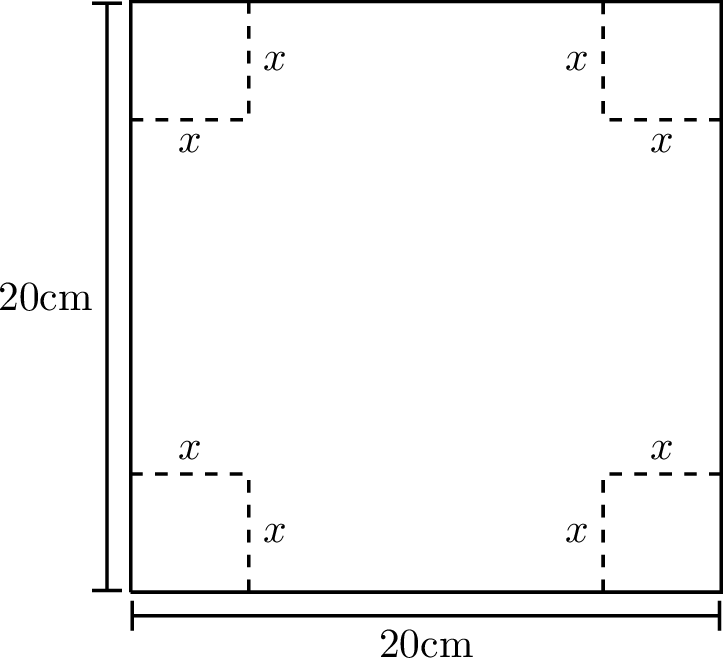
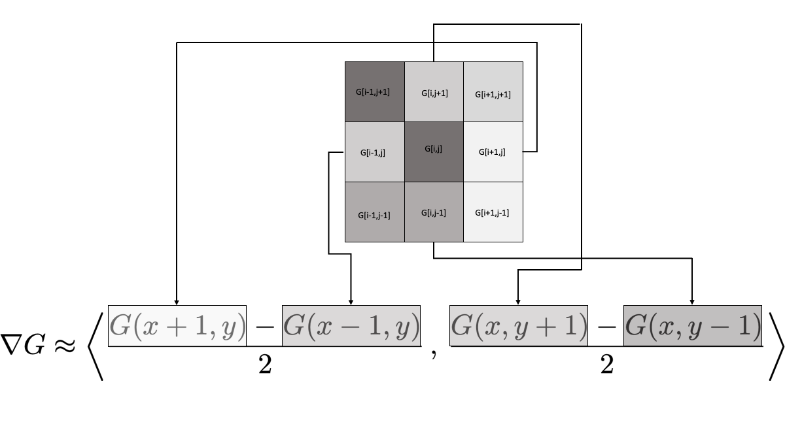
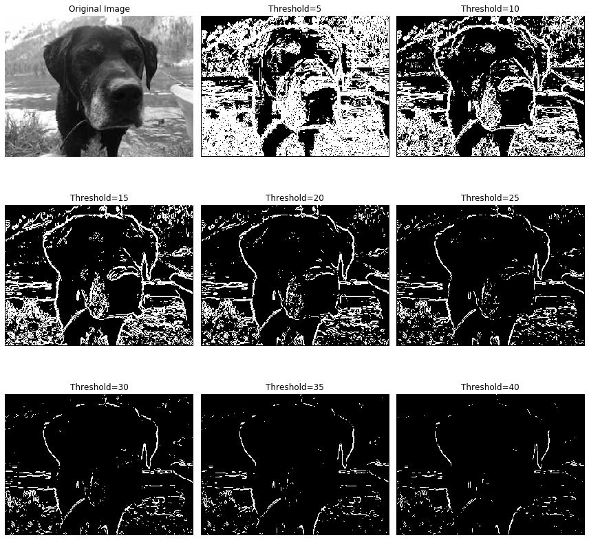

# Optimisation {#sec-optim}

> *It is not enough to do your best; you must know what to do, and then do your best.*\
> --[W. Edwards Deming](https://en.wikipedia.org/wiki/W._Edwards_Deming)


In applied mathematics we are often not interested in all solutions of a problem but in the optimal solution. Optimisation therefore permeates many areas of mathematics and science. In this section we will look at a few examples of optimisation problems and the numerical methods that can be used to solve them.

While working through this chapter on finding optima you will often be reminded of your work in @sec-roots1 and @sec-roots2 on finding roots. So I hope this chapter will also consolidate your understanding of those earlier chapters.

------------------------------------------------------------------------

## Single Variable Optimisation {#sec-1D-optimisation}

Let us start with solving optimisation problems where the quantity to be optimised is a function of a single variable. We'll later optimise over multiple variables in @sec-multiopt.

::: {#exr-3.48}
🖋 Here is an atypically easy optimisation problem that you can quickly do by hand:

 A piece of cardboard measuring 20cm by 20cm is to be cut so that it can be folded into a box without a lid (see @fig-3.8). We want to find the size of the cut, $x$, that maximises the volume of the box.

1.  Write a function $V(x)$for the volume of the box resulting from a cut of size $x$. What is the domain of your function?

2.  We know that we want to maximise this function so go through the full Calculus exercise to find the maximum:

    -   take the derivative $V'(x)$,

    -   set it to zero to find the critical points,

    -   determine the critical point that gives the maximum volume.

    Check that your answer is $10/3$.

{#fig-3.8 alt="Folds to make a cardboard box" height=6cm}
:::

------------------------------------------------------------------------

An optimisation problem is approached by first writing the quantity you want to optimise as a function of the parameters of the model. 
In the previous exercise that was the function $V(x)$ that gives the volume of the box as a function of the parameter $x$, which was the length of the cut. That function then needs to be maximised (or minimised, depending on what is optimal). 

Clearly any method for finding the minimum of a function can be used to find the maximum of a function because the maximum of a function $f$ is exactly at the same point as the minimum of the function $-f$. For concreteness we will usually default to methods for finding the minimum of a function.

In the above example it was easy to find the value of $x$ that maximised the function analytically However, in many cases it is not so easy. The equation for the parameters that arises from setting the derivatives to zero is usually not solvable analytically. In these cases we need to use numerical methods to find the extremum. 

------------------------------------------------------------------------

### Brute Force Search

::: {#exr-3.49c}

💻 Consider the function 
$$f(x) = -e^{-x^2} - \sin(x^2)$$ 
on the domain $0 \le x \le 1.5$. The minimum of this function on this domain can not be determined analytically.

Use Python to make a plot of this function over this domain. You should get something similar to the graph shown in @fig-opt-1. What is the $x$ that minimises the function on this domain? What is the $x$ that maximises the function on this domain? You can simply read off the approximate values from the graph. But this required you to know the function value everywhere in the interval. 

```{python}
#| label: fig-opt-1
#| fig-cap: Graph of the function $f(x) = -e^{-x^2} - \sin(x^2)$.
#| fig-alt: Graph of example function
#| echo: false
import numpy as np
import matplotlib.pyplot as plt
x = np.linspace(0,1.5,100)
f = -np.exp(-x**2) - np.sin(x**2)
plt.xlabel('$x$')
plt.ylabel('$f(x)$')
plt.plot(x,f)
```
:::

You can also find the minimum directly in Python: simply evaluate the function at many points and choose the smallest value: 

``` python
import numpy as np

f = lambda x: -np.exp(-x**2) - np.sin(x**2)
x = np.linspace(0,1.5,1000)
y = f(x)
print(x[np.argmin(y)])
```
Check that this agrees with what you obtained visually. How many of the digits returned by the above code should you believe?

----------------------------------------------------------------------

This is called a *brute force* search. This method is not very efficient. If evaluating the function is expensive, this is not a good approach. Just think about how often you would need to evaluate the function for the above approach to give the answer to 12 decimal places. As in the case of root finding we want a method that only requires a small number of function evaluations.

The advantage of this brute force method is that it is guaranteed to find the global minimum in the interval. Other, more efficient methods can get stuck in local minima. 


------------------------------------------------------------------------

### Golden Section Search

Here is an idea for a method that is similar to the bisection method for root finding. 

In the bisection method we needed a starting interval so that the function values had opposite signs at the endpoints. You were therefore guaranteed that there would be at least one root in that interval. Then you chose a point in the middle of the interval and by looking at the function value at that new point were able to choose an appropriate smaller interval that was still guaranteed to contain a root. By repeating this you honed in on the root.

Unfortunately by just looking at the function values at two points there is no way of knowing whether there is a minimum between them. However, if you were to look at the function values at three points and found that the value at the middle point was less than the values at the endpoints then you would know that there was a minimum between the endpoints.

-------------------------------------------------------------------

::: {#exr-3.51a}
🖋 Make a sketch of a function and choose three points on the function such that the middle point is lower than the two outer points. Use this to illustrate that there must be at least a local minimum between the two outer points.
:::

-------------------------------------------------------------------

The idea now is to choose a new point between the two outer points, compare the function value there to those at the previous three points, and then choose a new triplet of points that is guaranteed to contain a minimum. By repeating this process you would hone in on the minimum.

--------------------------------------------------------------------

::: {#exr-3.51b}
🖋 🎓 You want to find a minimum of a continuous function $f$ using the golden section search method. You start with the three points $a=1,c=3,b=5$ where the function takes the values $f(1)=5, f(3)=2,f(5)=3$. For the next step you decided to add the point $d=2.5$ and find that $f(2.5)=1$. Which three points should you choose to continue the search?
:::

-------------------------------------------------------------------

::: {#exr-3.51b}

💻 Complete the following function to implement this method. If you have done the previous two exercises you will have a good idea of what to do and this is mostly a coding task. So it would be alright to delegate this to just the group members who enjoy coding the most.

``` python
def golden_section(f, a, b, c, tol = 1e-12):
    """
    Find an approximation of a local minimum of a function f within the 
    interval [a, b] using a bracketing method.

    The function narrows down the interval [a, b] by maintaining a 
    triplet (a, c, b) where f(c) < f(a) and f(c) < f(b).
    The process iteratively updates the triplet to home in on the minimum, 
    stopping when the interval is smaller than `tol`.

    Parameters:
    f (function): A function to minimise.
    a, b (float): The initial interval bounds where the minimum is to be 
                  searched. It is assumed that a < b.
    c (float): An initial point within the interval (a, b) where 
               f(c) < f(a) and f(c) < f(b).
    tol (float): The tolerance for the convergence of the algorithm. 
                 The function stops when b - a < tol.

    Returns:
    float: An approximation of a point where f achieves a local minimum.
    """

    # Check that the point are ordered a < c < b

    # Check that the function value at `c` is lower than at both `a` and `b`

    # Loop until you have an interval smaller than the tolerance
    while b-a >= tol:

        # Choose a new point `d` between `a` and `b`
        # Think about what is the most efficient choice

        # Compare f(d) with f(c) and use the result
        # to choose a new triplet `a`, `b`, `c` in such a way that
        # b-a has decreased but f(c) is still lower than both f(a) and f(b)

        # While debugging, include a print statement to let you know what
        # is happening within your loop
    
    return c
    
```

Then try out your code on the function 
\begin{equation}
f(x) = -e^{-x^2} - \sin(x^2)
\end{equation}
from @fig-opt-1 to see if it can find the local minimum near $x \approx 1.14$.
:::

------------------------------------------------------------------------

The reason the method is called the golden section search is that, by a clever choice of the interior point, the size of the interval is reduced by the golden ratio at each step. This is the ratio that satisfies the equation
\begin{equation}
\frac{\text{longer subinterval}}{\text{shorter subinterval}} = \frac{\text{whole interval}}{\text{longer subinterval}} = \phi \approx 1.618
\end{equation}
This is the second time the golden ratio has shown up unexpectedly in this module (see @sec-secant_golden). One simply has to love Maths.

So the golden section method converges a little slower than bisection method, because in the latter the interval is reduced by a factor of $2$ at each step. And both methods converge only linearly.

Besides the slow convergence, the main shortcoming of the goldens section search method is that it works only for functions of a single argument.

------------------------------------------------------------------------

The intuition behind more efficient numerical optimisation schemes is typically to visualize the function as representing a landscape on which you are trying to walk or jump to the highest or lowest point. You however can only sense your immediate neighbourhood and need to use that information to make decisions about where to jump or walk to next.

------------------------------------------------------------------------

::: {#exr-3.49}
💬 If you were blindfolded and standing on a hillside, could you find the top of the hill? (assume no trees and no cliffs ...this is not supposed to be dangerous) How would you do it? Explain your technique clearly.
:::

------------------------------------------------------------------------

::: {#exr-3.50}
💬 If you were blindfolded and standing on a crater on the moon could you find the lowest point? How would you do it? Remember that you can hop as far as you like ... because gravity ... but sometimes that's not a great thing because you could hop too far.
:::

------------------------------------------------------------------------

{#fig-6.intuition alt="Intuition behind numerical optimisation" height=9cm}

### Gradient Descent

Let us explore the intuitive method of simply taking steps in the downhill
direction. That should eventually bring us to a local minimum. The problem is
only to know how to choose the step size and the direction. The gradient descent
method is a simple and effective way to do this. By making the step size
proportional to the negative gradient of the function we are guaranteed to be
moving in the right direction and we are also automatically reducing the step
size as we get closer to the minimum where the gradient gets smaller.


Let $f(x)$ be the objective function which you are seeking to minimise.

-   Find the derivative of your objective function, $f'(x)$.

-   Pick a starting point, $x_0$.

-   Pick a small control parameter, $\alpha$ (in machine learning this parameter is called the "learning rate" for the gradient descent algorithm).

-   Use the iteration $x_{n+1} = x_n - \alpha f'(x_n)$.

-   Iterate (decide on a good stopping rule).

------------------------------------------------------------------------

::: {#exr-3.57}
💬 What is the Gradient Descent algorithm doing geometrically? Draw a picture and be prepared to explain to your peers. Discuss what would be a good stopping rule. 
:::

------------------------------------------------------------------------

::: {#exr-3.53}
💻 Write code to implement the 1D gradient descent algorithm. Note that gradient descent is a fixed point iteration method. So you can adapt the code for Newton's method from @exr-2.38. Just be sure to change the iteration formula.

``` python
def gradient_descent_1d(df, x0, alpha, 
                     tol = 1e-12, max_iter=1000):
    """
    Find an approximation of a local minimum of a function f 
    using the gradient descent method.

    The function iteratively updates the current guess `x0` 
    by stepping in the direction of the negative gradient 
    of `f` at `x0` multiplied by `alpha`. 
    The process stops when the step taken is smaller than `tol`.

    Parameters:
    df (function): The derivative of the function you 
                   want to minimise.
    x0 (float): The initial guess for the minimum.
    alpha (float): The learning rate multiplies the 
                   gradient to give the step size.
    tol (float): The tolerance for the convergence.
    max_iter (int): The maximum number of iterations to perform.

    Returns:
    float: An approximation of a point where f achieves
           a local minimum.
    """
    # Initialize `x` with the starting value

    # Loop for a maximum of `max_iter` iterations

        # Calculate the next approximation `x_new`
        
        # If the step taken was smaller than `tol` then 
        # return `x_new`

        # Update `x = x_new`
        
    # If the loop finishes without returning then 
    #    return message that method did not converge
```

Use your function to solve @exr-3.48. Compare your answer to the analytic solution.
Also test your function to find the minimum of the function in @fig-opt-1
:::

------------------------------------------------------------------------

::: {#exr-3.56b}
💻 🎓 Use your gradient descent function to find the minimum of the function 
$$f(x) = (\sin(4x)+1)((x-5)^2-25)$$
on the domain $0 \le x \le 8$. Figure @fig-opt-2 shows a graph of the function with its multiple
local minima.
```{python}
#| label: fig-opt-2
#| fig-cap: Graph of the function $f(x) = (\sin(4x)+1)((x-5)^2-25)$.
#| fig-alt: Graph of example function
#| code-fold: true
import numpy as np
import matplotlib.pyplot as plt
f = lambda x: (np.sin(4*x)+1)*((x-5)**2-25)
x = np.linspace(0,8,100)
plt.plot(x,f(x))
```

Check that the derivative is
$$f'(x) = 4\cos(4x)((x-5)^2-25) + 2(x-5)(\sin(4x)+1)$$

If you choose $x_0=3$ as your starting point and a learning rate of $0.001$, what approximation do you get for $x$ at the minimum? Did gradient descent find the global minimum?
:::

------------------------------------------------------------------------

::: {#exr-3.55}
💻 🎓 Experiment with different values of the learning rate for the previous question, assuming that you can only specify it with up to 3 digits after the decimal point. Which choice of learning rate requires the smallest number of steps to reach the required tolerance of $10^{-12}$? 

:::


------------------------------------------------------------------------

::: {#exr-3.54}
💻 You will now explore how the error decreases as the number of gradient descent steps increases.

1. Write a Python function `gradient_descent_with_error_tracking()` that returns a list of absolute errors between the iterates and the exact minimum. You can adapt your `newton_with_error_tracking()` function from @exr-newton_error_tracking. 
2. Use this to print the errors when applied to the function $f(x)=\cos(x)$ with a starting value of $x_0=3$, a learning rate of $\alpha = 0.1$ and a tolerance of $10^{-12}$. Make sure you use the correct exact minimum in your error calculations. namely the one that you expect gradient descent to find.
3. Use your `plot_error_progression()` function that we wrote in @exm-3.1b to make a plot of the log of the absolute error at iteration $n+1$ against the log of the absolute error at iteration $n$. You should observe that the points line up approximately along a straight line.
4. 🎓 Read off the slope of the straight line fitted to the points.
5. What does this slope tell you about how the error $\epsilon_{n+1}$ is related to the error at the previous iteration $\epsilon_n$?
$$
\epsilon_{n+1} \approx ??? \epsilon_n^{???}
$$
6. Experiment with other starting points, other learning rates, other functions.
:::


------------------------------------------------------------------------

### Order of Convergence of Gradient Descent

You will by now have observed in @exr-3.54 that the error progression plots for gradient descent show a straight line with slope approximately equal to 1 in the log-log plot of $E_{n+1}$ against $E_n$. This means that gradient descent has **linear** convergence. In this section we consolidate your observations theoretically. As in @sec-roots2, this section is presented as a lecture rather than containing further explorations.

Recall from @def-a that a convergent sequence $\{x_n\}$ has **order of convergence** $\alpha$ if there exists a constant $\lambda > 0$ such that
$$
\lim_{n\to\infty}\frac{E_{n+1}}{E_n^\alpha} = \lambda,
$$
where $E_n = |x_n - p|$ is the absolute error. Convergence with $\alpha = 1$ is called *linear* and requires $0 < \lambda < 1$; convergence with $\alpha = 2$ is called *quadratic*.

The gradient descent iteration for minimising a function $f(x)$ is
$$
x_{n+1} = x_n - \alpha f'(x_n).
$$
This is a fixed-point iteration $x_{n+1} = g(x_n)$ with
$$
g(x) = x - \alpha f'(x).
$$ {#eq-gd-fp}
The fixed points of $g$ are the stationary points of $f$, i.e., the points $p$ where $f'(p) = 0$.

We can now apply the theory of the order of convergence of fixed-point iteration from @sec-roots2. We compute
$$
g'(x) = 1 - \alpha f''(x) \quad \Rightarrow \quad g'(p) = 1 - \alpha f''(p).
$$ {#eq-gd-gprime}
If $p$ is a local minimum then $f''(p) > 0$. In general $g'(p) \neq 0$, so 
it follows from @thm-a (with $m=1$, i.e., using @eq-nonlin35) that the gradient descent method produces a **linearly convergent** sequence with
$$
\lim_{n\to\infty}\frac{E_{n+1}}{E_n} = |1 - \alpha f''(p)|.
$$ {#eq-gd-rate}
For this to converge at all we need $|1 - \alpha f''(p)| < 1$, which requires $0 < \alpha < \frac{2}{f''(p)}$. This explains why the learning rate $\alpha$ must not be too large --- if it is, the method diverges.

The convergence is fastest when $|1 - \alpha f''(p)|$ is as small as possible, ideally zero.
This happens when $\alpha = \frac{1}{f''(p)}$, corresponding to the "optimal" learning rate. However, we usually do not know $f''(p)$ in advance (since we do not know $p$), so we cannot simply choose this optimal value.

Notice that when $\alpha = \frac{1}{f''(p)}$ we have $g'(p) = 0$. In this case, the linear term vanishes and we can apply @thm-a to determine whether higher-order convergence is achieved. We compute
$$
g''(x) = -\alpha f'''(x) \quad \Rightarrow \quad g''(p) = -\alpha f'''(p).
$$
If $f'''(p) \neq 0$, then $g''(p) \neq 0$ and the convergence is quadratic. This mirrors the situation with Newton's method for root-finding, where $g'(p) = 0$ also leads to quadratic convergence.

Note the interesting parallel: Newton's method applied to $f'(x) = 0$ gives the iteration
$$
x_{n+1} = x_n - \frac{f'(x_n)}{f''(x_n)},
$$
which is precisely gradient descent with the "learning rate" $\alpha = \frac{1}{f''(x_n)}$ adapted at each step. This explains why Newton's method for optimisation converges quadratically while gradient descent with a fixed learning rate only converges linearly.

------------------------------------------------------------------------

## Multivariable Optimisation {#sec-multiopt}

Now let us look at multi-variable optimisation. 

::: {#exm-fxy}
Here is a two-variable example: Find the minimum of the function
$$f(x,y) = \sin(x)\exp\left(-\sqrt{x^2+y^2}\right)$$

```{python}
#| label: fig-opt-3
#| fig-cap: Graph of the function $\sin(x)\exp\left(-\sqrt{x^2+y^2}\right)$.
#| fig-alt: Graph of example function
#| code-fold: true
import numpy as np
import matplotlib.pyplot as plt

f = lambda x, y: np.sin(x)*np.exp(-np.sqrt(x**2+y**2))

x = np.linspace(-2, 2, 100)
y = np.linspace(-1, 3, 100)
X, Y = np.meshgrid(x, y)
Z = f(X, Y)

fig, ax = plt.subplots(subplot_kw={"projection": "3d"}, figsize=(6, 5))
ax.plot_surface(X, Y, Z, cmap="viridis")
ax.set_xlabel("x")
ax.set_ylabel("y")
ax.set_zlabel("f(x,y)")
plt.tight_layout()
plt.show()
```

:::

------------------------------------------------------------------------

Finding the minima of multi-variable functions is a bit more complicated than finding the minima of single-variable functions. The reason is that there are many more directions in which to move. But the basic intuition that we want to move downhill to move towards a minimum of course still works. The gradient descent method is still a good choice for finding the minimum of a multi-variable function. The only difference is that the gradient is now a vector and the step is in the direction of the negative gradient.


::: {#exr-wgrad}
In your group, answer each of the following questions to remind yourselves of multivariable calculus. 

1.  What is a partial derivative (explain geometrically). For the function $f(x,y) = \sin(x)\exp\left(-\sqrt{x^2+y^2}\right)$ what is $\frac{\partial f}{\partial x}$ and what is $\frac{\partial f}{\partial y}$? (When writing the answer you need to specify the value of the partial derivatives at $(x,y) = (0,0)$ separately.)

2.  What is the gradient of a function? What does it tell us physically or geometrically? If $f(x,y) = \sin(x)\exp\left(-\sqrt{x^2+y^2}\right)$ then what is $\nabla f$?
:::

------------------------------------------------------------------------

But we could have a lot more than two variables $x$ and $y$. If we have many variables, we quickly run out of letters. So we change notation a bit and call our variables $x_0, x_1, \dots, x_{k-1}$. We want to find the minimum of a function $f(x_0, x_1, \ldots, x_{k-1})$. Such higher-dimensional problems are very common and the dimension $k$ can be very large in practical problems. A good example is the loss function of a neural network which is a function of the weights and biases of the network. In a large language model the loss function is a function of many billions of variables and the training of the model is a large optimisation problem.

Note that when we write $f(x_0, x_1, \ldots, x_{k-1})$, the indices on the $x$ distinguish the different variables. Do not confuse that with our use of the index in @sec-calculus for the grid points when discretising a single variable.

We can now combine all the arguments into a vector $\boldsymbol{x} = (x_0, x_1, \ldots, x_{k-1})$.

::: {#exm-wgrad_python}
For the function $f(x,y) = \sin(x)\exp\left(-\sqrt{x^2+y^2}\right)$ here is a Python function that takes a NumPy array with two elements with values for $x$ and $y$ as input and return a NumPy array with two elements with the values of the gradient.

```{python}
def df(x):
    """
    Evaluate the gradient of f(x,y) = sin(x) exp(-sqrt(x**2+y**2))

    Parameter:
    x (NumPy array): Point at which to evaluate gradient. 
                      x[0]=x, x[1]=y
    Returns:
    NumPy array: Gradient of f(x,y) at point x.
                 First element is df/dx, second element is df/dy.
    """
    
    # Calculate some values needed in the gradient
    s = np.sqrt(x[0]**2 + x[1]**2)
    e = np.exp(-s)

    # Need to handle case x=0,y=0 separately to avoid division by zero
    if s == 0:
        return np.array([1,0])

    gradient = np.zeros(2)
    gradient[0] = (np.cos(x[0]) - np.sin(x[0]) * x[0] / s) * e
    gradient[1] = - np.sin(x[0]) * x[1] / s * e

    return gradient
```

:::


### Gradient Descent Algorithm

We want to find the minimum of a multivariate function $f(\boldsymbol{x})=f(x_0, x_1, \ldots, x_{k-1})$. We proceed as follows:

1.  Choose an arbitrary starting point $\boldsymbol{x}_0 = (x_0,x_1,\ldots,x_{k-1})$. Note the potential notational confusion. The index on $\boldsymbol{x}$ is the iteration number, not to be confused with the indices of the components of the vector.

2.  Use this iteration equation to calculate a new guess for the optimal value: 
$$\
\boldsymbol{x}_{n+1} = \boldsymbol{x}_n - \alpha \nabla f(\boldsymbol{x}_n).
$$

    This iteration equation says to follow the negative gradient a certain distance from your present point (why are we doing this). Note that choosing the value of $\alpha$ is up to you, so experiment with a few values.

3.  Repeat the iterative process in step 2 until two successive points are *close enough* to each other, in the sense that their Euclidean distance is smaller than a given tolerance `tol`.
$$
|\boldsymbol{x}_{n+1}-\boldsymbol{x}_{n}|=\sqrt{\sum_{i=0}^{k-1}(x_{n+1,i}-x_{n,i})^2} < \text{tol}
$$

::: {#exr-3.58}
💻 🎓 Write code to implement the gradient descent algorithm for a function $f(\boldsymbol{x})$.

```python
def gradient_descent(df, x0, alpha, tol=1e-12, max_iter=1000):
    """
    Finds an approximation of a local minimum of a multivariate function using 
    gradient descent.

    Parameters:
    df (function): A function that returns the gradient of the function to
                   minimise. It should take a NumPy array with k elements
                   as input and return a NumPy array with k elements
                   representing the gradient.
    x0 (NumPy array): The initial guess for the minimum 
                      (a NumPy array with k elements).
    alpha (float): The learning rate (step size multiplier).
    tol (float): Tolerance for convergence 
                 (stops when the magnitude of the step is below this).
    max_iter (int): Maximum number of iterations.

    Returns:
    NumPy array: The approximated minimum point 
                 (a NumPy array with k elements).
    """
    
    # Here comes your code.
```
You can build on your code for the single-variable gradient descent from @exr-3.53.
To calculate the Euclidean distance between two points $\boldsymbol{x}$ and $\boldsymbol{y}$ you can use `np.linalg.norm(x-y)`.

Use your function to find the minimum of the function
$$f(x,y) = \sin(x)\exp\left(-\sqrt{x^2+y^2}\right).$$
with a starting point $(x_0,y_0)=(-1,1)$, a learning rate of $1$ and a tolerance of $10^{-6}$.
You can use your gradient function from @exm-wgrad_python.
:::

------------------------------------------------------------------------

::: {#exr-gd-difficulties}
💻 💬 The gradient descent method works well for some functions but struggles with others. In this exercise you will explore two functions that gradient descent struggles with.

1. Modify your gradient_descent function from @exr-3.58 to create a new function `gradient_descent_path` that returns the list of all iterates, not just the final one. 

2. Consider the function $$f(x,y)=x^2+100y^2.$$ This function has a clear minimum at the origin but is much steeper in the $y$ direction than in the $x$ direction. Try the starting point $(x_0,y_0)=(1,1)$ and experiment with different learning rates. The code below will get you started. Can you find a learning rate that gives fast convergence in both variables simultaneously?

```{python}
#| eval: false
f = lambda x: x[0]**2 + 100 * x[1]**2
df = lambda x: np.array([2 * x[0], 200 * x[1]])

alpha = 0.005  # Try different values
path = gradient_descent_path(df, np.array([1.0, 1.0]), alpha, 
                             tol=1e-6, max_iter=1000)
len(path)
```


3. Use the `plot_path()` function defined below to make a plot of the function and the path of the gradient descent iterates on top of it. Discuss with your group why gradient descent struggles with this function. Discuss why having very different curvatures along different directions makes gradient descent inefficient.

```{python}
#| eval: false
import numpy as np
import plotly.graph_objects as go

def plot_path(func, path, x_range=(-2, 2), y_range=(-2, 2), grid_pts=100):
    """
    Plots an interactive 3D surface and overlays an optimization path.
    Assumes 'func' takes a single numpy array of shape (2,) as its argument.
    """
    path = np.array(path)

    # 1. Define the grid
    x = np.linspace(x_range[0], x_range[1], grid_pts)
    y = np.linspace(y_range[0], y_range[1], grid_pts)
    X, Y = np.meshgrid(x, y)

    # 2. Evaluate the function over the grid
    # np.array([X, Y]) has shape (2, grid_pts, grid_pts).
    # apply_along_axis with axis=0 feeds 1D arrays of size 2 into func.
    Z = np.apply_along_axis(func, 0, np.array([X, Y]))

    # 3. Calculate z-coordinates for the path
    # path has shape (N, 2). axis=1 feeds 1D arrays of size 2 into func.
    path_z = np.apply_along_axis(func, 1, path)

    fig = go.Figure()

    # Surface plot
    fig.add_trace(go.Surface(
        z=Z, x=x, y=y,
        colorscale='Viridis',
        opacity=0.8,
        name='Surface'
    ))

    # Optimization path
    fig.add_trace(go.Scatter3d(
        x=path[:, 0], y=path[:, 1], z=path_z,
        mode='lines+markers',
        marker=dict(size=3, color='red'),
        line=dict(color='red', width=3),
        name='Iterates'
    ))

    # End point marker
    fig.add_trace(go.Scatter3d(
        x=[path[-1, 0]], y=[path[-1, 1]], z=[path_z[-1]],
        mode='markers',
        marker=dict(size=5, color='white',
                    line=dict(color='black', width=1)),
        name='End Point'
    ))

    fig.update_layout(
        scene=dict(xaxis_title='x', yaxis_title='y', zaxis_title='f(x,y)'),
        width=800, height=600,
        margin=dict(l=0, r=0, b=0, t=30)
    )

    return fig

alpha = 0.004  # Try different values
path = gradient_descent(df, np.array([1.0, 1.0]), alpha, 
                        tol=1e-6, max_iter=1000)
print(len(path))
plot_path(f, path)

```

3. In the previous example one could avoid the problem by simply rescaling the $y$ variable. However, for some functions this is not possible. Consider Rosenbrock's banana function:
    $$f(x,y) = (1-x)^2 + 100(y-x^2)^2.$$
    Choose a starting point $(x_0,y_0) = (-1, 1)$. The code below sets this up for you. The global minimum is at $(1,1)$ where $f(1,1)=0$. Try several different learning rates. You will find that small learning rates lead to extremely slow convergence and large learning rates lead to divergence. Can you find a learning rate that converges in a reasonable number of iterations? 

```{python}
#| eval: false
# Rosenbrock function and its gradient
f = lambda x: (1 - x[0])**2 + 100 * (x[1] - x[0]**2)**2
df = lambda x: np.array([
    -2 * (1 - x[0]) - 400 * x[0] * (x[1] - x[0]**2),
    200 * (x[1] - x[0]**2)
])

alpha = 0.0002  # Try different values
path = gradient_descent(df, np.array([-0.1, 4.0]), alpha, 
                        tol=1e-6, max_iter=1000)
print(len(path))
plot_path(f, path, x_range=(-2, 2), y_range=(-2, 5))
```

:::

------------------------------------------------------------------------

To use the gradient descent algorithm one needs to first work out the gradient function.
Doing this by hand can be annoying when the function is very complicated. A good alternative
then is to use automatic differentiation as described in @sec-autodiff.

Of course there are many other methods for finding the minimum of a multi-variable function. An important method that does not need the gradient of the function is the Nelder-Mead method. This method is a direct search method that only needs the function values at the points it is evaluating. The method is very robust and is often used when the gradient of the function is too difficult to calculate. There are also clever variants of the gradient descent method that are more efficient than the basic method. The Adam and RMSprop algorithms are two such methods that are used in machine learning. This subject is a large and active area of research and we will not go into more detail here.

------------------------------------------------------------------------

## Optimisation with SciPy

You have already seen that there are many tools built into the NumPy and SciPy libraries that will do some of our basic numerical computations. The same is true for numerical optimisation problems. Keep in mind throughout the remainder of this section that the whole topic of numerical optimisation is still an active area of research and there is much more to the story than what we will see here. However, the Python tools provided by `scipy.optimize` are highly optimised and tend to work quite well.

------------------------------------------------------------------------

::: {#exr-3.77}
 Let us solve a very simple function minimization problem to get started. Consider the function $f(x) = (x-3)^2 - 5$. A moment's thought reveals that the global minimum of this parabolic function occurs at $(3,-5)$. We can have `scipy.optimize.minimize()` find this value for us numerically. The routine is much like Newton's Method in that we give it a starting point *near* where we think the optimum will be and it will iterate through some algorithm (like a derivative free optimisation routine) to approximate the minimum.

``` python         
import numpy as np
from scipy.optimize import minimize

# Find minimum of a 1D function
f = lambda x: (x-3)**2 - 5
minimize(f, 2)

# Find minimum of a 2D function
f = lambda x: np.sin(x[0]) * np.exp(-np.sqrt(x[0]**2 + x[1]**2))
x0 = np.array([0,0])
minimize(f, x0)
```

1.  Spend some time playing around with the `minimize` command to minimise more challenging functions.

2.  Consult the [help page](https://docs.scipy.org/doc/scipy/reference/generated/scipy.optimize.minimize.html) and explain what all of the [output information](https://docs.scipy.org/doc/scipy/reference/generated/scipy.optimize.OptimizeResult.html) is from the `minimize()` command.

:::

------------------------------------------------------------------------


## Machine Learning

A very important application of optimisation is in machine learning, where one wants to learn from data. Of course we won't go into the details of machine learning here, it is a huge topic. We will just introduce a very simple learning task:

*If we have some data points and a reasonable guess for the type of function fitting the points, how would we determine the actual function?*

You may recognize this as the basic question of non-linear regression from statistics. But it captures the basic idea behind supervised learning.

What we will do here is pose this machine learning problem as an optimisation problem. Then we will use the tools that we have built so far to solve the optimisation problem.

------------------------------------------------------------------------

::: {#exr-3.80}
 🖋 💬 Consider the function $f(x)$ that goes exactly through the points $(0,2)$, $(1,4)$, and $(2,12)$.

1.  Find a function that goes through these points exactly. Be able to defend your work.

2.  Is your function unique? That is to say, is there another function out there that also goes exactly through these points?

:::

------------------------------------------------------------------------

::: {#exr-3.81}
 💻 💬 Now let us make a minor tweak to the previous exercise. Let us say that we have the data points $(0,2.37)$, $(1,4.14)$, $(2,12.22)$, and $(3,23.68)$. Notice that these points are *close* to the points we had in the previous exercise, but all of the $y$ values have a little noise in them and we have added a fourth point. If we suspect that a function $f(x)$ that *best* fits this data is quadratic then $f(x) = ax^2 + bx + c$ for some constants $a$, $b$, and $c$.

2.  Work with your group to choose $a$, $b$, and $c$ so that you get a good visual match to the data. The Python code below will help you get started.


```{python}
#| label: fig-3.11
#| fig-cap: Initial attempt at matching data with a quadratic.
#| fig-alt: Initial attempt at matching data with a quadratic.
import numpy as np
import matplotlib.pyplot as plt
xdata = np.array([0, 1, 2, 3])
ydata = np.array([2.37, 4.14, 12.22, 23.68])
# make a plot of the data 
plt.plot(xdata,ydata,'bo', label='Data')
# make a plot of the guessed function
a = 1 # conjecture a value of a
b = 1 # conjecture a value of b
c = 0 # conjecture a value of c
x = np.linspace(0,4,100)
guess = a*x**2 + b*x + c
plt.plot(x,guess,'r--', label='Guess')
plt.grid()
plt.legend()
```


:::

------------------------------------------------------------------------

::: {#exr-3.82}
 💻 💬 Now let us be a bit more systematic about things from the previous exercise. Let us say that you have a pretty good guess that $b \approx 2$ and $c \approx 0.7$. We need to get a good estimate for $a$.

1.  Pick an arbitrary starting value for $a$ then for each of the four points find the error between the predicted $y$ value and the actual $y$ value. These errors are called the *residuals*.

2.  Square all four of your errors and add them up. (Pause, ponder, and discuss: why are we squaring the errors before we sum them?)

3.  Now change your value of $a$ to several different values and record the sum of the square errors for each of your values of $a$. 

4.  Make a plot with the value of $a$ on the horizontal axis and the value of the sum of the square errors on the vertical axis. Use your plot to defend the optimal choice for $a$.

Clearly the above is calling for some Python code to automate this exploration. Write a loop that tries many values of $a$ in very small increments and calculates the sum of the squared errors. The following partial Python code should help you get started. In the resulting plot you should see a clear local minimum. What does that minimum tell you about solving this problem?

``` python         
import numpy as np
import matplotlib.pyplot as plt
xdata = np.array([0, 1, 2, 3])
ydata = np.array([2.37, 4.14, 12.22, 23.68])
b = 2
c = 0.75
A = # give a numpy array of values for a
SumSqRes = [] # this is storage for the sum of the sq. residuals
for a in A:
  guess = a*xdata**2 + b*xdata + c
  residuals = # write code to calculate the residuals
  SumSqRes.append( ??? ) # calculate the sum of the squ. residuals
plt.plot(A, SumSqRes)
plt.grid()
plt.xlabel('Value of a')
plt.ylabel('Sum of squared residuals')
plt.show()
```

:::

------------------------------------------------------------------------

Now let us formalize the process that we have described in the previous exercises.


### Least Squares Regression {.unnumbered}
Let 
\begin{equation}
S = \{ (x_0, y_0), \, (x_1, y_1), \, \ldots, \, (x_n, y_n) \}
\end{equation}
 be a set of $n+1$ ordered pairs in $\mathbb{R}^2$. If we guess that a function $f(x)$ is a best choice to fit the data and if $f(x)$ depends on parameters $a_0, a_n, \ldots, a_n$ then

1.  Pick initial values for the parameters $a_0, a_1, \ldots, a_n$ so that the function $f(x)$ *looks like* it is close to the data (this is strictly a visual step ...take care that it may take some playing around to guess the initial values of the parameters)

2.  Calculate the square error between the data point and the prediction from the function $f(x)$ 
\begin{equation}
\text{error for the point $x_i$: } e_i = \left( y_i - f(x_i) \right)^2.
\end{equation}
 Note that squaring the error has the advantages of removing the sign, accentuating errors larger than 1, and decreasing errors that are less than 1.

3.  As a measure of the total error between the function and the data, sum the squared errors 
\begin{equation}
\text{sum of square errors } = \sum_{i=1}^n \left( y_i - f(x_i) \right)^2 =: L(\boldsymbol{a}).
\end{equation}
This function $L(\boldsymbol{a})$ is called the *loss function*.

4.  Change the parameters $a_0, a_1, \ldots$ so as to minimise the loss function $L(\boldsymbol{a})$.


------------------------------------------------------------------------

::: {#exr-3.84}
💬 💻 The last step above is a bit vague. That was purposeful since there are many techniques that could be used to minimise the sum of the square errors. However, if we just think about the sum of the squared residuals as a function then we can apply `scipy.optimize.minimize()` to that function in order to return the values of the parameters that best minimise the sum of the squared residuals. The following blocks of Python code implement the idea in a very streamlined way. Go through the code and comment each line to describe exactly what it does.

``` python         
import numpy as np
import matplotlib.pyplot as plt
from scipy.optimize import minimize 
xdata = np.array([0, 1, 2, 3])
ydata = np.array([2.37, 4.14, 12.22, 23.68])

def SSRes(parameters):
  # In the next line of code we want to build our 
  # quadratic approximation y = ax^2 + bx + c
  # We are sending in a list of parameters so 
  # a = parameters[0], b = parameters[1], and c = parameters[2]
  yapprox = parameters[0]*xdata**2 + \
            parameters[1]*xdata + \
            parameters[2]
  residuals = np.abs(ydata-yapprox)
  return np.sum(residuals**2)


BestParameters = minimize(SSRes,[1,1,1])
print("The best values of a, b, and c are: \n",BestParameters.x)
# If you want to print the diagnositc then use the line below:
# print("The minimization diagnostics are: \n",BestParameters)
```

``` python         
plt.plot(xdata,ydata,'bo')
x = np.linspace(0,4,100)
y = BestParameters.x[0]*x**2 + \
    BestParameters.x[1]*x + \
    BestParameters.x[2]
plt.plot(x,y,'r--')
plt.grid()
plt.xlabel('x')
plt.ylabel('y')
plt.title('Best Fit Quadratic')
plt.show()
```

:::

------------------------------------------------------------------------

::: {#exr-3.85b}

💻 Now I'll let you in on a little secret: the data that you have fitted the quadratic function to above was not real data. I created it with the following script.

```{python}
import numpy as np
# Set a seed for the random number generator
np.random.seed(1)
# Use a quadratic function to generate some fake data
a, b, c = 2, 2, 0.75
f = lambda x: a*x**2 + b*x + c
# Choose 4 equally-spaced x-values
xdata = np.linspace(0,3,4)
# Add normally distributed errors to the y values
ydata = f(xdata) + np.random.normal(0,1,4)
# round to two digits
ydata = np.around(ydata, 2)
print(xdata)
print(ydata)
```
Such fake data that is generated from a know function with known distribution of the error is referred to as "synthetic data" and is very useful for testing parameter fitting methods.

You will notice that the parameters that we estimated with the Least Squares method are not at all the same as the parameters that I used to generate the data. This is because we had only 4 noisy data points to estimate 3 parameters. 

Adjust the above script so that it generates 100 values for $x$ between 0 and 3 and corresponding noisy $y$ values. Then try to estimate the parameters of the quadratic function that generated the data. Does the estimate get closer to the original parameter values?
:::

------------------------------------------------------------------------

Least squares fitting to data is of course just a very simple example of machine learning. But much of machine learning is based on the same idea: 

1. Choose a family of functions $f(x)$ that you think might be able to describe the data. Often this is a deep neural network as introduced in @sec-nn, sometimes with billions of parameters.

2. Choose a loss function that measures how well your function $f(x)$ describes the data. The sum of squared residuals is a common choice.

3. Implement a fast way to calculate the gradient of the loss function with respect to the parameters of $f(x)$. This often done with automatic differentiation, introduced in @sec-autodiff. In the case of deep neural networks this is known as backpropagation.

4. Use a gradient descent algorithm to find the parameters of $f(x)$ that minimise the loss function. This usually a stochastic gradient descent, where one uses random subsets of the data to calculate the gradient of the loss function. 

This is a large and active area of research and we will not go into more detail here.

------------------------------------------------------------------------

## Algorithm Summaries

::: {#exr-3.94}
💬 Explain in clear language how the Golden Section Search method works.

:::

------------------------------------------------------------------------

::: {#exr-3.94b}
💬 Explain in clear language how the Gradient Descent method works.

:::

------------------------------------------------------------------------

::: {#exr-3.96}
💬 Explain in clear language how you use the method of Least Squares to fit a function to data.

:::

------------------------------------------------------------------------

## Exam-Style Question

(a) Briefly explain the logic behind the Golden Section Search method for finding a local minimum of a continuous function $f(x)$. What is the necessary condition for a triplet of points $(a, c, b)$ with $a < c < b$ to guarantee that a minimum exists within the interval $[a, b]$? [3 marks]

(b) When using the Gradient Descent method to find the minimum of a single-variable function $f(x)$, the iteration formula is $x_{n+1} = x_n - \alpha f'(x_n)$. Explain the role of the parameter $\alpha$ (the learning rate). What happens if $\alpha$ is chosen to be too large, and what happens if $\alpha$ is chosen to be too small? [3 marks]

(c) Consider finding the minimum of a multi-variable function $f(x, y)$. Write down the iteration formula for the Gradient Descent method in this case. Explain geometrically why moving in the direction of the negative gradient is an effective strategy for finding a minimum point. [3 marks]

(d) The following incomplete Python code implements the Gradient Descent method for a single-variable function. Provide the missing code indicated by `...`. Assume `df` is the derivative function, `x0` is the starting guess, `alpha` is $\alpha$, and `tol` is the tolerance for stopping when the gradient is sufficiently close to zero. [2 marks]

``` python
def gradient_descent_1d(df, x0, alpha, tol=1e-12, max_iter=10000):
    x = x0
    for i in range(max_iter):
        grad = ...
        if abs(grad) < tol:
            return x
        x = ...
    return x
```

------------------------------------------------------------------------

::: {.content-visible when-format="html"}

## Problems


::: {#exr-3.106}
 For each of the following functions write code to numerically approximate the local maximum or minimum that is closest to $x=0$. You may want to start with a plot of the function just to get a feel for where the local extreme value(s) might be.

1.  $\displaystyle f(x) = \frac{x}{1+x^4} + \sin(x)$

2.  $\displaystyle g(x) = \left(x-1\right)^3\cdot\left(x-2\right)^2+e^{-0.5\cdot x}$

:::

------------------------------------------------------------------------

::: {#exr-3.58}
 (This exercise is modified from [@Meerschaert])\
A pig weighing 200 pounds gains 5 pounds per day and costs
45 cents a day to keep. The market price for pigs is 65 cents per pound, but is
falling 1 cent per day. When should the pig be sold to maximise the profit?

Write the expression for the profit $P(t)$ as a function of time $t$ and maximise this analytically (by hand). Then solve the problem with all three methods outlined in @sec-1D-optimisation.

:::

------------------------------------------------------------------------

::: {#exr-3.59}
 (This exercise is modified from [@Meerschaert])\
Reconsider the pig @exr-3.58 but now suppose that the weight of the pig after $t$ days is 
\begin{equation}
w = \frac{800}{1+3e^{-t/30}} \text{ pounds}.
\end{equation}
 When should the pig be sold and how much profit do you make on the pig when you sell it? Write this situation as a single variable mathematical model. You should notice that the algebra and calculus for solving this problem is no longer really a desirable way to go. Use an appropriate numerical technique to solve this problem.

:::

------------------------------------------------------------------------

::: {#exr-3.107}
Go back to your old Calculus textbook or homework and find your favourite optimisation problem. State the problem, create the mathematical model, and use any of the numerical optimisation techniques in this chapter to get an approximate solution to the problem.

:::

------------------------------------------------------------------------

::: {#exr-3.109}
 (**The Goat Problem**) This is a classic problem in recreational mathematics that has a great approximate solution where we can leverage some of our numerical analysis skills. Grab a pencil and a piece of paper so we can draw a picture.

-   Draw a coordinate plane

-   Draw a circle with radius 1 unit centred at the point $(0,1)$. This circle will obviously be tangent to the $x$ axis.

-   Draw a circle with radius $r$ centred at the point $(0,0)$. We will take $0 < r < 2$ so there are two intersections of the two circles.

    -   Label the left-hand intersection of the two circles as point $A$. (Point $A$ should be in the second quadrant of your coordinate plane.)

    -   Label the right-hand intersection of the circles as point $B$. (Point $B$ should be in the first quadrant of your coordinate plane.)

-   Label the point $(0,0)$ as the point $P$.

A rancher has built a circular fence of radius 1 unit centred at the point $(0,1)$ for his goat to graze. He tethers his goat at point $P$ on the far south end of the circular fence. He wants to make the length of the goat's chain, $r$, just long enough so that it can graze half of the area of the fenced region. How long should he make the chain?

Hints:

-   It would be helpful to write equations for both circles. Then you can use the equations to find the coordinates of the intersection points $A$ and $B$.

    -   You can either solve for the intersection points algebraically or you can use a numerical root finding technique to find the intersection points.

    -   In any case, the intersection points will (obviously) depend on the value of $r$

-   Set up an integral to find the area grazed by the goat.

    -   You will likely need to use a numerical integration technique to evaluate the integral.

-   Write code to narrow down on the best value of $r$ where the integral evaluates to half the area of the fenced region.

:::

------------------------------------------------------------------------

## Projects

In this section we propose several ideas for projects related to numerical optimisation. These projects are meant to be open ended, to encourage creative mathematics, to push your coding skills, and to require you to write and communicate your mathematics.

### Edge Detection in Images

Edge detection is the process of finding the boundaries or edges of objects in an image. There are many approaches to performing edge detection, but one method that is quite robust is to use the gradient vector in the following way:

-   First convert the image to gray scale.

-   Then think of the gray scale image as a plot of a multivariable function $G(x,y)$ where the ordered pair $(x,y)$ is the pixel location and the output $G(x,y)$ is the value of the gray scale at that point.

-   At each pixel calculate the gradient of the function $G(x,y)$ numerically.

-   If the magnitude of the gradient is larger than some threshold then the function $G(x,y)$ is steep at that location and it is possible that there is an edge (a transition from one part of the image to a different part) at that point. Hence, if $\|\nabla G(x,y)\| > \delta$ for some threshold $\delta$ then we can mark the point $(x,y)$ as an edge point.

**Your Tasks:**

1.  Choose several images on which to do edge detection. You should take your own images, but if you choose not to be sure that you cite the source(s) of your images.

2.  Write Python code that performs edge detection as described above on the image. In the end you should produce side-by-side plots of the original picture and the image showing only the edges. To calculate the gradient use a centred difference scheme for the first derivatives 
\begin{equation}
 f'(x) \approx \frac{f(x+h)-f(x-h)}{2h}. 
\end{equation}
 In an image we can take $h=1$ (why?), and since the gradient is two dimensional we get 
\begin{equation}
 \nabla G(x,y) \approx \left< \frac{G(x+1,y)-G(x-1,y)}{2} \, , \, \frac{G(x,y+1)-G(x,y-1)}{2} \right>. 
\end{equation}
 @fig-3.14 depicts what this looks like when we zoom in to a pixel and its immediate neighbours. The pixel labelled `G[i,j]` is the pixel at which we want to evaluate the gradient, and the surrounding pixels are labelled by their indices relative to `[i,j]`.

{#fig-3.14 alt="The gradient computation on a single pixel using a central difference scheme for the first derivative."}

3.  There are many ways to approximate numerical first derivatives. The simplest approach is what you did in part (2) -- using a centred difference scheme. However, pixels are necessarily tightly packed in an image and the immediate neighbours of a point may not have enough contrast to truly detect edges. If you examine @fig-3.14 you will notice that we only use 4 of the 8 neighbours of the pixel `[i,j]`. Also notice that we did not reach out any further than a single pixel. Your job now is to build several other approaches to calculating the gradient vector, implement them to perform edge detection, and show the resulting images. For each method you need to give the full mathematical details for how you calculated the gradient as well as give a list of pros and cons for using the new numerical gradient for edge detection based on what you see in your images. As an example, you could use a centred difference scheme that looks two pixels away instead of at the immediate neighbouring pixels 
\begin{equation}
 f'(x) \approx \frac{??? f(x-2) + ??? f(x+2)}{???}. 
\end{equation}
 Of course you would need to determine the coefficients in this approximation scheme.\
    Another idea could use a centred difference scheme that uses pixels that are immediate neighbours AND pixels that are two units away 
\begin{equation}
 f'(x) \approx \frac{??? f(x-2) + ??? f(x-1) + ??? f(x+1) + ??? f(x+2)}{???}. 
\end{equation}
\
    In any case, you will need to use Taylor Series to derive coefficients in the formulas for the derivatives as well as the order of the error. There are many ways to approximate the first derivatives so be creative. In your exploration you are not restricted to using just the first derivative. There could be some argument for using the second derivatives and/or the Hessian matrix of the gray scale image function $G(x,y)$ and using some function of the concavity as a means of edge detection. Explore and have fun!

The following code will allow you to read an image into Python as an `np.array()`.

``` python         
import numpy as np
import matplotlib.pyplot as plt
from matplotlib import image
I = np.array(image.plt.imread('ImageName.jpg'))
plt.imshow(I)
plt.axis("off")
plt.show()
```

You should notice that the image, `I`, is a three dimensional array. The three layers are the red, green, and blue channels of the image. To flatten the image to gray scale you can apply the rule 
\begin{equation}
 \text{grayscale value} = 0.3 \text{Red} + 0.59 \text{Green} + 0.11 \text{Blue}. 
\end{equation}
 The output should be a 2 dimensional `numpy` array which you can show with the following Python code.

``` python         
plt.imshow(G, cmap='gray') # "cmap" stands for "color map"
plt.axis("off")
plt.show()
```

@fig-3.15 shows the result of different threshold values applied to the simplest numerical gradient computations. The image was taken by the author.

{#fig-3.15 alt="Edge detection using different thresholds for the value of the gradient on the grayscale image"}

:::