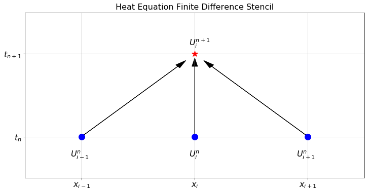

# PDE 1 {#sec-pde}

> *When you open the toolkit of differential equations you see the hammers and saws of engineering and physics for the past two centuries and for the foreseeable future.*\
> --[Benoit Mandelbrot](https://en.wikipedia.org/wiki/Benoit_Mandelbrot)

::: {.callout-caution}
This chapter is still undergoing changes, to be released on Thursday of week 8.
:::

## Intro to PDEs

Partial differential equations (PDEs) are differential equations involving the partial derivatives of an unknown multivariable function. In most of this chapter we will examine two classical problems from physics: heat transport phenomena and wave phenomena. Do not think, however, that just because we are focusing on these two primary examples that this is the extent of the utility of PDEs. Basically, every scientific field has been impacted by (or has directly impacted) the study of PDEs. Any phenomenon that can be modelled via the change in multiple continuous variables (not restricted to space and time) is likely governed by a PDE model. Some common phenomena that are modelled by PDEs are:

-   heat transport

    -   The heat equation models heat energy (temperature) diffusing through a metal rod or a solid body

-   diffusion of a concentrated substance

    -   The diffusion equation is a PDE model for the diffusion of smells, contaminants, or the motion of a solute

-   wave propagation

    -   The wave equation is a PDE that can be used to model the standing waves on a guitar string, the waves on lake, or sound waves traveling through the air

-   travelling waves

    -   The traveling wave equation is a PDE that can be used to model pulses of light propagating through a fiber optic cable or regions of high density traffic moving along a highway.

-   quantum mechanics

    -   The wave functions of quantum mechanics are described by a PDE called the Schrodinger Equation.

-   electro-magnetism

    -   Maxwell's Equations are a system of PDEs describing the relationships between electricity and magnetism.

-   fluid flow

    -   The Navier-Stokes equations are a system of PDEs that model fluids in three dimensions -- including turbulent flow.

    -   Darcy's Law and Richard's equation are PDE models for the motion of fluids moving through saturated and unsaturated soils.

-   stress and strain in structures

    -   The Linear Elasticity equation is a PDE that models the stresses in a solid body (like a bridge or a building) under load.

-   spatial patterns

    -   Solutions to the Helmholtz equation are known for exhibiting *Turing patterns* which are patterns like leopard spots or zebra stripes.

-   ... and many more ...

In many cases we are interested in solving PDEs in terms of our usual three spatial dimensions along with an extra dimension for time. Often we do not have to work with all three spatial dimensions (like if the domain is much larger in one or two directions versus the others) or in some cases (like in linear elasticity) we do not need to worry about time.

There is a wealth of wonderful theory for finding analytic solutions to many special classes of PDEs. However, most PDEs simply do not lend themselves to analytic solutions that we can write down in terms of the regular mathematical operations of sums, products, powers, roots, trigonometric functions, logarithms, etc. For these PDEs we must turn to numerical methods to approximate the solution.

Recall that numerical solutions to ODEs were approximations of the value of the unknown function at a discrete set of times. Similarly, numerical solutions to PDEs are going to be approximations of the value of the unknown function at a discrete set of points in time AND space.

What we will cover in this chapter will include one primary and powerful technique for approximating solutions to PDEs: **the finite difference method**. There are many other techniques for approximating solutions to PDEs, and the field of numerical PDEs is still an active area of mathematical and scientific research.


## The Heat Equation

You have probably met the heat equation, also known as the diffusion equation, in a previous module. The heat equation is a partial differential equation that describes how heat diffuses through a material. The heat equation is a parabolic PDE and is given by
$$
\frac{\partial u}{\partial t} = D \nabla^2 u
$$
where $u(t,x)$ is the temperature of the material at time $t$ and position $x$ and $D$ is the diffusion coefficient. The heat equation is a simple model for heat diffusion but also describes diffusion in general, like the diffusion of a solute in a solvent or of plants in a field or, .... well, you get the idea.

In the remainder of this section we will use a technique called **the finite difference method** to build numerical approximations to solutions of the heat equation in 1D, 2D, and 3D. You of course know that the heat equation is easy to solve analytically, given that it is a linear homogeneous PDE with constant coefficients. However, the finite difference method is a powerful tool for solving similar PDEs that do not have simple analytic solutions. The advantage of using the heat equation as a test case for the finite difference method is that we can easily verify the accuracy of our numerical solutions by comparing them to the known analytic solutions.

### In One Spatial Dimensions {#sec-heat1d}

For the sake of simplicity we will start by considering the heat equation in 1 spatial dimension:
$$
 \frac{\partial u}{\partial t} = D \frac{\partial^2 u}{\partial x^2}. 
$$
We will also use the alternative notation
$$
 u_t = D u_{xx},
$$ {#eq-heat1d}
where the subscripts denote partial derivatives. 

::: {#exr-6.29}

🖋 Just as we did in [Chapter -@sec-ode] to approximate solutions to ODEs, we will start by partitioning the spatial domain into finitely many pieces and we will partition time into finitely many pieces. We do this by introducing a grid of points $(t_n,x_i)$ where $t_n = t_0 + n\,\Delta t$ and $x_i = x_0 + i\,\Delta x$.
Then we want to build a numerical approximation to the function $u(t,x)$ at these grid points. 

First we need to introduce some notation for the numerical solution. As you will see in a moment, there is a lot to keep track of in numerical PDEs so careful indexing and well-chosen notation is essential. Let $U_i^n$ be the approximation of the solution to $u(t,x)$ at the point $t=t_n=t_0+n\,\Delta t$ and $x=x_i=x_0+i\,\Delta x$ (since we have two variables we need two indices). For example, $U_4^1$ is the value of the approximation at time $t_1$ and at the spatial point $x_4$.

Next we need to approximate both derivatives $u_t$ and $u_{xx}$ in the PDE using methods that we have used before. Now would be a good time to go back to [Chapter -@sec-differentiation] and refresh your memory for how we build approximations of derivatives.

(a)  Use the forward-difference formula to approximate the time derivative $u_t$ at the point $t=t_n$ and $x=x_i$.
$$
 u_t(t_n,x_i) \approx \frac{??? - ???}{???}. 
$$


(b)  Use the centred-difference formula to approximate the second spatial derivative $u_{xx}$ at the point $t=t_n$ and $x=x_i$.
$$
 u_{xx}(t_n,x_i) \approx \frac{??? - ??? + ???}{???}.
$$


(c)  Put your answers from parts (a) and (b) together using the 1D heat equation (@eq-heat1d)
$$
\frac{??? - ???}{\Delta t} = D \left( \frac{??? - ??? + ???}{\Delta x^2} \right).
$$
 Be sure that your indexing is correct: the superscript $n$ is the index for time and the subscript $i$ is the index for space.

(d)  Rearrange your result from part (c) to solve for $U_i^{n+1}$: 
$$
\begin{aligned} U_i^{n+1} = ??? + \frac{D \Delta t}{\Delta x^2} \left( ??? - ??? + ??? \right). \end{aligned}
$$
 The iterative scheme which you just derived is called the **forward difference scheme** for the heat equation. Notice that the term on the left is the only term at the next time step $n+1$. So, for every spatial point $x_i$ we can build $U_i^{n+1}$ by evaluating the right-hand side of the finite difference scheme.

(e)  The numerical errors made by using the forward difference scheme we just built come from two sources: from the approximation of the time derivative and from the approximation of the second spatial derivative. Fill in the question marks in the powers of the following expression: 
$$
 \text{Numerical Error} = \mathcal{O}(\Delta t^{???}) + \mathcal{O}(\Delta x^{???}). 
$$

(f)  Explain what the result from part (e) means in plain English?

:::

------------------------------------------------------------------------

There are many different finite difference schemes due to the fact that there are many different ways to approximate derivatives (See [Chapter -@sec-differentiation]). One convenient way to keep track of which information you are using and what you are calculating in a finite difference scheme is to use a **finite difference stencil image**. @fig-6.8 shows the finite difference stencil for the approximation to the heat equation that you built in the previous exercise. In this figure we are showing that the function values $U_{i-1}^n$, $U_i^n$, and $U_{i+1}^n$ at the points $x_{i-1}$, $x_i$, and $x_{i+1}$ at time step $t_n$ are used to calculate $U_i^{n+1}$. We will build similar stencil diagrams for other finite difference schemes throughout this chapter.

{#fig-6.8 alt="The forward difference stencil for the 1D heat equation."}

------------------------------------------------------------------------

::: {#exr-6.30}
💻 Now we want to implement your answer to part (d) of the previous exercise to approximate the solution to the following problem: Solve
$$
u_t = 0.1u_{xx}
$$
on the domain $0 < x < 1$ and $0 < t < 1$ with the initial condition
 with 
$$
u(0,x) = \sin(2 \pi x)
$$
and boundary conditions
$$
u(t,0) = 0, \, \text{and} \, u(t,1) = 0.
$$
For this purpose divide the $x$ domain into 20 equal pieces and the $t$ domain into 100 equal pieces.

Some partial code is given below to get you started.

-   First we import the proper libraries, set up the time domain, and set up the spatial domain.

``` python         
import numpy as np
import matplotlib.pyplot as plt
from ipywidgets import interactive

# Write code to give a vector of times starting at t=0 and ending 
# at t=1 that divides the interval into 100 equal pieces.

# Calculate the step size `dt`.

# Write code to give a vector of x values starting at x=0 and 
# ending exactly at x=1 that divides the interval into 20 equal pieces.

# Calculate the step size `dx`.

# Specify the diffusion coefficient
D = 0.01
# The coefficient "a" appears in the forward difference scheme.
a = D*dt / dx**2

print("dt=", dt, ", dx=", dx, " and D dt/dx^2=", a)
```

-   Next we build the array $U$ so we can store all of the approximations at all times and at all spatial points. The array will have the dimensions `len(t)` by `len(x)`. We then need to enforce the boundary conditions so for all times we fill the proper portions of the array with the proper boundary conditions. Lastly, we will build the initial condition for all spatial steps in the first time step.

``` python         
U = np.zeros((len(t),len(x)))
U[:,0] = # left boundary condition
U[:,-1] = # right boundary condition
U[0,:] = # the function for the init. condition (should depend on x)
```

-   Now we step through a loop that fills the $U$ array one row at a time. Keep in mind that we want to leave the boundary conditions fixed so we will only fill indices `1` through `-2` (stop and explain this). Be careful to get the indexing correct. For example, if we want $U_i^n$ we use `U[n,1:-1]`, if we want $U_{i+1}^n$ we use `U[n,2:]`, if we want $U_i^{n+1}$ we use `U[n+1,1:-1]`, etc.

``` python         
for n in range(len(t)-1):
    U[n+1,1:-1] = U[n,?:?] + a*( U[n,?:] - 2*U[n,?:?] + U[n,:?])
```

-   It remains to visualise the solutions. You can either make a plot or an animation to illustrate the time evolution of $u$. For each of these there a various Python packages you could use. Below is a function `plot_solution_1d()` using plotly to make a plot and a function `animate_solution_1d()` using matplotlib to make an animated 2D plot. You can use either of these or you can use your own plotting code.

``` python 
import plotly.graph_objects as go

def plot_solution_1d(t, x, U):
    """Plots the numerical approximation to a function u(t,x).

    Args:
        t: A vector of time values.
        x: A vector of spatial values.
        U: A 2D array approximating the solution u(x,t) at each grid point.
    """
    fig = go.Figure(data=[go.Surface(z=U, x=x, y=t)])
    fig.update_layout(
        width=800, height=600,
        scene=dict(
            yaxis_title='t',
            zaxis_title='u'
        )
    )
    return fig
```

``` python
import matplotlib.pyplot as plt
from matplotlib import animation, rc
from IPython.display import HTML

def animate_solution_1d(t, x, U):
    """Animates the numerical approximation to a function u(t,x).

    Args:
        t: A vector of time values.
        x: A vector of spatial values.
        U: A 2D array approximating the solution u(x,t) at each grid point.
    """
    fig, ax = plt.subplots()
    plt.close()
    ax.grid()
    ax.set_xlabel("x")
    ax.set_ylabel("u")
    ax.set_xlim((np.min(x), np.max(x)))
    ax.set_ylim((np.min(U), np.max(U)))
    frame, = ax.plot([], [], linewidth=2)

    # Don't display every time
    step = int(len(t)/30)+1
    frames = range(0, int(len(t)/step), 1)

    def animator(i):
        n = i*step
        ax.set_title(f"t = {t[n]:.2f}")
        frame.set_data(x, U[n,:])
        return (frame, )
        
    ani = animation.FuncAnimation(fig, animator, frames=frames, interval=100)
    rc('animation', html='jshtml') # embed in the HTML for Google Colab
    return ani
```

:::

------------------------------------------------------------------------

::: {#exr-heat1d}
💻 🎓 Now wrap up your code for solving the one-dimensional heat equation as a function so that you can easily call it with different parameters.

``` python
def heat1d(u_0, D=0.1, t_0=0, t_max=1, N_t=100, x_left=0, x_right=1, N_x=20):
    """Solves the 1D heat equation using the forward difference method.

    This function solves the 1D heat equation with given initial and 
    boundary conditions. It also prints a diagnostic message stating
    the step sizes `dt` and `dx` used and the value of `a = D*dt/dx**2`.

    Args:
        u_0: A function giving the initial condition u(0,x).
        D: The diffusion coefficient. Defaults to 1.
        t_0: The initial time. Defaults to 0.
        t_max: The maximum time. Defaults to 1.
        N_t: The number of time steps. Defaults to 100.
        x_left: The left boundary of the spatial domain. Defaults to 0.
        x_right: The right boundary of the spatial domain. Defaults to 1.
        N_x: The number of spatial steps. Defaults to 20.

    Returns:
        A tuple containing the following:
            t: A vector of time values.
            x: A vector of spatial values.
            U: A 2D array approximating the solution u(t,x) at each grid point.
    """
    # Your code goes here
```

Use your function to solve the heat equation with diffusion coefficient $D=0.1$ and the following initial and boundary conditions:
$$
 u(0,x) = \sin(2 \pi x), \, u(t,0) = 0, \, \text{and} \, u(t,1)
$$
Use  stepsizes $\Delta t=0.01$ and $\Delta x=0.01$ to determine an approximate value for $u(0.2,0.25)$.

:::

------------------------------------------------------------------------

::: {#exr-6.31a}
💻 💬 Now run the solution method from the previous exercise with the same diffusion coefficient $D=0.1$, the same step sizes $\Delta t=0.01$ and $\Delta x=0.01$, and the same initial and boundary conditions but run it for a longer time $t=0.5$ and plot the solution on the domain $t\in[0,0.5]$ and $x\in[0,1]$. Do you believe what you see? What is happening to the solution?
:::

------------------------------------------------------------------------

::: {#exr-6.31}
💻 💬 🎓 You will have found that you did not get a sensible solution from your method for the previous problem. The point of this exercise is to show that value of $a = D\frac{\Delta t}{\Delta x^2}$ controls the stability of the forward difference solution to the heat equation, and furthermore that there is a threshold for $a$ above which the forward difference scheme will be unstable. Experiment with values of $\Delta t$ and $\Delta x$ and conjecture the values of $a = D \frac{\Delta t}{\Delta x^2}$ that give a stable result. Your conjecture should take the form:

*If* $a = D\frac{\Delta t}{\Delta x^2} < \underline{\hspace{0.5in}}$ then the forward difference solution for the 1D heat equation is stable. Otherwise it is unstable.

Hint: the threshold is a simple fraction. If you think you have found a value for $a$ at which the method is stable, run the simulation for longer (while keeping the same $\Delta t$) to check that it is really stable. Close to the threshold the errors grow more slowly (albeit still exponentially).

:::

------------------------------------------------------------------------

::: {#exr-6.32}
🖋 💻 Consider the one dimensional heat equation with diffusion coefficient $D=1$: 
$$
 u_t = u_{xx}. 
$$
 We want to solve this equation on the domain $x \in [0,1]$ and $t\in [0,0.1]$ subject to the initial condition $u(0,x) = \sin(\pi x)$ and the boundary conditions $u(t,0)=u(t,1) = 0$.

(a)  Show that the function $u(t,x) = e^{-\pi^2 t} \sin(\pi x)$ is a solution to this heat equation, satisfies the initial condition, and satisfies the boundary conditions.

(b)  Pick values of $\Delta t$ and $\Delta x$ so that you can get a stable forward difference solution to this heat equation. Then make a plot of your numerical solution.

(c) Compare your plot to the plot of the exact solution that you can get with
``` python
X, T = np.meshgrid(x, t)
u_exact = np.exp(-np.pi**2*T)*np.sin(np.pi*X)
plot_solution_1d(t, x, u_exact)
```

:::

------------------------------------------------------------------------

::: {#exr-6.32b}
🖋 💻 🎓 Now let us change the initial condition to $u(0,x)=\sin(\pi x) + \sin(3 \pi x)$. We will keep the same boundary conditions as before: $u(t,0)=u(t,1)=0$.

(a)   Show that the function $u(t,x) = e^{-\pi^2 t} \sin(\pi x) +  e^{-9\pi^2t}\sin(3\pi x)$ is a solution to this heat equation, matches this new initial condition, and matches the boundary conditions.

(b)  Pick values of $\Delta t$ and $\Delta x$ so that you can get a stable forward difference solution to this heat equation. Make a 3d plot of your numerical solution.

(c) Compare your plot to the plot of the exact solution.

:::

------------------------------------------------------------------------

### Different Boundary Conditions {#sec-neumann}

In any initial and boundary value problem such as the heat equation, the boundary are often of Dirichlet or Neumann type. In Dirichlet boundary conditions the values of the solution at the boundary are specified. In contrast, Neumann boundary conditions specify the flux at the boundary instead of the value of the solution. 

::: {#exr-6.34}
#### Time-dependent Dirichlet Boundary Condition
💻 Modify your 1D heat equation code to plot an approximate solution of the diffusion equation $u_t = 0.5 u_{xx}$ with $x \in (0,1)$, $u(0,x) = \sin(2\pi x)$, $u(t,0) = 0$ and $u(t,1) = \sin(5\pi t)$.

:::

------------------------------------------------------------------------

::: {#exr-6.33}
#### Neumann Boundary Condition
🖋 💻 🎓 Consider the 1D heat equation $u_t = u_{xx}$ with boundary conditions $u_x(t,0)=0$ and $u(t,1)=0$ with initial condition $u(0,x) = \cos(\pi x/2)$. Notice that the initial condition satisfies both boundary conditions: $\frac{d}{dx}(\cos(\pi \cdot x/2))\Big|_{x=0} = 0$ and $\cos(\pi \cdot 1/2)=0$. As the heat profile evolves in time the Neumann boundary condition $u_x(t,0)=0$ says that the slope of the solution needs to be fixed at 0 at the left-hand boundary.

(a)  Draw several images of what the solution to the PDE should look like as time evolves. Be sure that all boundary conditions are satisfied and that your solution appears to solve the heat equation.

(b)  The Neumann boundary condition $u_x(t,0) = 0$ can be approximated with the first order approximation 
$$
 u_x(t_n,0) \approx \frac{U_1^n - U_0^n}{\Delta x} \text{ for all } n.
$$
 If we set this approximation to 0 (since $u_x(t,0)=0$) and solve for $U_0^n$ we get an additional constraint at every time step of the numerical solution to the heat equation:
 $$ U_0^n = ??? \text{ for all } n.$$

(c)  Modify your 1D heat equation code to implement this Neumann boundary condition, plot the numerical solution and verify visually that the Neumann boundary is satisfied.

:::

------------------------------------------------------------------------

### Variations on the Heat Equation {#sec-heatvar}
The heat equation is a parabolic PDE and the forward-difference method that we have developed
can be adapted to work for other parabolic PDEs. 

#### Reaction-Diffusion Equations {#sec-rde}

For example, the heat equation can be modified to include a reaction term. The reaction-diffusion equation is a PDE that models the diffusion of a substance in space and time with a reaction term that describes the rate of change of the substance due to some reaction. While it has its origin in chemistry, it shows up in many other fields as well, for example in ecology and epidemiology.

::: {#exr-6.34}
#### Fisher-KPP Equation
💻 🎓 Modify your 1D heat equation code to calculate an approximate solution of the Fisher-KPP equation 
$$
u_t = u_{xx} +u(1-u)
$$ 
with $t\in[0,10]$, $x \in (0,50)$, boundary conditions
$$
u(t,0) = 0,\ \ \ \ u(t,50) = 1
$$
and initial condition
$$
u(0,x) = \frac{1+\tanh\left(\dfrac{x-40}{2}\right)}{2}.
$$
Use `animate_solution_1d()` to visualize the solution. How does the solution change as time evolves?
:::

------------------------------------------------------------------------

#### Advective-Diffusion Equations {#sec-advect}

The diffusion term usually arises from random spatial motion of particles. However, in some cases the particles are advected by a flow field. In this case we need to add an advection term to the diffusion equation. The advection-diffusion equation is a PDE that models the diffusion of a substance in space and time with an advection term that describes the rate of change of the substance due to some flow field.

::: {#exr-6.34b}
💻 🎓 Modify your 1D heat equation code to plot an approximate solution of the following simple advection-diffusion equation:
$$
 u_t = 0.1 u_{xx} - u_x
$$
Use the forward difference formula for the $u_x$ term and the centred difference formula for the $u_{xx}$ term. Use the initial condition $u(0,x) = \sin(\pi x)$, Dirichlet boundary conditions $u(t,0) = 0$ and $u(t,1) = 0$, and $t\in[0,1]$. Use $20$ spatial steps and $100$ time steps. Make a plot and an animation of the solution.

:::

------------------------------------------------------------------------

## Exam-style question

(a) Consider the 1D heat equation $u_t = D u_{xx}$. Using a forward difference approximation for the time derivative and a centred difference approximation for the second spatial derivative, derive the explicit finite difference scheme for $U_i^{n+1}$. Use step sizes $\Delta t$ and $\Delta x$, and let $U_i^n \approx u(t_n, x_i)$. [3 marks]

(b) What are the truncation errors associated with the forward difference approximation for $u_t$ and the centred difference approximation for $u_{xx}$? State the overall order of the numerical scheme derived in part (a). [3 marks]

(c) What condition on $a = D\frac{\Delta t}{\Delta x^2}$ must be satisfied for this explicit forward difference scheme to be numerically stable? [1 mark]

(d) Suppose you have a Neumann boundary condition at the left boundary, $u_x(t, 0) = 0$. Using a first-order forward difference approximation for the spatial derivative, express $U_0^n$ in terms of other grid values. [2 marks]

(e) The following incomplete Python code solves the 1D heat equation $u_t = D u_{xx}$ using the explicit scheme derived in part (a), subject to Dirichlet boundary conditions $u(t,0) = 0$ and $u(t,1) = 0$. Provide the missing code indicated by `...`. [4 marks]

``` python
import numpy as np

def solve_heat1d(u_0, D, tmax, dt, xmax, dx):
    """
    Solves the 1D heat equation.
    u_0 is a function giving the initial condition.
    """
    t = np.arange(0, tmax + dt, dt)
    x = np.arange(0, xmax + dx, dx)
    
    a = ...
    
    U = np.zeros((len(t), len(x)))
    
    # Apply initial condition
    U[0, :] = u_0(x)
    
    # Boundary conditions are naturally 0 from np.zeros
    
    for n in range(len(t) - 1):
        # Update interior spatial points
        U[n+1, 1:-1] = ...
        
    return t, x, U
```

