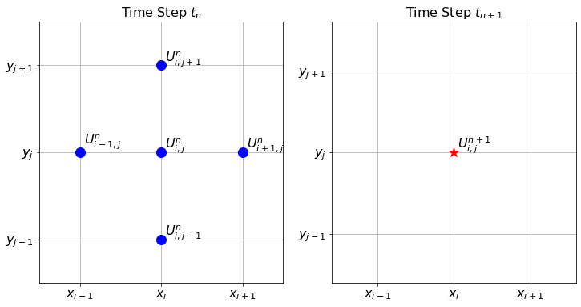
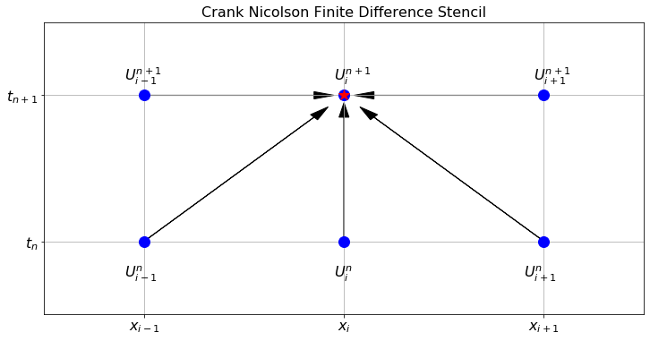
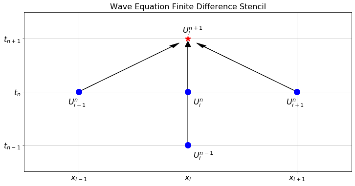

# PDE 2 {#sec-pde2}

## Two-dimensional Heat Equation {#sec-heat2d}

Now we transition to the two dimensional heat equation. Instead of thinking of this as heating a long metal rod we can think of heating a thin plate of metal (like a flat cookie sheet). The heat equation models the propagation of the heat energy throughout the 2D surface. In two spatial dimensions the heat equation is 
$$
 \frac{\partial u}{\partial t} = D \left( \frac{\partial^2 u}{\partial x^2} + \frac{\partial^2 u}{\partial y^2} \right),
$$
 or, using subscript notation for the partial derivatives, 
$$
 u_t = D\left( u_{xx} + u_{yy} \right). 
$$

------------------------------------------------------------------------

::: {#exr-6.35}
🖋 Let us build a numerical solution to the 2D heat equation. We need to make a minor modification to our notation since there is now one more spatial dimension to keep track of. Let $U_{i,j}^n$ be the approximation to $u$ at the point $(t_n, x_i, y_j)$. For example, $U_{2,3}^4$ will be the approximation to the solution at the point $(t_4,x_2,y_3)$.

(a)  We already know how to approximate the time derivative in the heat equation: 
$$
 u_t(t_{n}, x_i, y_j) \approx \frac{U_{i,j}^{n+1} - U_{i,j}^n}{\Delta t}. 
$$
 The new challenge now is that we have two spatial partial derivatives: one in $x$ and one in $y$. Use what you learned in [Chapter -@sec-differentiation] to write the approximations of $u_{xx}$ and $u_{yy}$. 
$$
 u_{xx}(t_n,x_i,y_j) \approx \frac{??? - ??? + ???}{\Delta x^2} 
$$
$$
 u_{yy}(t_n,x_i,y_j) \approx \frac{??? - ??? + ???}{\Delta y^2} 
$$
 Take careful note that the index $i$ is the only one that changes for the $x$ derivative. Similarly, the index $j$ is the only one that changes for the $y$ derivative.

(b)  Put your answers to part (a) together with the 2D heat equation 
$$
 \frac{U_{i,j}^{n+1} - U_{i,j}^n}{\Delta t} = D \left( \frac{??? - ??? + ???}{\Delta x^2} + \frac{??? - ??? + ???}{\Delta y^2} \right). 
$$


(c)  Let us make one simplifying assumption. Choose the partition of the domain so that $\Delta x = \Delta y$. Note that we can usually do this in square domains. In more complicated domains we will need to be more careful. Simplify the right-hand side of your answer to part (b) under this assumption. 
$$
 \frac{U_{i,j}^{n+1} - U_{i,j}^n}{\Delta t} = D \left( \frac{??? + ??? - ??? + ??? + ???}{???} \right). 
$$


(d)  Now solve your result from part (c) for $U_{i,j}^{n+1}$. Your answer is the explicit forward difference scheme for the 2D heat equation. 
$$
 U_{i,j}^{n+1} = U_{???,???}^{???} + \frac{D \cdot ???}{???} \left( ??? + ??? - ??? + ??? + ??? \right) 
$$


:::

------------------------------------------------------------------------

The finite difference stencil for the 2D heat equation is a bit more complicated since we now have three indices to track. Hence, the stencil is naturally three dimensional. @fig-6.9 shows the stencil for the forward difference scheme that we built in the previous exercise. The left-hand subplot in the figure shows the five points used in time step $t_n$, and the right-hand subplot shows the one point that is calculated at time step $t_{n+1}$.

{#fig-6.9 alt="The finite difference stencil for the 2D heat equation."}

------------------------------------------------------------------------

::: {#exr-6.36}
💻 Now we need to implement the finite difference scheme that you developed in the previous problem. As a model problem, consider the 2D heat equation $u_t = D(u_{xx} + u_{yy})$ on the domain $(x,y) \in [0,1] \times [0,1]$ with the initial condition $u(0,x,y) = \sin(\pi x)\sin(\pi y)$, Dirichlet boundary conditions $u(t,x,0) = u(t,x,1)=u(t,0,y)=u(t,1,y)=0$, and $D=1$. Fill in the holes in the following code chunks.

-   First we import the proper libraries and set up the domains for $x$, $y$, and $t$.
``` python         
import numpy as np
import matplotlib.pyplot as plt
from matplotlib import cm # this allows for color maps 
from ipywidgets import interactive

# Write code to build a linearly spaced array of x values 
# starting at 0 and ending at exactly 1
x = # your code here
y = x # this could be generalised later
# The consequence of the previous line is that dy = dx.
dx = # Extract dx from your array of x values.
# Now write code to build a linearly spaced array of time values 
# starting at 0 and ending at 0.1.
# You will want to use many more values for time than for space 
# (think about the stability conditions from the 1D heat equation).
t = # your code here
dt = # Extract dt from your array of t values

# Next we will use the np.meshgrid() command to turn the arrays of 
# x and y values into 2D grids of x and y values.  
# If you match the corresponding entries of X and Y then you get 
# every ordered pair in the domain.
Y, X = np.meshgrid(y, x)

# Next we set up a 3 dimensional array of zeros to store all of 
# the time steps of the solutions.
U = np.zeros((len(t), len(x), len(y)))
```

-   Next we have to set up the boundary and initial conditions for the given problem.
``` python         
U[0,:,:] = # initial condition depending on X and Y
U[:,0,:] = # boundary condition for x=0
U[:,-1,:] = # boundary condition for x=1
U[:,:,0] = # boundary condition for y=0
U[:,:,-1] = # boundary condition for y=1
```

-   We know that the value of $D \Delta t / \Delta x^2$ controls the stability of the forward difference method. Therefore, the next step in our code is to calculate this value and print it.
``` python         
D = 1
a = D*dt/dx**2
print(a)
```

-   Next for the part of the code that actually calculates all of the time steps. Be sure to keep the indexing straight. Also be sure that we are calculating all of the spatial indices *inside* the domain since the boundary conditions dictate what happens on the boundary.
``` python         
for n in range(len(t)-1):
  U[n+1,1:-1,1:-1] = U[n,1:-1,1:-1] + \
    a*(U[n, ?:? , ?:?] + \
       U[n, ?:?, ?:?] - \
       4*U[n, ?:?, ?:?] + \
       U[n, ?:?, ?:?] + \
       U[n, ?:?, ?:?])
```

-   Finally, we just need to visualize the solution. We can no longer make a plot of $u$ against $t, x$ and $y$ because that would require four dimensions. So we will animate the solution. You can use the following function:
``` python         
import numpy as np
import matplotlib.pyplot as plt
from matplotlib import animation
from mpl_toolkits.mplot3d import Axes3D
from IPython.display import HTML

def animate_solution_2d(t, x, y, U):
    Y, X = np.meshgrid(y, x)

    # Set up the figure and axis
    fig = plt.figure()
    ax = fig.add_subplot(111, projection='3d')

    # Initialize the surface plot
    surface = [ax.plot_surface(X, Y, U[0, :, :], cmap='viridis')]

    # Don't display every time
    step = int(len(t)/30)+1
    frames = int(len(t)/step)

    def animate(i):
        n = i*step
        # Update the data of the surface plot for each frame
        ax.clear()  # Clear the previous frame
        surface[0] = ax.plot_surface(X, Y, U[n, :, :], cmap='viridis')
        ax.set_zlim(np.min(U), np.max(U))
        ax.set_title(f"Time: {t[n]:.2f}")

    # Create animation
    ani = animation.FuncAnimation(fig, animate, frames=frames, repeat=True)
    plt.close()

    # Display the animation
    return HTML(ani.to_jshtml())
```

:::

------------------------------------------------------------------------

::: {#exr-6.37}
💻 🎓 Time to do some experimentation with your new 2D heat equation code! Numerically solve the 2D heat equation with different boundary conditions (both Dirichlet and Neumann). Be prepared to present your solutions.

:::

------------------------------------------------------------------------

::: {#exr-6.2db}
💻 In order for the forward difference solution to the 2D heat equation on a square domain to be stable we need $D \Delta t / \Delta x^2 < \underline{\hspace{0.5in}}$.

Experiment with several parameters to empirically determine the bound.

:::

------------------------------------------------------------------------

::: {#exr-6.38}
💻 Now solve the 2D heat equation on a rectangular domain. You will need to make some modifications to your code since it is unlikely that assuming that $\Delta x = \Delta y$ is a good assumption any longer. Again, be prepared to present your solutions.
:::


------------------------------------------------------------------------

## Implicit Methods {#sec-heat_stability}

Let us summarize the stability criteria for the forward difference solutions to the heat equation.

-   In the 1D heat equation the forward difference solution is stable if $D \Delta t / \Delta x^2 < \underline{\hspace{0.5in}}$.

-   In the 2D heat equation the forward difference solution is stable if $D \Delta t / \Delta x^2 < \underline{\hspace{0.5in}}$ (assuming a square domain where $\Delta x = \Delta y$)

::: {#exr-6.39}
#### Sawtooth Errors
💻 💬 We have already seen that the 1D heat equation is stable if $D \Delta t / \Delta x^2 < 0.5$. The goal of this problem is to show what, exactly, occurs when we choose parameters in the unstable region. We will solve the PDE $u_t = u_{xx}$ on the domain $x \in [0,1]$ with initial conditions $u(0,x) = \sin(\pi x)$ and homogeneous Dirichlet boundary conditions $u(t,0)=u(t,1)=0$ for all $t\in[0,0.25]$. The analytic solution is $u(t,x) = e^{-\pi^2 t}\sin(\pi x)$. To build the spatial and temporal grid use 20 spatial steps and 100 time steps. This means that $\Delta x = 0.05$ and $\Delta t = 0.0025$ so the ratio $D \Delta t / \Delta x^2 = 1 > 0.5$ (certainly in the unstable region). Solve the heat equation with your `heat1d()` function using these parameters. Make plots of the approximate solution on top of the exact solution at time steps 0, 10, 20, 30, 31, 32, 33, 34, etc. Describe what you observe.

:::

------------------------------------------------------------------------

::: {#exr-6.40}
#### Hedgehog Errors
💻 💬 Solve the 2D heat equation on the unit square with homogeneous Dirichlet boundary conditions with the following parameters:

-   A diffusion coefficient of $D=1$;

-   A partition of 21 points in both the $x$ and $y$ direction;

-   301 points between 0 and 0.25 for time;

-   An initial condition of $u(0,x,y) = \sin(\pi x) \sin(\pi y)$.

What happens near time step number 70?

:::

------------------------------------------------------------------------

It is actually possible to beat the stability criteria given in the previous exercises! What follows are two implicit methods that use a forward-looking scheme to help completely avoid unstable solutions. The primary advantage to these schemes is that we will not need to pay as close attention to the ratio of the time step to the square of the spatial step. Instead, we can take time and spatial steps that are appropriate for the application we have in mind.

------------------------------------------------------------------------

### Backward Difference Method

::: {#exr-6.43}
🖋 💻 🎓 For the 1D heat equation $u_t = D u_{xx}$ we have been finding the numerical solution using the explicit finite difference scheme 
$$
\frac{U_i^{n+1} - U_i^n}{\Delta t} = D \frac{U_{i+1}^{n} - 2U_i^{n} + U_{i-1}^{n}}{\Delta x^2}
$$
 where we approximate the spatial derivative with the centred difference and the time derivative with the usual forward difference. If, however, we use the backward difference formula for the time derivative we get the finite difference scheme 
$$
\frac{U_i^{n} - U_i^{n-1}}{\Delta t} = D \frac{U_{i+1}^{n} - 2U_i^{n} + U_{i-1}^{n}}{\Delta x^2}.
$$
or, shifting to the next timestep,
$$
\frac{U_i^{n+1} - U_i^n}{\Delta t} = D \frac{U_{i+1}^{n+1} - 2U_i^{n+1} + U_{i-1}^{n+1}}{\Delta x^2}.
$$
 This may seem completely ridiculous since we do not yet know the information at time step $n+1$ but some algebraic rearrangement shows that we can treat this as a system of linear equations which can be solved (using something like `np.linalg.solve()`) for the $(n+1)^{st}$ time step.

We again introduce the coefficient $a = D \Delta t / \Delta x^2.$ This will save a little bit of writing in the coming steps.

1.  Rearrange the new finite difference scheme so that all of the terms at the $(n+1)^{st}$ time step are on the left-hand side and all of the term at the $n^{th}$ time step are on the right-hand side. 
$$
(\underline{\hspace{0.25in}}) U_{i-1}^{n+1} + (\underline{\hspace{0.5in}}) U_{i}^{n+1} + (\underline{\hspace{0.25in}}) U_{i+1}^{n+1} = U_i^n
$$


2.  Now we are going to build a very small example with only 6 spatial points so that you can clearly see the structure of the resulting linear system.

    a.  If we have 6 total points in the spatial grid ($x_0, x_1, \ldots, x_5$) then we have the following equations (fill in the blanks): 
$$
\begin{aligned} (\text{for $x_1$: }) \quad \underline{\hspace{0.25in}} U_0^{n+1} + \underline{\hspace{0.5in}} U_1^{n+1} + \underline{\hspace{0.25in}} U_2^{n+1} &= U_1^{n} \\ (\text{for $x_2$: }) \quad \underline{\hspace{0.25in}} U_1^{n+1} + \underline{\hspace{0.5in}} U_2^{n+1} + \underline{\hspace{0.25in}} U_3^{n+1} &=  U_2^{n} \\ (\text{for $x_3$: }) \quad \underline{\hspace{0.25in}} U_2^{n+1} + \underline{\hspace{0.5in}} U_3^{n+1} + \underline{\hspace{0.25in}} U_4^{n+1} &=  U_3^{n} \\ (\text{for $x_4$: }) \quad \underline{\hspace{0.25in}} U_3^{n+1} + \underline{\hspace{0.5in}} U_4^{n+1} + \underline{\hspace{0.25in}} U_5^{n+1} &=  U_4^{n} \\ \end{aligned}
$$


    b.  Notice that we aready know $U_0^{n+1}$ and $U_5^{n+1}$ since these are dictated by the boundary conditions (assuming Dirichlet boundary conditions). Hence we can move these known quantities to the right-hand side of the equations and hence rewrite the system of equations as: 
$$
\begin{aligned} 
(\text{for $x_1$: }) & \quad  & \underline{\hspace{0.5in}} U_1^{n+1} &+ \underline{\hspace{0.25in}} U_2^{n+1} &=  U_1^{n} &+ \underline{\hspace{0.25in}} U_0^{n+1}\\ 
(\text{for $x_2$: }) &\quad  \underline{\hspace{0.25in}} U_1^{n+1} &+ \underline{\hspace{0.5in}} U_2^{n+1} &+ \underline{\hspace{0.25in}} U_3^{n+1} &=  U_2^{n} &\\ (\text{for $x_3$: }) &\quad  \underline{\hspace{0.25in}} U_2^{n+1} &+ \underline{\hspace{0.5in}} U_3^{n+1} &+ \underline{\hspace{0.25in}} U_4^{n+1} &=  U_3^{n}& \\ (\text{for $x_4$: }) &\quad  \underline{\hspace{0.25in}} U_3^{n+1} &+ \underline{\hspace{0.5in}} U_4^{n+1}& &=  U_4^{n} &+ \underline{\hspace{0.25in}} U_5^{n+1} \\ \end{aligned}
$$


    c.  Now we can write this as a matrix equation: 
$$
\begin{pmatrix} \underline{\hspace{0.25in}} & \underline{\hspace{0.25in}} & 0 & 0 \\ \underline{\hspace{0.25in}} & \underline{\hspace{0.25in}} & \underline{\hspace{0.25in}} & 0 \\ 0 & \underline{\hspace{0.25in}} & \underline{\hspace{0.25in}} & \underline{\hspace{0.25in}} \\ 0 & 0 & \underline{\hspace{0.25in}} & \underline{\hspace{0.25in}} \end{pmatrix}\begin{pmatrix} U_1^{n+1} \\ U_2^{n+1} \\ U_3^{n+1} \\ U_4^{n+1} \end{pmatrix} = \begin{pmatrix} U_1^{n} \\ U_2^{n} \\ U_3^{n} \\ U_4^{n} \end{pmatrix} + \begin{pmatrix} \underline{\hspace{0.25in}} U_0^{n+1} \\ 0 \\ 0 \\ \underline{\hspace{0.25in}} U_5^{n+1} \end{pmatrix}
$$


3.  At this point the structure of the coefficient matrix on the left and the vector sum on the right should be clear (even for more spatial points). It is time for us to start writing some code. we will start with the basic setup of the problem.

``` python         
import numpy as np
import matplotlib.pyplot as plt

D = 1
x = # set up a linearly spaced spatial domain 
t = # set up a linearly spaced temporal domain
dx = x[1]-x[0]
dt = t[1]-t[0]
a = D*dt/dx**2
IC = lambda x: # write a function for the initial condition
BCleft = lambda t: 0*t # left boundary condition 
BCright = lambda t: 0*t # right boundary condition 

U = np.zeros((len(t), len(x))) # set up a blank array for U
U[0,:] = IC(x) # set up the initial condition
U[:,0] = BCleft(t) # set up the left boundary condition
U[:,-1] = BCright(t) # set up the right boundary condition
```

4.  Next we write a function that takes in the number of spatial points and returns the coefficient matrix for the linear system. Take note that the first and last rows take a little more care than the rest.

``` python         
def coeffMatrix(M,a): # we are using M=len(x) as the first input
  A = np.zeros((M-2, M-2))
  # why are we using M-2 x M-2 for the size?
  A[0,0] = # top left entry
  A[0,1] = # entry in the first row second column
  A[-1,-1] = # bottom right entry
  A[-1,-2] = # entry in the last row second to last column
  for i in range(1,M-3): # now loop through all of the other rows
    A[i,i] = # entry on the main diagonal
    A[i,i-1] = # entry on the lower diagonal
    A[i,i+1] = # entry on the upper diagonal
  return A

A = coeffMatrix(len(x),a)
print(A)
plt.spy(A) 
# spy is a handy plotting tool that shows the structure 
# of a matrix (optional)
plt.show()
```

5.  Next we write a loop that iteratively solves the system of equations for each new time step.

``` python         
for n in range(len(t)-1):
  b1 = U[n,???] 
  # b1 is a vector of U at step n for the inner spatial nodes
  b2 = np.zeros(len(b1)) # set up the second right-hand vector
  b2[0] = ???*BCleft(t[n+1]) # fill in the correct first entry
  b2[-1] = ???*BCright(t[n+1]) # fill in the correct last entry
  b = b1 + b2 # The vector "b" is the right side of the equation
  # 
  # finally use a linear algebra solver to fill in the 
  # inner spatial nodes at step n+1
  U[n+1,???] = ???
```

6.  All of the hard work is now done. It remains to plot the solution. Try this method on several sets of initial and boundary conditions for the 1D heat equation. Be sure to demonstrate that the method is stable no matter the values of $\Delta t$ and $\Delta x$.

7.  What are the primary advantages and disadvantages to the implicit method described in this problem?

:::

------------------------------------------------------------------------

### Stability of the Backward Difference Method

The backward difference scheme can be written in matrix form. Rearranging so that all terms at time step $n+1$ are on the left gives
$$
B\mathbf{U}_{n+1} = \mathbf{U}_n,
$$
where $B$ is the $(N_x-1)\times(N_x-1)$ tridiagonal matrix with $1+2a$ on the diagonal and $-a$ on the two off-diagonals:
$$
B = \begin{pmatrix}1+2a&-a&&\\
-a&1+2a&-a&&\\
&\ddots&\ddots&\ddots&\\
&&-a&1+2a\end{pmatrix}.
$$
Solving for $\mathbf{U}_{n+1}$ gives
$$
\mathbf{U}_{n+1} = B^{-1}\mathbf{U}_n,
$$
so after $n$ steps, $\mathbf{U}_n = (B^{-1})^n\mathbf{U}_0$. Exactly as in the analysis of the forward difference method in @sec-stability-heat, if an error $\mathbf{\epsilon}$ is introduced at some step it evolves to $\mathbf{\epsilon}^{(n)} = (B^{-1})^n\mathbf{\epsilon}$. For stability we need all eigenvalues of $B^{-1}$ to have absolute value at most 1, which is equivalent to requiring all eigenvalues of $B$ to have absolute value at least 1.

Using the same Fourier analysis as for the forward difference method, the matrix $B$ shares the same eigenvectors as the forward difference matrix $A$, and its eigenvalues are
$$
\mu_k = 1 + 4a\left(\sin\left(\frac{k\pi}{2N_x}\right)\right)^2, \quad k = 1,\ldots,N_x-1.
$$
Since $a > 0$ and $\sin^2(\cdot) \geq 0$, we have $\mu_k \geq 1$ for all $k$ and all $a > 0$. Therefore $|1/\mu_k| \leq 1$ for every $k$, and the backward difference method is **unconditionally stable**: no restriction on the ratio $a = D\Delta t/(\Delta x)^2$ is needed to keep the numerical solution bounded.

------------------------------------------------------------------------

### The Crank-Nicolson Method

::: {#exr-6.44}
🖋 🎓 We conclude this section with one more implicit scheme: the **Crank-Nicolson Method**. In this method we take the average of the forward and backward difference schemes: 
$$
\frac{U_i^{n+1} - U_i^n}{\Delta t} = \frac{1}{2} \left[D \left( \frac{U_{i-1}^n - 2U_i^n + U_{i+1}^n}{\Delta x^2}\right) +D \left(\frac{U_{i-1}^{n+1} - 2U_i^{n+1} + U_{i+1}^{n+1}}{\Delta x^2} \right) \right].
$$
 Letting $r = D \Delta t / (2\Delta x^2)$ we can rearrange to get 
$$
\underline{\hspace{0.25in}} U_{i-1}^{n+1} + \underline{\hspace{0.25in}} U_{i}^{n+1} + \underline{\hspace{0.25in}} U_{i+1}^{n+1} = \underline{\hspace{0.25in}} U_{i-1}^{n} + \underline{\hspace{0.25in}} U_{i}^{n} + \underline{\hspace{0.25in}} U_{i+1}^{n}.
$$
 This can now be viewed as a system of equations. Let us build this system carefully and then write code to solve the heat equation from the previous problems with the Crank-Nicolson method. For this problem we will assume fixed Dirichlet boundary conditions on both the left- and right-hand sides of the domain.

1.  First let us write the equations for several values of $i$. 
$$
\begin{aligned} (\text{$x_1$ }): \quad \underline{\hspace{0.15in}} U_0^{n+1} + \underline{\hspace{0.15in}} U^{n+1}_1 + \underline{\hspace{0.15in}} U^{n+1}_2 &= \underline{\hspace{0.15in}}U^n_0 + \underline{\hspace{0.15in}} U^n_1 + \underline{\hspace{0.15in}}U^n_2 \\ (\text{$x_2$ }): \quad \underline{\hspace{0.15in}} U_1^{n+1} + \underline{\hspace{0.15in}} U^{n+1}_2 + \underline{\hspace{0.15in}}U^{n+1}_3 &= \underline{\hspace{0.15in}}U^n_1 + \underline{\hspace{0.15in}} U^n_2 + \underline{\hspace{0.15in}}U^n_3 \\ (\text{$x_3$ }): \quad \underline{\hspace{0.15in}} U_2^{n+1} + \underline{\hspace{0.15in}} U^{n+1}_3 + \underline{\hspace{0.15in}}U^{n+1}_4 &= \underline{\hspace{0.15in}}U^n_2 + \underline{\hspace{0.15in}} U^n_3 + \underline{\hspace{0.15in}}U^n_4 \\ \qquad \vdots & \qquad \vdots \\ (\text{$x_{M-2}$ }): \quad \underline{\hspace{0.1in}} U_{M-3}^{n+1} + \underline{\hspace{0.1in}} U^{n+1}_{M-2} + \underline{\hspace{0.1in}}U^{n+1}_{M-1} &= \underline{\hspace{0.1in}}U^n_{M-3} + \underline{\hspace{0.1in}} U^n_{M-2} + \underline{\hspace{0.1in}}U^n_{M-1} \end{aligned}
$$
 where $M$ is the number of spatial points (enumerated $x_0, x_1, x_2, \ldots, x_{M-1}$).

2.  The first and last equations can be simplified since we are assuming that we have Dirichlet boundary conditions. Therefore for $x_1$ we can rearrange to move the $U_0^{n+1}$ term to the right-hand side since it is given for all time. Similarly for $x_{M-2}$ we can move the $U_{M-1}^{n+1}$ term to the right-hand side since it is fixed for all time. Rewrite these two equations.

3.  Verify that the left-hand side of the equations that we have built in parts (1) and (2) can be written as the following matrix-vector product: 
$$
\begin{aligned} \begin{pmatrix} (1+2r) & -r & 0 & 0 & \cdots & 0 \\ -r & (1+2r) & -r & 0 & \cdots & 0 \\ 0 & -r & (1+2r) & -r & \cdots & 0 \\ \vdots & & & & & 0 \\ 0 & \cdots & & 0 & -r & (1+2r) \end{pmatrix} \begin{pmatrix} U^{n+1}_1 \\ U^{n+1}_2 \\ U^{n+1}_3 \\ \vdots \\U^{n+1}_{M-2} \end{pmatrix} \end{aligned}
$$


4.  Verify that the right-hand side of the equations that we built in parts (1) and (2) can be written as
$$
\begin{pmatrix} (1-2r) & r & 0 & 0 & \cdots & 0 \\ r & (1-2r) & r & 0 & \cdots & 0 \\ 0 & r & (1-2r) & r & & 0 \\ \vdots & & & & & \\ & & & & r & (1-2r) \end{pmatrix} \begin{pmatrix} U^{n}_1 \\ U^{n}_2 \\ U_3^n \\ \vdots \\U^{n}_{M-2} \end{pmatrix}\\ + \begin{pmatrix} r(U_0^{n+1}+U_0^{n}) \\ 0 \\ \vdots \\ 0 \\ r(U_{M-1}^{n}+U_{M-1}^{n+1}) \end{pmatrix}
$$


5.  Now for the wonderful part! The entire system of equations from part (a) can be written as
$$
A \mathcal{U}^{n+1} = B \mathcal{U}^n + \mathbf{d}.
$$
 What are the matrices $A$ and $B$ and what are the vectors $\mathcal{U}^{n+1}$, $\mathcal{U}^n$, and $\mathbf{d}$?

6.  To solve for $\mathcal{U}^{n+1}$ at each time step we simply need to do a linear solve:
$$
\mathcal{U}^{n+1} = A^{-1} \left( B \mathcal{U}^n + \mathbf{d} \right).
$$
 Of course, we will never do a matrix inverse on a computer. Instead we can lean on tools such as `np.linalg.solve()` to do the linear solve for us.

7. 💻 Finally. Write code to solve the 1D Heat Equation implementing the Crank Nicolson method described in this problem. The setup of your code should be largely the same as for the implicit method from @exr-6.43. You will need to construct the matrices $A$ and $B$ as well as the vector $D$. Then your time stepping loop will contain the code from part 6 of this problem.

:::

------------------------------------------------------------------------

::: {#exr-6.45}
🖋 To graphically show the Crank Nicolson method we can again use a finite difference stencil to show where the information is coming from and where it is going to. In @fig-6.10 notice that there are three points at the new time step that are used to calculate the value of $U_i^{n+1}$ at the new time step. Sketch a similar image for the original implicit scheme from @exr-6.43

{#fig-6.10 alt="The finite difference stencil for the Crank Nicolson method."}
:::

------------------------------------------------------------------------

### Stability of the Crank-Nicolson Method

Ignoring the boundary terms (which are fixed and do not grow), the Crank-Nicolson scheme for homogeneous Dirichlet conditions reads
$$
A\mathbf{U}_{n+1} = B\mathbf{U}_n,
$$
where, using $r = D\Delta t/(2\Delta x^2)$, the matrices $A$ and $B$ are both tridiagonal:
$$
A = \begin{pmatrix}1+2r&-r&&\\-r&1+2r&-r&&\\&\ddots&\ddots&\ddots\\&&-r&1+2r\end{pmatrix}, \qquad
B = \begin{pmatrix}1-2r&r&&\\r&1-2r&r&&\\&\ddots&\ddots&\ddots\\&&r&1-2r\end{pmatrix}.
$$
The update formula is $\mathbf{U}_{n+1} = A^{-1}B\,\mathbf{U}_n$, so the amplification matrix is $A^{-1}B$. Using the same Fourier analysis as in @sec-stability-heat, $A$ and $B$ share the same eigenvectors, with eigenvalues
$$
\mu_k^A = 1 + 4r\left(\sin\left(\frac{k\pi}{2N_x}\right)\right)^2, \qquad \mu_k^B = 1 - 4r\left(\sin\left(\frac{k\pi}{2N_x}\right)\right)^2,
$$
for $k=1,\ldots,N_x-1$. The eigenvalues of the amplification matrix $A^{-1}B$ are therefore
$$
g_k = \frac{\mu_k^B}{\mu_k^A} = \frac{1 - 4r\sin^2\!\left(\frac{k\pi}{2N_x}\right)}{1 + 4r\sin^2\!\left(\frac{k\pi}{2N_x}\right)}.
$$
Setting $s = 4r\sin^2(k\pi/(2N_x)) \geq 0$, we have $g_k = (1-s)/(1+s)$. Since $|1-s| \leq 1+s$ for all $s \geq 0$, we conclude $|g_k| \leq 1$ for every $k$ and every $r > 0$. Hence the Crank-Nicolson method is **unconditionally stable**, with no restriction on $\Delta t/(\Delta x)^2$.

It turns out that the error terms for the forward and backward difference methods have the form
$C\Delta t+O(\Delta t^2)$ and
$-C\Delta t+O(\Delta t^2)$. Taking the average cancels the
$\pm C\Delta t$ terms and leaves an error of order $O(\Delta t^2)$; in combination with the space variable, we have an error of order $O(\Delta t^2)+O(\Delta x^2)$
 for the whole method, as compared with $O(\Delta t)+O(\Delta x^2)$
 for the forward and backward difference methods.


## The Wave Equation


The problems that we have dealt with thus far all model natural diffusion processes: heat transport, molecular diffusion, etc. Another interesting physical phenomenon is that of wave propagation. The 1D *wave equation* is 
$$
u_{tt} = c^2 u_{xx}
$$
where $c$ is a parameter modelling the stiffness of the medium the wave is travelling through. With homogeneous Dirichlet boundary conditions we can think of this as the behaviour of a guitar string after it has been plucked. If the boundaries are in motion then the model might be of someone wiggling a taut string from one end.

------------------------------------------------------------------------

::: {#exr-6.46}
🖋 💻 Let us write code to numerically solve the 1D wave equation. As before, we use the notation $U_i^n$ to represent the approximate solution $u(t,x)$ at the point $t=t_n$ and $x=x_i$.

1.  Give a reasonable discretization of the second derivative in time: 
$$
 u_{tt}(t_{n}, x_i) \approx \underline{\hspace{1in}}. 
$$


2.  Give a reasonable discretization of the second derivative in space: 
$$
 u_{xx}(t_n, x_i) \approx \underline{\hspace{1in}}. 
$$


3.  Put your answers to parts 1 and 2 together with the wave equation to get 
$$
 \frac{??? - ??? + ???}{\Delta t^2} = c^2 \frac{??? - ??? + ???}{\Delta x^2}. 
$$


4.  Solve the equation from part 3 for $U_i^{n+1}$. The resulting difference equation is the finite difference scheme for the 1D wave equation.

5.  You should notice that the finite difference scheme for the wave equation references two different times: $U_i^n$ and $U_i^{n-1}$. Based on this observation, what information do we need in order to actually start our numerical solution?

6.  Consider the wave equation $u_{tt} = 2 u_{xx}$ in $x \in (0,1)$ with $u(0,x) = 4x(1-x)$, $u_t(0,x) = 0$, and $u(t,0) = u(t,1) = 0$. Use the finite difference scheme that you built in this problem to approximate the solution to this PDE.

:::

------------------------------------------------------------------------

@fig-6.11 shows the finite difference stencil for the 1D wave equation. Notice that we need two prior time steps in order to advance to the new time step. This means that in order to start the finite difference scheme for the wave equation we need to have information about time $t_0$ and also time $t_1$. We get this information by using the two initial conditions $u(0,x)$ and $u_t(0,x)$.

{#fig-6.11 alt="The finite difference stencil for the 1D wave equation."}

------------------------------------------------------------------------

::: {#exr-6.47}
💻 💬 The ratio $c^2\Delta t^2 / \Delta x^2$ shows up explicitly in the finite difference scheme for the 1D wave equation. Just like in the heat equation, this parameter controls when the finite difference solution will be stable. Experiment with your finite difference solution and conjecture a value of $a = c^2 \Delta t^2 / \Delta x^2$ which divides the regions of stability versus instability. Your answer should be in the form:

*If* $a = c^2\Delta t^2 / \Delta x^2 < \underline{\hspace{0.5in}}$ then the finite difference scheme for the 1D wave equation will be stable. Otherwise it will be unstable.

:::

------------------------------------------------------------------------

::: {#exr-6.48}
💻 Show several plots demonstrating what occurs to the finite difference solution of the wave equation when the parameters are in the unstable region and right on the edge of the unstable region.

:::

------------------------------------------------------------------------

::: {#exr-6.49}
💬 What is the expected error in the finite difference scheme for the 1D wave equation? What does this mean in plain English?

:::

------------------------------------------------------------------------

::: {#exr-6.50}
💻 💬 Use your finite difference code to solve the 1D wave equation 
$$
 u_{tt} = c^2 u_{xx} 
$$
 with boundary conditions $u(t,0) = u(t,1) = 0$, initial condition $u(0,x) = 4x(1-x)$, and zero initial velocity. Experiment with different values of $c^2$. What does the parameter $c$ do to the wave? Give a physical interpretation of $c$.

:::

------------------------------------------------------------------------

::: {#exr-6.51}
💻 💬 Solve the 1D wave equation 
$$
 u_{tt} = u_{xx} 
$$
 with Dirichlet boundary conditions $u(t,0) = 0.4 \sin(\pi t)$ and $u(t,1) = 0$ along with initial condition $u(0,x) = 0$ and zero initial velocity. This time the left-hand boundary is being controlled externally and the string starts off at equilibrium. Give a physical situation where this sort of setup might arise. Then modify your solution so that both sides of the string are being wiggled at different frequencies.

:::

------------------------------------------------------------------------

## Exam-Style Question

(a) Consider the 2D heat equation $u_t = D(u_{xx} + u_{yy})$. Let $U_{i,j}^n$ denote the numerical approximation to $u(t_n, x_i, y_j)$. Using a forward difference for the time derivative and centred differences for the spatial derivatives, derive the explicit finite difference formula for $U_{i,j}^{n+1}$. Assume $\Delta x = \Delta y = h$. [3 marks]

(b) What is the finite difference stencil for the scheme derived in part (a)? Briefly explain how the points in the stencil are used to compute $U_{i,j}^{n+1}$. [2 marks]

(c) What is the condition on $a = D \frac{\Delta t}{h^2}$ for the explicit forward difference solution to the 2D heat equation to be stable? [1 mark]

(d) Consider instead the 1D wave equation $u_{tt} = c^2 u_{xx}$. Write down the explicit finite difference scheme for this equation using $U_i^n \approx u(t_n, x_i)$, and state the initial data required to start the numerical computation. [3 marks]

(e) The following incomplete Python code computes the numerical solution to the 2D heat equation using the explicit scheme derived in part (a) on a square domain $[0,1] \times [0,1]$ with Dirichlet boundary conditions of zero. Provide the missing code indicated by `...`. [4 marks]

``` python
import numpy as np

def solve_heat2d(u_0, D, tmax, dt, L, dx):
    """
    Solves the 2D heat equation on [0,L]x[0,L].
    u_0 is a function u_0(X, Y) giving the initial condition.
    """
    t = np.arange(0, tmax + dt, dt)
    x = np.arange(0, L + dx, dx)
    y = np.arange(0, L + dx, dx)
    
    Y, X = np.meshgrid(y, x)
    
    a = ...
    
    U = np.zeros((len(t), len(x), len(y)))
    
    # Apply initial condition
    U[0, :, :] = ...
    
    # Boundary conditions are naturally 0
    
    for n in range(len(t) - 1):
        # Update interior spatial points
        U[n+1, 1:-1, 1:-1] = U[n, 1:-1, 1:-1] + a * (
            ... + 
            ... - 
            4 * U[n, 1:-1, 1:-1] + 
            ... + 
            ...
        )
        
    return t, x, y, U
```

