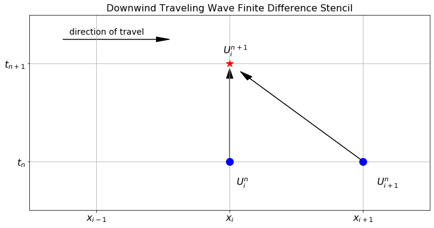
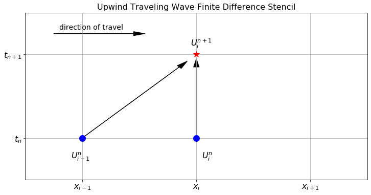
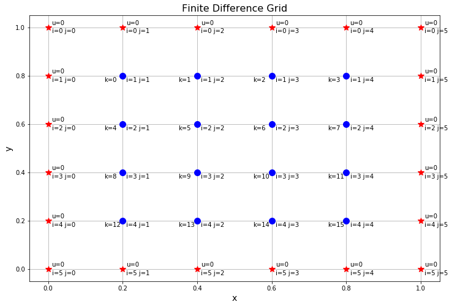

# PDE 3 {#sec-pde3}

::: {.callout-caution}
This appendix is still undergoing changes, to be released on Thursday of week 9.
:::

## The 2D Wave Equation

::: {#exr-6.52}
🖋 💻 Now consider the 2D wave equation 
$$
 u_{tt} = c^2\left( u_{xx} + u_{yy} \right).
$$
 We want to build a numerical solution to this new PDE. Just like with the 2D heat equation we propose the notation $U_{i,j}^n$ for the approximation of the function $u(t,x,y)$ at the point $t=t_n$, $x=x_i$, and $y=y_j$.

1.  Give discretizations of the derivatives $u_{tt}$, $u_{xx}$, and $u_{yy}$.

2.  Substitute your discretizations into the 2D wave equation, make the simplifying assumption that $\Delta x = \Delta y$, and solve for $U_{i,j}^{n+1}$. This is the finite difference scheme for the 2D wave equation.

3.  Write code to implement the finite difference scheme from part 2 on the domain $(x,y) \in (0,1)\times (0,1)$ with homogeneous Dirichlet boundary conditions, initial condition $u(0,x,y) = \sin(2\pi (x-0.5))\sin(2\pi(y-0.5))$, and zero initial velocity.

4.  Draw the finite difference stencil for the 2D wave equation.

:::

------------------------------------------------------------------------

::: {#exr-6.53}
💻 💬 What is the region of stability for the finite difference scheme on the 2D wave equation? Produce several plots showing what happens when we are in the unstable region as well as when we are right on the edge of the stable region.

:::

------------------------------------------------------------------------

::: {#exr-6.54}
💻 Solve the 2D wave equation on the unit square with $u$ starting at rest and being driven by a wave coming in from one boundary.
:::

## The Travelling Wave Equation

Now we turn our attention to a new PDE: the transport equation 
$$
 u_t + v u_x = 0. 
$$

 In this equation $u(t,x)$ is the height of a wave at time $t$ and spatial location $x$. The parameter $v$ is the velocity of the wave. Imagine this as sending a single solitary wave pulsing down a taught rope or as sending a single pulse of light down a fibre optic cable.


------------------------------------------------------------------------

::: {#exr-6.55}
🖋 Consider the PDE $u_t + v u_x = 0$. There is a very easy way to get an analytic solution to this equation that describes a travelling wave. If we have the initial condition $u(0,x) = f(x) = e^{-(x-4)^2}$ then we claim that $u(t,x) = f(x-vt)$ is an analytic solution to the PDE. More explicitly, we are claiming that 
$$
 u(t,x) = e^{-(x-vt-4)^2} 
$$
 is the analytic solution to the PDE. Let us prove this.

1.  Take the $t$ derivative of $u(t,x)$.

2.  Take the $x$ derivative of $u(t,x)$.

3.  The PDE claims that $u_t + vu_x = 0$. Verify that this equal sign is indeed true.

:::

------------------------------------------------------------------------

::: {#exr-6.56}
💻 Now we would like to visualize the solution to the PDE from the previous exercise. The Python code below gives an interactive visual of the solution. Experiment with different values of $v$ and different initial conditions.

``` python         
import numpy as np
import matplotlib.pyplot as plt
from matplotlib import animation, rc
from IPython.display import HTML

v = 1
f = lambda x: np.exp(-(x-4)**2)
u = lambda t, x: f(x - v*t)
x = np.linspace(0,10,101)
t = np.linspace(0,10,101)

fig, ax = plt.subplots()
plt.close()
ax.grid()
ax.set_xlabel('x')
ax.set_xlim(( 0, 10))
ax.set_ylim(( -0.1, 1))
frame, = ax.plot([], [], linewidth=2, linestyle='--')

def animator(N):
  ax.set_title(f"Time = {t[N]:.2f}")
  frame.set_data(x,???) # plot the correct time step for u(t,x)
  return (frame,)

PlotFrames = range(0,len(t),1) 
anim = animation.FuncAnimation(fig, 
                               animator, 
                               frames=PlotFrames, 
                               interval=100, 
                              )

rc('animation', html='jshtml') # embed in the HTML for Google Colab
anim
```

:::

------------------------------------------------------------------------

::: {#exr-6.57}
🖋 Use the chain rule to prove that for any differentiable function $f(x)$ the function $u(t,x) = f(x-vt)$ is an analytic solution to the transport equation $u_t + v u_{x} = 0$ with initial condition $u(0,x) = f(x)$.

:::

------------------------------------------------------------------------

Thus the travelling wave equation $u_t + vu_x = 0$ has a very nice analytic solution which we can always find. Therefore there is no need to ever find a numerical solution -- we can just write down the analytic solution if we are given the initial condition. As it turns out though, the numerical solutions exhibit some very interesting behaviour.

------------------------------------------------------------------------

::: {#exr-6.58}
🖋 💻 Consider the travelling wave equation $u_t + vu_x = 0$ with initial condition $u(0,x) = f(x)$ for some given function $f$ and boundary condition $u(t,0) = 0$. To build a numerical solution we will again adopt the notation $U_i^n$ for the approximation to $u(t,x)$ at the point $t=t_n$ and $x=x_i$.

(a)  Write an approximation of $u_t$ using $U_i^{n+1}$ and $U_i^n$.

(b)  Write an approximation of $u_x$ using $U_{i+1}^n$ and $U_i^n$.

(c)  Substitute your answers from parts (a) and (b) into the travelling wave equation and solve for $U_i^{n+1}$. This is our first finite difference scheme for the travelling wave equation.

(d)  Write Python code to get the finite difference approximation of the solution to the PDE. Plot your finite difference solution on top of the analytic solution for $f(x) = e^{-(x-4)^2}$. What do you notice? Can you stabilize this method by changing the values of $\Delta t$ and $\Delta x$ like with did with the heat and wave equations?

:::

------------------------------------------------------------------------

The finite difference scheme that you built in the previous exercise is called the downwind scheme for the travelling wave equation. @fig-6.12 shows the finite difference stencil for this scheme. We call this scheme "downwind" since we expect the wave to travel from left to right and we can think of a fictitious wind blowing the solution from left to right. Notice that we are using information from "downwind" of the point at the new time step.

{#fig-6.12 alt="The finite difference stencil for the 1D downwind scheme on the traveling wave equation."}

------------------------------------------------------------------------

::: {#exr-6.59}
💬 You should have noticed in the previous exercise that you cannot reasonably stabilize the finite difference scheme. Propose several reasons why this method appears to be unstable no matter what you use for the ratio $v \Delta t / \Delta x$.

:::

------------------------------------------------------------------------

::: {#exr-6.60}
💻 One of the troubles with the finite difference scheme that we have built for the travelling wave equation is that we are using the information at our present spatial location and the next spatial location to the right to propagate the solution forward in time. The trouble here is that the wave is moving from left to right, so the interesting information about the next time step's solution is actually coming from the left, not the right. We call this "looking upwind" since you can think of a fictitious *wind* blowing from left to right, and we need to look "upwind" to see what is coming at us. If we write the spatial derivative as 
$$
 u_x \approx \frac{U_i^n - U_{i-1}^n}{\Delta x} 
$$
 we still have a first-order approximation of the derivative but we are now looking left instead of right for our spatial derivative. Make this modification in your finite difference code for the travelling wave equation (call it the "upwind method"). Approximate the solution to the same PDE as we worked with in the previous exercises. What do you notice now?

:::

------------------------------------------------------------------------

@fig-6.13 shows the finite difference stencil for the upwind scheme. We call this scheme "upwind" since we expect the wave to travel from left to right and we can think of a fictitious wind blowing the solution from left to right. Notice that we are using information from "upwind" of the point at the new time step.

{#fig-6.13 alt="The finite difference stencil for the 1D upwind scheme on the traveling wave equation."}

------------------------------------------------------------------------

::: {#exr-6.61}
💬 Complete the following sentences:

1.  In the downwind finite difference scheme for the travelling wave equation, the approximate solution moves at the correct speed, but ...

2.  In the upwind finite difference scheme for the travelling wave equation, the approximate solution moves at the correct speed, but ...

:::

------------------------------------------------------------------------

::: {#exr-6.62}
🖋 💻 💬 Neither the downwind nor the upwind solutions for the travelling wave equation are satisfactory. They completely miss the interesting dynamics of the analytic solution to the PDE. Some ideas for stabilizing the finite difference solution for the travelling wave equation are as follows. Implement each of these ideas and discuss pros and cons of each. Also draw a finite difference stencil for each of these methods.

1.  Perhaps one of the issues is that we are using first-order methods to approximate $u_t$ and $u_x$. What if we used a second-order approximation for these first derivatives 
$$
 u_t \approx \frac{U_i^{n+1} - U_i^{n-1}}{2\Delta t} \quad \text{ and } \quad u_x \approx \frac{U_{i+1}^n - U_{i-1}^n}{2\Delta x}? 
$$
 Solve for $U_i^{n+1}$ and implement this method. This is called the **leapfrog method.**

2.  For this next method let us stick with the second-order approximation of $u_x$ but we will do something clever for $u_t$. For the time derivative we originally used 
$$
 u_t \approx \frac{U_i^{n+1} - U_i^n}{\Delta t} 
$$
 what happens if we replace $U_i^n$ with the average value from the two surrounding spatial points 
$$
 U_i^n \approx \frac{1}{2} \left( U_{i+1}^n + U_{i-1}^n \right)? 
$$
 This would make our approximation of the time derivative 
$$
 u_t \approx \frac{U_i^{n+1} - \frac{1}{2} \left( U_{i+1}^n + U_{i-1}^n \right)}{\Delta t}. 
$$
 Solve this modified finite difference equation for $U_i^{n+1}$ and implement this method. This is called the **Lax-Friedrichs** method.

3.  Finally we will do something very clever (and very counter intuitive). What if we inserted some artificial diffusion into the problem? You know from your work with the heat equation that diffusion spreads a solution out. The downwind scheme seemed to have the issue that it was *bunching up* at the beginning and end of the wave, so artificial diffusion might smooth this out. The **Lax-Wendroff method** does exactly that: take a regular Euler-type step in time 
$$
 u_t \approx \frac{U_i^{n+1} - U_i^n}{\Delta t}, 
$$
 use a second-order centred difference scheme in space to approximate $u_x$ 
$$
 u_x \approx \frac{U_{i+1}^n - U_{i-1}^n}{2\Delta x}, 
$$
 but add on the term 
$$
 \left( \frac{v^2 \Delta t^2}{2\Delta x^2} \right) \left( U_{i-1}^n - 2 U_i^n + U_{i+1}^n \right) 
$$
 to the right-hand side of the equation. Notice that this new term is a scalar multiple of the second-order approximation of the second derivative $u_{xx}$. Solve this equation for $U_i^{n+1}$ and implement the Lax-Wendroff method.
:::

## The Laplace and Poisson Equations

::: {#exr-6.63}
💻 💬 Consider the 1D heat equation $u_t = 1 u_{xx}$ with boundary conditions $u(t,0) = 0$ and $u(t,1)=1$ and initial condition $u(0,x) = 0$.

1.  Describe the physical setup for this problem.

2.  Recall that the solution to a differential equation reaches a steady state (or equilibrium) when the time rate of change is zero. Based on the physical system, what is the steady state heat profile for this PDE?

3.  Use your 1D heat equation code to show the full time evolution of this PDE. Run the simulation long enough so that you see the steady state heat profile.

:::

------------------------------------------------------------------------

::: {#exr-6.64}
💻 💬 Now consider the forced 1D heat equation $u_t = u_{xx} + e^{-(x-0.5)^2}$ with the same boundary and initial conditions as the previous exercise. The exponential forcing function introduced in this equation is an external source of heat (like a flame held to the middle of the metal rod).

1.  Conjecture what the steady state heat profile will look like for this particular setup. Be able to defend your answer.

2.  Modify your 1D heat equation code to show the full time evolution of this PDE. Run the simulation long enough so that you see the steady state heat profile.

:::

------------------------------------------------------------------------

::: {#exr-6.65}
💻 💬 Next we will examine 2D steady state heat profiles. Consider the PDE $u_t = u_{xx} + u_{yy}$ with boundary conditions $u(t,0,y) = u(t,x,0) = u(t,x,1) = 0$ and $u(t,1,y) = 1$ with initial condition $u(0,x,y) = 0$.

1.  Describe the physical setup for this problem.

2.  Based on the physical system, describe the steady state heat profile for this PDE. Be sure that your steady state solution still satisfies the boundary conditions.

3.  Use your 2D heat equation code to show the full time evolution of this PDE. Run the simulation long enough so that you see the steady state heat profile.

:::

------------------------------------------------------------------------

::: {#exr-6.66}
💻 💬 Now consider the forced 2D heat equation $u_t = u_{xx} + u_{yy} + 10e^{-(x-0.5)^2-(y-0.5)^2}$ with the same boundary and initial conditions as the previous exercise. The exponential forcing function introduced in this equation is an external source of heat (like a flame held to the middle of the metal sheet).

1.  Conjecture what the steady state heat profile will look like for this particular setup. Be able to defend your answer.

2.  Modify your 2D heat equation code to show the full time evolution of this PDE. Run the simulation long enough so that you see the steady state heat profile.

:::

------------------------------------------------------------------------

Up to this point we have studied PDEs that all depend on time. In many applications, however, we are not interested in the transient (time dependent) behaviour of a system. Instead we are often interested in the steady state solution when the forces in question are in static equilibrium. Two very famous time-independent PDEs are the Laplace Equation 
$$
 u_{xx} + u_{yy} + u_{zz} = 0 
$$
 and the Poisson equation 
$$
 u_{xx} + u_{yy} + u_{zz} = f(x,y,z). 
$$
 Notice that both the Laplace and Poisson equations are the equations that we get when we consider the limit $u_t \to 0$. In the limit when the time rate of change goes to zero we are actually just looking at the eventual steady state heat profile resulting from the initial and boundary conditions of the heat equation. In the previous exercises you already wrote code that will show the steady state profiles in a few setups. The trouble with the approach of letting the time-dependent simulation run for a *long time* is that the finite difference solution for the heat equation is known to have stability issues. Moreover, it may take a lot of computational time for the solution to reach the eventual steady state. In the remainder of this section we look at methods of solving for the steady state directly -- without examining any of the transient behaviour. We will first examine a 1D version of the Laplace and Poisson equations.

------------------------------------------------------------------------

::: {#exr-6.67}
🖋 💻 Consider a 1-dimensional rod that is infinitely thin and has unit length. For the sake of simplicity assume the following:

-   the specific heat of the rod is exactly 1 for the entire length of the rod,

-   the temperature of the left end is held fixed at $u(0) = 0$,

-   the temperature of the right end is held fixed at $u(1) = 1$, and

-   the temperature has reached a steady state.

You can assume that the temperatures are *reference temperatures* instead of absolute temperatures, so a temperature of "0" might represent room temperature.

Since there are no external sources of heat we model the steady-state heat profile we must have $u_t = 0$ in the heat equation. Thus the heat equation collapses to $u_{xx} = 0$. This is exactly the one dimensional Laplace equation.

(a)  To get an exact solution of the Laplace equation in this situation we simply need to integrate twice. Do the integration and write the analytic solution (there should be no surprises here).

(b)  To get a numerical solution we first need to partition the domain into finitely many point. For the sake of simplicity let us say that we subdivide the interval into 5 equal sub intervals (so there are 6 points including the endpoints). Furthermore, we know that we can approximate $u_{xx}$ as 
$$
 u_{xx} \approx \frac{U_{i+1} - 2U_i + U_{i-1}}{\Delta x^2}. 
$$
 Thus we have 6 linear equations: 
$$
\begin{aligned} U_0 &= 0 \quad \text{(left boundary condition)}\\ \frac{U_2 - 2U_1 + U_0}{\Delta x^2} &= 0 \\ \frac{U_3 - 2U_2 + U_1}{\Delta x^2} &= 0 \\ \frac{U_4 - 2U_3 + U_2}{\Delta x^2} &= 0 \\ \frac{U_5 - 2U_4 + U_3}{\Delta x^2} &= 0 \\ U_5 &= 1 \quad \text{(right boundary condition).} \end{aligned}
$$
 Notice that there are really only four unknowns since the boundary conditions dictate two of the temperature values. Rearrange this system of equations into a matrix equation and solve for the unknowns $U_1$, $U_2$, $U_3$, and $U_4$. Your coefficient matrix should be $4 \times 4$.

(c)  Compare your answers from parts (a) and (b).

(d)  Write code to build the numerical solution with an arbitrary value for $\Delta x$ (i.e. an arbitrary number of sub intervals). You should build the linear system automatically in your code.

:::

------------------------------------------------------------------------


Solving the 1D Laplace equation with Dirichlet boundary conditions is rather uninteresting since the answer will always be a linear function connecting the two boundary conditions. The Poisson equation $u_{xx} = f(x)$ is more interesting than the Laplace equation in 1D. The function $f(x)$ is called a forcing function. You can think of it this way: if $u$ is the amount of force on a linear bridge, then $f$ might be a function that gives the distribution of the forces on the bridge due to the cars sitting on the bridge. In terms of heat we can think of this as an external source of heat energy warming up the one-dimensional rod somewhere in the middle (like a flame being held to one place on the rod).

------------------------------------------------------------------------

::: {#exr-6.69}
🖋 How would we analytically solve the Poisson equation $u_{xx} = f(x)$ in one spatial dimension? As a sample problem consider $x\in [0,1]$, the forcing function $f(x) = 5\sin(2 \pi x)$ and boundary conditions $u(0) = 2$ and $u(1) = 0.5$. Of course you need to check your answer by taking two derivatives and making sure that the second derivative exactly matches $f(x)$. Also be sure that your solution matches the boundary conditions exactly.

:::

------------------------------------------------------------------------

::: {#exr-6.70}
🖋 💻 Now we can solve the Poisson equation from the previous problem numerically. Let us again build this with a partition that contains only 6 points just like we did with the Laplace equation a few exercise ago. We know the approximation for $u_{xx}$ so we have the linear system 
$$
\begin{aligned} U_0 &= 2 \quad \text{(left boundary condition)}\\ \frac{U_2 - 2U_1 + U_0}{\Delta x^2} &= f(x_1) \\ \frac{U_3 - 2U_2 + U_1}{\Delta x^2} &= f(x_2) \\ \frac{U_4 - 2U_3 + U_2}{\Delta x^2} &= f(x_3) \\ \frac{U_5 - 2U_4 + U_3}{\Delta x^2} &= f(x_4) \\ U_5 &= 0.5 \quad \text{(right boundary condition).} \end{aligned}
$$


(a)  Rearrange the system of equations as a matrix equation and then solve the system for $U_1, U_2, U_3$, and $U_4$. There are really only four equations so your matrix should be $4 \times 4$.

(b)  Compare your solution from part (a) to the function values that you found in the previous exercise.

(c)  Now generalize the process of solving the 1D Poisson equation for an arbitrary value of $\Delta x$. You will need to build the matrix and the right-hand side in your code. Test your code on new forcing functions and new boundary conditions.

:::

------------------------------------------------------------------------

::: {#exr-6.71}
🖋 💻 The previous exercises only account for Dirichlet boundary conditions (fixed boundary conditions). We would now like to modify our Poisson solution to allow for a Neumann condition: where we know the derivative of $u$ at one of the boundaries. The statement of the problem is as follows: 
$$
\text{Solve: } u_{xx} = f(x) \quad \text{on} \quad x \in (0,1) \quad \text{with} \quad u_x(0) = \alpha \quad \text{and} \quad u(1) = \beta.
$$
 The derivative condition on the boundary can be approximated by using a first-order approximation of the derivative, and as a consequence we have one new equation. Specifically, if we know that $u_x(0) = \alpha$ then we can approximate this condition as 
$$
 \frac{U_1 - U_0}{\Delta x} = \alpha, 
$$
 and we simply need to add this equation to the system that we were solving in the previous exercise. If we go back to our example of a partition with 6 points the system becomes 
$$
\begin{aligned} \frac{U_1 - U_0}{\Delta x} &= \alpha \quad \text{(left boundary condition)}\\ \frac{U_2 - 2U_1 + U_0}{\Delta x^2} &= f(x_1) \\ \frac{U_3 - 2U_2 + U_1}{\Delta x^2} &= f(x_2) \\ \frac{U_4 - 2U_3 + U_2}{\Delta x^2} &= f(x_3) \\ \frac{U_5 - 2U_4 + U_3}{\Delta x^2} &= f(x_4) \\ U_5 &= \beta \quad \text{(right boundary condition).} \end{aligned}
$$
 There are 5 equations this time.

(a)  With a 6 point grid solve the Poisson equation $u_{xx} = 5\sin(2\pi x)$ with $u_x(0) = 0$ and $u(1) = 3$.

(b)  Modify your code from part (a) to solve the same problem but with a much smaller value of $\Delta x$. You will need to build the matrix equation in your code.

:::

------------------------------------------------------------------------

::: {#exr-6.72}
#### The 2D Poisson Equation
🖋 💻 💬 We conclude this section, and chapter, by examining the two dimensional Poisson equations. As a sample problem, we want to solve the Poisson equation 
$$u_{xx} + u_{yy} = f(x,y)$$
on the domain $(x,y) \in (0,1)\times (0,1)$ with homogeneous Dirichlet boundary conditions and forcing function
$$f(x,y) = -20\text{exp}\left( -\frac{(x-0.5)^2 + (y-0.5)^2}{0.05} \right)$$ 
numerically. 

We are going to start with a $6 \times 6$ grid of points and explicitly write down all of the equations. In @fig-6.14 the red stars represent boundary points where the value of $u(x,y)$ is known and the blue interior points are the ones where $u(x,y)$ is yet unknown. It should be clear that we should have two indices for each point (one for the $x$ position and one for the $y$ position), but it should also be clear that this will cause problems when writing down the resulting system of equations as a matrix equation (stop and think carefully about this). Therefore, in @fig-6.14 we propose an index, $k$, starting at the top left of the unknown nodes and reading left to right (just like we do with Python arrays).

(a)  Start by discretizing the 2D Poisson equation $u_{xx} + u_{yy} = f(x,y)$. For simplicity we assume that $\Delta x = \Delta y$ so that we can combine like terms from the $x$ derivative and the $y$ derivative. Fill in the missing coefficients and indices below. 
$$
U_{i+1,j} + U_{i,j-1} - (\underline{\hspace{0.2in}}) U_{\underline{\hspace{0.2in}},\underline{\hspace{0.2in}}} + U_{\underline{\hspace{0.2in}},\underline{\hspace{0.2in}}} + U_{\underline{\hspace{0.2in}},\underline{\hspace{0.2in}}} = \Delta x^2 f(x_i,y_j)
$$


(b)  In @fig-6.14 we see that there are 16 total equations resulting from the discretization of the Poisson equation. Your first task is to write all 16 of these equations. we will get you started:
$$
\begin{aligned} \text{$k=0$: } &\quad U_{k=1} + {\color{red} U_{i=1,j=0} } - 4U_{k=0} + {\color{red} U_{i=0,j=1} } + U_{k=4} = \Delta x^2 f(x_1,y_1) \\ \text{$k=1$: } &\quad U_{k=2} + U_{k=0} - 4U_{k=1} + {\color{red} U_{i=0,j=2} } + U_{k=5} = \Delta x^2 f(x_1,y_2) \\ & \qquad \vdots \\ \text{$k=15$: } &\quad {\color{red} U_{i=4,j=5}} + U_{k=14} - 4 U_{k=15} + U_{k=11} + {\color{red} U_{i=5,j=4}} = \Delta x^2 f(x_4,y_4) \end{aligned}
$$
In this particular example we have homogeneous Dirichlet boundary conditions so all of the boundary values are zero. If this was not the case then every boundary value would need to be moved to the right-hand sides of the equations. 

(c)  We now have a $16 \times 16$ matrix equation to write based on the equations from part (b). Each row and column of the matrix equation is indexed by $k$. The coefficient matrix $A$ is started for you below. Write the whole thing out and fill in the blanks. Notice that this matrix has a much more complicated structure than the coefficient matrix in the 1D Poisson and Laplace equations.
$$
A = \begin{pmatrix} -4 & 1 & 0 & 0 & 1 & 0 & 0 & 0 & \cdots & 0 \\ 1 & -4 & 1 & 0 & 0 & 1 & 0 & 0 & \cdots & 0 \\ 0 & 1 & -4 & 1 & 0 & 0 & 1 & 0 & \cdots & 0 \\ 0 & 0 & 1 & -4 & 1 & 0 & 0 & 1 & & \\ 1 & 0 & 0 & 0 & -4 & 1 & 0 & 0 & \ddots & \\ 0 & & & & & & & & & \\ \vdots & & & & & & & & & \\ & & & & & & & & & \\ & & & & & & & & & -4 \\ \end{pmatrix}
$$


(d)  In the coefficient matrix from part (c) notice that the small matrix 
$$
\begin{pmatrix} -4 & 1 & 0 & 0 \\ 1 & -4 & 1 & 0 \\ 0 & 1 & -4 & 1 \\ 0 & 0 & 1 & -4 \end{pmatrix}
$$
 shows up in blocks along the main diagonal. If you have a hard copy of the matrix go back and draw a box around these blocks in the coefficient matrix. Also notice that there are diagonal bands of $1^s$. Discuss the following:

  1. Why are the blocks $4 \times 4$?

  2. How could you have predicted the location of the diagonal bands of $1^s$?

  3. What would the structure of the matrix look like if we partitioned the domain into a $10 \times 10$ grid of points instead of a $6 \times 6$ grid (including the boundary points)?

  4. Why is it helpful to notice this structure?

(e)  The right-hand side of the matrix equation resulting the your system of equations from part (b) is 
$$
\boldsymbol{b} = \Delta x^2 \begin{pmatrix} f(x_1,y_1) \\ f(x_1,y_2) \\ f(x_1,y_3) \\ f(x_1,y_4) \\ f(x_2,y_1) \\ f(x_2,y_2) \\ \vdots \\ \\ f(x_4,y_4) \end{pmatrix}.
$$
 Notice the structure of this vector. Why is it structured this way? Why is it useful to notice this?

(f)  Write Python code to solve the problem at hand. Recall that $f(x,y) = -20\exp\left(-\frac{(x-0.5)^2+(y-0.5)^2}{0.05}\right)$. Show a contour plot of your solution. This will take a little work changing the indices back from $k$ to $i$ and $j$. Think carefully about how you want to code this before you put fingers to keyboard. You might want to use the `np.block()` command to build the coefficient matrix efficiently or you can use loops with carefully chosen indices.

(g)  (Challenge) Generalize your code to solve the Poisson equation with a much smaller value of $\Delta x = \Delta y$.

(h)  One more significant observation should be made about the 2D Poisson equation on this square domain. Notice that the corner points of the domain (e.g. $i=0, j=0$ or $i=5, j=0$) are never included in the system of equations. What does this mean about trying to enforce boundary conditions that only apply at the corners?

{#fig-6.14 alt="A finite difference grid for the Poisson equation with 6 grid points in each direction."}
:::

------------------------------------------------------------------------

## Algorithm Summaries

::: {#exr-6.76}
💬 Show the full mathematical details for building a first-order in time and second-order in space approximation method for the one-dimensional heat equation. Explain what the order of the error means in this context

:::

------------------------------------------------------------------------

::: {#exr-6.77}
💬 Show the full mathematical details for building a second-order in time and second-order in space approximation method for the one-dimensional wave equation. Explain what the order of the error means in this context

:::

------------------------------------------------------------------------

::: {#exr-6.78}
💬 Show the full mathematical details for building a first-order in time and second-order in space approximation method for the two-dimensional heat equation. Explain what the order of the error means in this context

:::

------------------------------------------------------------------------

::: {#exr-6.79}
💬 Show the full mathematical details for building a second-order in time and second-order in space approximation method for the two-dimensional wave equation. Explain what the order of the error means in this context

:::

------------------------------------------------------------------------

::: {#exr-6.80}
💬 Explain in clear language what it means for a finite difference method to be stable versus unstable.

:::

------------------------------------------------------------------------

::: {#exr-6.81}
💬 Show the full mathematical details for solving the 1D heat equation using the implicit and Crank-Nicolson methods.

:::

------------------------------------------------------------------------

::: {#exr-6.82}
💬 Show the full mathematical details for building a downwind finite difference scheme for the travelling wave equation. Discuss the primary disadvantages of the downwind scheme.

:::

------------------------------------------------------------------------

::: {#exr-6.83}
💬 Show the full mathematical details for building an upwind finite difference scheme for the travelling wave equation. Discuss the primary disadvantages of the upwind scheme.

:::

------------------------------------------------------------------------

::: {#exr-6.84}
💬 Show the full mathematical details for numerically solving the 1D Laplace and Poisson equations.

:::

------------------------------------------------------------------------

::: {.content-visible when-format="html"}

## Problems

::: {#exr-6.85}
🖋 💻 💬 In this problem we will solve a more realistic 1D heat equation. We will allow the diffusivity to change spatially, so $D = D(x)$ and we want to solve 
$$
u_t = \left( D(x) u_x \right)_x
$$
 on $x \in (0,1)$ with Dirichlet boundary conditions $u(t,0) = u(t,1) = 0$ and initial condition $u(0,x) = \sin(2 \pi x)$. This is "more realistic" since it would be rare to have a perfectly homogeneous medium, and the function $D$ reflects any heterogeneities in the way the diffusion occurs. In this problem we will take $D(x)$ to be the parabola $D(x)= x^3(1-x)$. We start by doing some calculus to rewrite the differential equation: 
$$
u_t = D(x) u_{xx}(x) + D'(x) u_x(x).
$$


Your jobs are:

1.  Describe what this choice of $D(x)$ might mean physically in the heat equation.

2.  Write an explicit scheme to solve this problem by using centred differences for the spatial derivatives and an Euler-type discretization for the temporal derivative. Write a clear and thorough explanation for how you are doing the discretization as well as a discussion for the errors that are being made with each discretization.

3.  Write a script to find an approximate solution to this problem.

4.  Write a clear and thorough discussion about how your will choose $\Delta x$ and $\Delta t$ to give stable solutions to this equation.

5.  Graphically compare your solution to this problem with a heat equation where $D$ is taken to be the constant average diffusivity found by calculating $D_{ave} = \int_0^1 D(x) dx.$ How does the changing diffusivity change the shape of the solution?

:::

------------------------------------------------------------------------

::: {#exr-6.86}
💻 In a square domain create a function $u(0,x,y)$ that looks like the university logo. The simplest way to do this might be to take a photo of the logo, crop it to a square, and use the `scipy.ndimage.imread` command to read in the image. Use this function as the initial condition for the heat equation on a square domain with homogeneous Dirichlet boundary conditions. Numerically solve the heat equation and show an animation for what happens to the logo as time evolves.

:::

------------------------------------------------------------------------

::: {#exr-6.87}
💻 Repeat the previous exercise but this time solve the wave equation with the logo as the initial condition.

:::

------------------------------------------------------------------------

::: {#exr-6.88}
💻 💬 The explicit finite difference scheme that we built for the 1D heat equation in this chapter has error on the order of $\mathcal{O}(\Delta t) + \mathcal{O}(\Delta x^2)$. Explain clearly what this means. Then devise a numerical experiment to empirically test this fact. Clearly explain your thought process and show sufficient plots and mathematics to support your work.

:::

------------------------------------------------------------------------

::: {#exr-6.89}
🖋 💻 Suppose that we have a concrete slab that is 10 meters in length, with the left boundary held at a temperature of $75^\circ$ and the right boundary held at a temperature of $90^\circ$. Assume that the thermal diffusivity of concrete is about $k = 10^{-5}$ m$^2$/s. Assume that the initial temperature of the slab is given by the function $T(x) = 75 + 1.5x - 20 \sin( \pi x / 10)$. In this case, the temperature can be analytically solved by the function $T(t,x) = 75 + 1.5x - 20 \sin(\pi x / 10) e^{-ct}$ for some value of $c$.

1.  Working by hand (no computers!) test the proposed analytic solution by substituting it into the 1D heat equation and verifying that it is indeed a solution. In doing so you will be able to find the correct value of $c$.

2.  Write numerical code to solve this 1D heat equation. The output of your code should be an animation showing how the error between the numerical solution and the analytic solution evolve in time.

:::

------------------------------------------------------------------------

::: {#exr-6.90}
💻 💬 (This problem is modified from [@Spayd]). The data given below is real experimental data provided courtesy of the authors.)

Harry and Sally set up an experiment to gather data specifically for the heat diffusion through a long thin metal rod. Their experimental setup was as follows.

-   The ends of the rod are submerged in water baths at different temperatures and the heat from the hot water bath (on the right hand side) travels through the metal to the cooler end (on the left hand side).

-   The temperature of the rod is measured at four locations; those measurements are sent to a Raspberry Pi, which processes the raw data and sends the collated data to be displayed on the computer screen.

-   They used a metal rod of length $L = 300 mm$ and square cross-sectional width $3.2 mm$.

-   The temperature sensors were placed at $x_1 = 47mm$, $x_2 = 94mm$, $x_3 = 141mm$, and $x_4 = 188mm$ as measured from the cool end (the left end).

-   Foam tubing, with a thickness of 25 mm, was wrapped around the rod and sensors to provide some insulation.

-   The ambient temperature in the room was $22^\circ C$ and the cool water bath is a large enough reservoir that the left side of the rod is kept at $22^\circ C$.

The data table below gives temperature measurements at 60 second intervals for each of the four sensors.

| **Time (sec)** | **Sensor 188** | **Sensor 141** | **Sensor 94** | **Sensor 47** |
|----------------|----------------|----------------|---------------|---------------|
| 0              | 22.8           | 22             | 22            | 22            |
| 60             | 29.3           | 24.4           | 23.2          | 22.8          |
| 120            | 35.7           | 27.5           | 25.9          | 25.2          |
| 180            | 41.8           | 30.3           | 27.9          | 26.8          |
| 240            | 45.8           | 33.8           | 30.6          | 29.2          |
| 300            | 48.2           | 36.5           | 32.6          | 31.2          |
| 360            | 50.6           | 37.7           | 34.2          | 32            |
| 420            | 53.4           | 38.5           | 34.9          | 32.8          |
| 480            | 53             | 38.9           | 35.3          | 33.6          |
| 540            | 53             | 40.4           | 36.5          | 34.8          |
| 600            | 55.1           | 41.2           | 37.3          | 35.2          |
| 660            | 54.7           | 42             | 38.1          | 35.6          |
| 720            | 54.7           | 42.4           | 38.1          | 36            |
| 780            | 54.7           | 42.4           | 38.1          | 36.4          |
| 840            | 54.7           | 42             | 38.5          | 36            |
| 900            | 57.5           | 41.2           | 37.7          | 35.6          |
| 960            | 56.3           | 40.8           | 37.3          | 35.6          |

1.  At time time $t=960$ seconds the temperatures of the rod are essentially at a steady state. Use this data to make a prediction of the temperature of the hot water bath located at $x=300mm$.

2.  The thermal diffusivity, $D$, of the metal is unknown. Use your numerical solution in conjunction with the data to approximate the value of $D$. Be sure to fully defend your process.

3.  It is unlikely that your numerical solution to the heat equation and the data from part 2 match very well. What are some sources of error in the data or in the heat equation model?

You can load the data directly with the following code.

``` python         
import numpy as np
import pandas as pd
URL = 'https://github.com/gustavdelius/NumericalAnalysis2025/raw/main/data/PDE/'
data = np.array(pd.read_csv(URL+'1dheatdata.csv'))
```

:::

------------------------------------------------------------------------

::: {#exr-6.91}
You may recall from your differential equations class that population growth under limited resources is governed by the logistic equation $x' = k_1x(1-x/k_2)$ where $x=x(t)$ is the population, $k_1$ is the intrinsic growth rate of the population, and $k_2$ is the carrying capacity of the population. The carrying capacity is the maximum population that can be supported by the environment. The trouble with this model is that the species is presumed to be fixed to a spatial location. Let us make a modification to this model that allows the species to spread out over time while they reproduce. We have seen throughout this chapter that the heat equation $u_t = D(u_{xx} + u_{yy})$ models the diffusion of a substance (like heat or concentration). We therefore propose the model\

$$
 \frac{\partial u}{\partial t} = k_1 u \left( 1 - \frac{u}{k_2} \right) + D \left( \frac{\partial^2 u}{\partial x^2} + \frac{\partial^2 u}{\partial y^2} \right) 
$$
 where $u(t,x,y)$ is the population density of the species at time $t$ and spatial point $(x,y)$, $(x,y)$ is a point in some square spatial domain, $k_1$ is the growth rate of the population, $k_2$ is the carrying capacity of the population, and $D$ is the rate of diffusion. Develop a finite difference scheme to solve this PDE. Experiment with this model showing the interplay between the parameters $D$, $k_1$, and $k_2$. Take an initial condition of 
$$
 u(0,x,y) = e^{-( (x-0.5)^2 + (y-0.5)^2)/0.05}. 
$$

:::

------------------------------------------------------------------------

::: {#exr-6.92}
In @exr-6.72 you solved the Poisson equation, $u_{xx} + u_{yy} = f(x,y)$, on the unit square with homogeneous Dirichlet boundary conditions and a forcing function $f(x,y) = -20 \exp\left(-\frac{(x-0.5)^2 + (y-0.5)^2}{0.05} \right)$. Use a $10 \times 10$ grid of points to solve the Poisson equation on the same domain with the same forcing function but with boundary conditions 
$$
u(0,y)=0, \quad u(1,y) = 0, \quad u(x,0) = -\sin(\pi x), \quad u(x,1) = 0.
$$
 Show a contour plot of your solution.
:::

## Projects

In this section we propose several ideas for projects related to numerical partial differential equations. These projects are meant to be open ended, to encourage creative mathematics, to push your coding skills, and to require you to write and communicate your mathematics.

### Hunting and Diffusion

Let $u$ be a function modelling a mobile population in an environment where it has an intrinsic growth rate of $r$ and a carrying capacity of $K$. If we were only worried about the size of the population we could solve the differential equation 
$$
\frac{du}{dt} = ru \left( 1-\frac{u}{K} \right),
$$
 but there is more to the story.

Hunters harvest the population at a per-capita rate $h$ so we can append the differential equation with the harvesting term $-h u$ to arrive at the ordinary differential equation 
$$
\frac{du}{dt} = ru \left( 1-\frac{u}{K} \right) - hu.
$$

Since the population is mobile let us make a few assumptions about the environment that they are in and how the individuals move.

-   The growing conditions for the population are the same everywhere

-   Individuals move around randomly.

Clearly these assumptions imply that our model is a simplification of real populations and real environments, but let us go with it for now. Given the nature of these assumptions we assume that a diffusion term models the spread of the individuals in the population. Hence, the PDE model is 
$$
\frac{\partial u}{\partial t} = ru\left( 1-\frac{u}{K} \right) - hu + D \left( u_{xx} + u_{yy} \right).
$$

1.  Use any of your ODE codes to solve the ordinary differential equation with harvesting. Give a complete description of the parameter space.

2.  Write code to solve the spatial+temporal PDE equation on the 2D domain $(x,y) \in [0,1] \times [0,1]$. Choose an appropriate initial condition and choose appropriate boundary conditions.

3.  The third assumption is not necessary true for rough terrain. The true form of the spatial component of the differential equation is $\nabla \cdot \left( D(x,y) \nabla u \right)$ where $D(x,y)$ is a multivariable function dictating the ease of diffusion in different spatial locations. Propose a (non-negative) function $D(x,y)$ and repeat part 2 with this new diffusion term.

### Heating Adobe Houses

Adobe houses, typically built in desert climates, are known for their great thermal efficiency. The heat equation 
$$
\frac{\partial T}{\partial t} = \frac{k}{c_p \rho} \left( T_{xx} + T_{yy} + T_{zz} \right),
$$
 where $c_p$ is the specific heat of the adobe, $\rho$ is the mass density of the adobe, and $k$ is the thermal conductivity of the adobe, can be used to model the heat transfer through the adobe from the outside of the house to the inside. Clearly, the thicker the adobe walls the better, but there is a trade off to be considered:

-   it would be prohibitively expensive to build walls so think that the inside temperature was (nearly) constant, and

-   if the walls are too thin then the cost is low but the temperature inside has a large amount of variability.

Your Tasks:

1.  Pick a desert location in the southwestern US (New Mexico, Arizona, Nevada, or Southern California) and find some basic temperature data to model the outside temperature during typical summer and winter months.

2.  Do some research on the cost of building adobe walls and find approximations for the parameters in the heat equation.

3.  Use a numerical model to find the optimal thickness of an adobe wall. Be sure to fully describe your criteria for optimality, the initial and boundary conditions used, and any other simplifying assumptions needed for your model.


:::